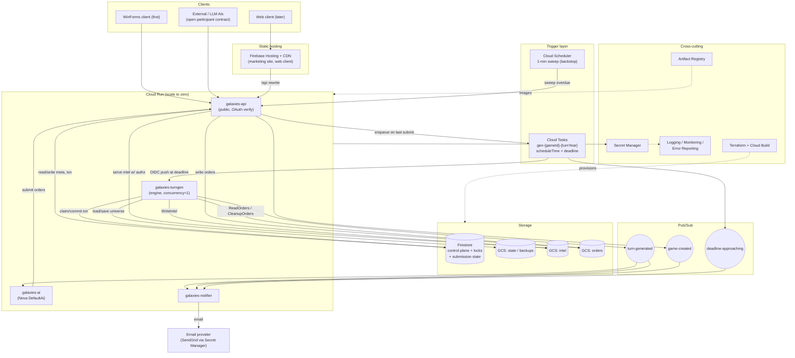
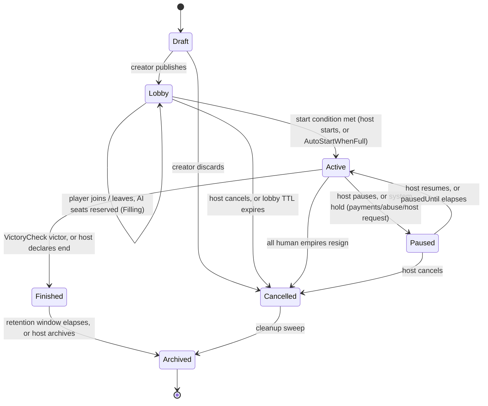

# Galaxies: cloud modernization design

Status: design, pending build. Engine: Stars! Nova (GPL v2). Cloud: GCP project `roybot`. Brand: Galaxies (Hearthlight / Vigil).

## The whole idea

Galaxies takes Stars! Nova, a mature open-source reimagining of the 1990s 4X game Stars!, and turns it into a free, ad-supported, cloud service you sign into with Google. It keeps the original's shape: an asynchronous, play-by-email game where everyone plans in secret, submits orders before a deadline, and the whole galaxy resolves at once. The work is to lift a Windows desktop program into a headless cloud backend, give each game a wall-clock (the "maximum time between turns"), put real accounts behind Google sign-in, and keep the existing desktop client playable while a browser client follows later.

## Where the code stands today (the short version)

Stars! Nova is about 73,000 lines of C# on .NET Framework 4.8 and WinForms. It has no network layer at all; multiplayer today is files exchanged through a shared folder (`.orders` in, `.intel` out). That file boundary is a gift: it is already a per-player wire protocol with real fog of war, because the server writes each empire only what it can see. The turn engine (`ServerState/TurnGenerator.Generate()`) is a clean, self-contained "advance the universe by one year" routine, and its file I/O sits behind `protected virtual` seams we can redirect at cloud storage. The hard parts are three, and the plan is built around them: the engine is entangled with WinForms and `System.Drawing` even in its shared and server layers; its randomness is unseeded, so turns are not reproducible and are barely tested; and there is no concept of a deadline anywhere.

## Confirmed product decisions

From the project owner:

- Client: adapt the existing WinForms desktop client to the cloud API first; build a browser client later.
- Cadence: asynchronous only, with a per-game "maximum time between turns"; a turn generates when everyone submits, or when the deadline passes.
- Auth: Google / Gmail sign-in only.
- AI: reuse the Nova AI as cloud workers, and open the seat to community and LLM participants through one contract (its own spec, `AI-PARTICIPANTS.md`).
- Money: free and ad-supported (standard ads), plus a low-pressure donations block. No subscriptions, no on-site payments.
- Naming and license: ship as "Galaxies," credit the Stars! team and Stars! Nova, keep the engine GPL v2 and open, and get counsel to confirm the trademark and the GPL boundary before launch (Section G).

## Resolved key decisions (authoritative)

Several choices came up in more than one section, sometimes with different answers. These are the calls the program is built on; where a section below still weighs an alternative, this table wins.

| Topic | Decision |
|---|---|
| Target framework | .NET 10 (current LTS, supported into 2028), not .NET 8 or 9. |
| Metadata and identity store | Firestore for everything, including accounts (doc id `users/{google_sub}`), so there is one store, transactional joins, and scale-to-zero. Cloud SQL is not used. |
| Auth | Broker Google through Firebase Auth for the user record and revocation; the backend mints a short-lived first-party JWT plus a rotating refresh token. |
| Wire payload (v1) | Keep the existing XML inside a small JSON envelope for the desktop client (zero domain-model drift); expose a native JSON projection for AI and the future web client; converge on native JSON when the web client lands. |
| Command dispatch | A self-registering `CommandRegistry`; both the XML path and the AI JSON adapter resolve through it, so a new command type needs no `switch` edit. |
| AI turn ordering | AI seats are dispatched by the scheduler and submit orders through the same channel as humans; the single-slot generation worker never blocks on an AI call. |
| Determinism seed | Persist `ServerData.MasterSeed` at creation; per-turn seed = `hash(MasterSeed, turnYear)`; per-seat seed = `hash(MasterSeed, turnYear, empireId)`. |
| Submission source of truth | Firestore is authoritative for scheduling; the API writes it on submit; the engine sets `EmpireData.TurnSubmitted` during generation and reconciles. |
| "Turn ready" delivery (v1) | A 60-second client poll plus an email nudge; no long-poll (it would bill a warm slot per idle client). |
| Transactional email | Postmark at low volume; revisit Amazon SES only if send volume makes cost dominate. |
| AI execution shape | Each AI participant is a push-subscription Cloud Run service; Cloud Run Jobs are reserved for the ladder harness and batch backfills. |

## How to read this document

- Section A ports the engine to headless, Linux-clean .NET and builds the determinism safety net.
- Section B is the GCP topology on project `roybot`.
- Section C is Google auth, the account model, and authorization.
- Section D is the turn clock: the "maximum time between turns," deadlines, missed-turn policy, the game lifecycle, notifications, and the full game-creation options.
- Section E is the API that replaces the file exchange, and the desktop-client adaptation.
- Section G is the product surface: creature comforts, the Hearthlight public site, ads and donations, licensing and credit, and ops.
- Section F, the open AI-participant contract, is published as its own document: `AI-PARTICIPANTS.md`. This document has no Section F on purpose.
- The closing part, "Program view," is the cross-section read: gaps nobody owned, the decisions above with their trade-offs, the top risks, the phased roadmap, and a reuse map of what we keep versus what is net-new.

Style note: this document follows the Hearthlight house rules (no em dashes, plain and direct, honest about limits). Where it says a thing needs legal review or is not yet built, read that at face value.

---
## Section A. Engine modernization and headless extraction

The goal of this section is a single deliverable: `Nova.Common` plus `Nova.Server` compiling as modern-.NET, Linux-clean class libraries with zero WinForms or `System.Drawing` in the turn-generation path, wrapped by a `TurnService.GenerateTurn(gameId)` entry point that touches neither the filesystem nor a UI. Everything below serves that. The work is deliberately ordered so that the safety net (determinism plus golden turns, items 4 and 6) is built *before* the framework port (item 1), not after, because the port is otherwise unverifiable.

### A.0 Project partition

Today `Server.csproj` references `ControlLibrary.csproj` (a WinForms control library) and imports `System.Windows.Forms` in `ServerData.cs`. That reference is the headline structural problem: the turn engine transitively depends on WinForms. The partition below cuts it.

| Assembly (today) | Fate | Target framework | Notes |
|---|---|---|---|
| `Common` (`Common.csproj`, Nova.Common) | Split. Pure domain and serialization stay; UI and live-bitmap files move out. | `net10.0` | Becomes the shared engine contract. Drop the `System.Windows.Forms`, `System.Drawing`, and `System.Runtime.Serialization.Formatters.Soap` references. |
| new `Nova.Client.Presentation` | New assembly to receive the files removed from `Common`. | `net10.0-windows` | Holds `ProgressDialog.*`, `ComboBoxItem.cs`, the WinForms `Report` sink, the dialog bodies of `FileSearcher`, and live `Bitmap` handling (`ShipIcon.Image`, `Component.ComponentImage`, `AllShipIcons`, `AllRaceIcons`, `RaceIcon`). |
| `ServerState` (`Server.csproj`, Nova.Server) | Headless engine. Remove the `ControlLibrary` project reference and the `SaveFileDialog` in `ServerData.Save`. | `net10.0` | The turn engine. Must not reference any `-windows` assembly. |
| new `Nova.Server.Host` | New. Wraps `Generate()` as `TurnService`; owns cloud storage and DI. | `net10.0` | Container entry point (see A.5). References `Common` and `ServerState` only. |
| `Nova` (GUI + AI, 35.6k lines) | Stays client for the GUI; **AI subtree must be extracted** into its own headless worker assembly. | GUI `net10.0-windows`; AI worker `net10.0` | Cross-reference to the AI-contract section: `Nova/Ai/*` currently lives inside the WinForms GUI project and drags WinForms; it has to be pulled into a UI-free assembly that references only pure `Common`. Flagged here as a dependency, designed elsewhere. |
| `ControlLibrary` | Client-only, unchanged in scope. | `net10.0-windows` | |
| `Graphics` (net 3.5) | Client-only; retarget. | `net10.0-windows` | Resource/icon assembly; not on the server path. |
| `TestHarness` (net 4.0 Exe) | Retarget or retire. | `net10.0` | Small; likely fold into the test project. |
| `Tests` (NUnit 3.12) | Modernize (A.6). | `net10.0` | Already on NUnit 3; `Common` still references the ancient NUnit 2.4.0.2, which must go. |

### A.1 Framework migration

**Framework choice, honest about the calendar.** The prompt offers ".NET 8 or 9". As of this plan (mid 2026) that menu is stale: .NET 9 is STS and reached end of support in May 2026; .NET 8 is LTS but its window closes in November 2026, four months out. Porting to either means re-porting almost immediately. **Recommend the current LTS, .NET 10** (released November 2025, supported into 2028). If a policy forces the original menu, pick 8 over 9, because 9 is already out of support. The port work is identical across 8/10; only the `TargetFramework` string differs.

**Mechanics.**

| Task | Detail | Effort | Risk |
|---|---|---|---|
| SDK-style csproj rewrite | Replace all nine legacy `ToolsVersion="12.0"` non-SDK projects with `<Project Sdk="Microsoft.NET.Sdk">`. The current files carry ClickOnce bootstrappers, `BaseAddress`, `FileAlignment`, x86 `PlatformTarget`, and per-config `USE_COMMAND_ORDERS` blocks; almost all of it is deleted, not translated. | M | Low |
| Drop x86 | Remove every `x86` and `USE_COMMAND_ORDERS` `PropertyGroup`. Confirm no P/Invoke assumes 32-bit; grep found none in the engine. Build `AnyCPU`/`x64`. | S | Low |
| Drop LangVersion 7.3 | SDK default (C# 12+) is fine; the code is conservative C#. | S | Low |
| Kill the pre-build lock hack | `Common.csproj` has a `PreBuildEvent` that renames the output to `*.locked`; a relic of the shared-folder lock loops. Delete. | S | Low |
| Retarget `Graphics` (3.5) and `TestHarness` (4.0) | Bring both to the common target so one SDK builds everything. | S | Low |
| Remove dead SOAP/Binary serialization refs | `Common/Serializer.cs` (BinaryFormatter) is dead code and **will not compile** on modern .NET without an obsolete opt-in; delete it and the `System.Runtime.Serialization.Formatters.Soap` reference outright. This is a hard blocker, not a cleanup. | S | Low |
| `Thread.Abort` removal | `Report.FatalError` calls `Thread.CurrentThread.Abort()`, which throws `PlatformNotSupportedException` on modern .NET. Change to throw a `NovaFatalException`. Hard compile/runtime blocker. | S | Low |

The headless server package is `Common` (post-split) plus `ServerState` plus the new `Nova.Server.Host`. Everything with a `-windows` suffix is client-only.

### A.2 De-WinForms and de-Drawing the shared and server layers

Enumerated coupling points, grounded in the tree:

| Location | Coupling | Replacement |
|---|---|---|
| `Common/Report.cs` | `MessageBox.Show` in `Error/Information/FatalError/Debug`; `Thread.Abort`. | Introduce `IReporter { void Error/Info/Fatal/Debug(string) }`. Keep `Report` as a static facade with a settable `Report.Sink` (minimizes churn: `Report.*` is called throughout `Common`). Server sets `Report.Sink = new LoggingReporter(ILogger)` writing to Cloud Logging/stdout; client sets a WinForms sink in `Nova.Client.Presentation`. |
| `Common/FileSearcher.cs` | `FolderBrowserDialog` (`GetGraphicsPath`), `OpenFileDialog` (`AskUserForFile`); registry/`nova.conf` resolution via `Config`. | Introduce `IContentLocator` returning `Stream`s for `components.xml`, race files, settings. Server implementation resolves from the container image or a GCS bucket (env-var/`appsettings.json` roots), never a dialog and never `GetNovaRoot()` directory-walking. Dialog fallbacks move to the client sink. |
| `Common/Files/Config.cs` | `Microsoft.Win32` registry; Windows-only. | Server never uses it. Path/config resolution becomes DI config (env vars + `appsettings.json`), read once at host startup. |
| `Common/ProgressDialog.cs` / `.Designer.cs` / `.resx` | WinForms `Form`. | Move to `Nova.Client.Presentation`. Server passes a no-op or logging progress. |
| `Common/IProgress.cs` (`IProgressCallback`) | Imports `System.Windows.Forms` (interface only). | Drop the import; or replace with BCL `System.IProgress<T>`. Trivial. |
| `Common/DataStructures/GameSettings.cs` and `Common/Files/GameSettings.cs` | `SaveFileDialog` in `Save()`; there are two GameSettings files, note the duplication. | `Save`/`Restore` take a `Stream` (or go through `IContentLocator`). No dialog. Server writes the `.settings` blob to storage. |
| `ServerState/Persistence/ServerData.cs` | `System.Windows.Forms`; `SaveFileDialog` in `Save()` when `StatePathName == null`; 8-second lock-retry loop in `Restore()`. | `Save()`/`Restore()` operate on injected streams (A.5). Delete the dialog branch and the `Global.TotalFileWaitTime` sleep loop; GCS gives atomic writes with preconditions instead. Remove the `ControlLibrary` project reference. |
| `ServerState/NewGame/StarMapInitialiser.cs` | `using System.Drawing`; builds `ShipIcon(hull.ImageFile, (Bitmap)hull.ComponentImage)` for seed colony ship, scout, starbase. | Server needs the ship *stats*, not pixels. Construct `ShipIcon` from the `Source` string only (keep `Source` in `Common`), leaving the live `Bitmap` null/deferred. The client resolves the bitmap later by `Source`. |
| `ServerState/BattleEngine.cs` | `using System.Drawing` (battle-grid geometry). | Audit; battle math uses positions, not bitmaps. Replace any `Point`/`Size` with `NovaPoint`/ints and drop the import. |
| `Common` domain model: `ShipIcon.cs` (`Bitmap image`), `Components/Component.cs` (`ComponentImage = new Bitmap(...)`), `Item.cs`, `AllShipIcons`, `AllRaceIcons`, `RaceIcon`, `Waypoint.cs`, `SpaceAllocator`, `PointUtilities`, `NovaPoint` | Pervasive `System.Drawing` references. Most are cosmetic; `NovaPoint` only *constructs from* `System.Drawing.Point`, gameplay math is on `NovaPoint` itself. | Data/reference split: keep string identifiers in `Common` (`ShipIcon.Source`, `Component.ImageFile`), move the live `Bitmap Image` / `ComponentImage` properties and file loading to `Nova.Client.Presentation`. Drop `NovaPoint`'s `System.Drawing.Point` constructor (client-only convenience). After this the engine references no `System.Drawing`. |

**Why not just reference `System.Drawing.Common`?** On .NET 6+ `System.Drawing.Common` is Windows-only and throws on Linux. Pulling it into the container would compile and then fail at runtime the first time map generation or icon loading executes. The data/reference split above is the correct fix, not a NuGet reference.

Effort M to L (the domain-model `System.Drawing` split is the bulk of it); risk M.

### A.3 Serialization strategy

**Recommendation: keep the hand-rolled `ToXml`/`XmlNode`-ctor format as the durable and wire format for the port. Do not migrate to JSON or protobuf now.**

Rationale, from the code:
- The XML boundary *is* the protocol already (`.intel`, `.orders`, `.settings`, and the `ServerState` document). Changing the format means simultaneously rewriting the client's `IntelReader`/`OrderWriter`, breaking the "adapt the existing WinForms client first" plan.
- Every persistable class has a symmetric `ToXml(XmlDocument)` / `XmlNode` constructor pair. These are battle-tested and mutually consistent. A `System.Text.Json` port would need custom converters for polymorphic `ICommand` and `IWaypointTask`, non-string-keyed dictionaries (`AllStars` keyed by string is fine, `AllEmpires` keyed by int is not a native JSON object key), and, critically, the by-key object graph that `ServerData.LinkServerStateReferences()` rebuilds. protobuf is worse: a rigid schema is the wrong shape for a graph reconstructed by name.
- The rewrite risk is all downside: subtle format bugs that corrupt saved games, caught late, with no format advantage that the product needs yet.

**`LinkServerStateReferences()` in any strategy.** The load path is whole-graph: `Restore()` deserializes a throwaway `ServerData`, copies the top-level dictionaries (`AllEmpires`, `AllStars`, `AllRaces`, `AllMinefields`, `AllMessages`, `AllCommands`), then calls `LinkServerStateReferences()` to re-wire references by key/name (fleets to stars, stars to owners, and so on). This relink is *independent of the serialization format*: it runs after the objects exist. Keeping XML means it is untouched. Any future format migration must preserve exactly this two-phase load (materialize flat, then relink), so it stays a supported seam regardless.

**Storage shape: blob for state, rows for metadata.** The universe is a deeply linked graph that `LinkServerStateReferences` reconstructs from a single whole-document load. Do not shred it into relational rows; that fights both the object model and the per-empire fog-of-war split (`OwnedStars`/`StarReports`, `OwnedFleets`/`FleetReports`).

| Data | Store | Layout |
|---|---|---|
| Authoritative `ServerState` XML | GCS object per game | `games/{gameId}/state.xml`; prior turns archived under `games/{gameId}/{year}/` (replaces `BackupTurn`'s `GameFolder/<year>/`). |
| Per-empire `.intel` | GCS objects | `games/{gameId}/turn/{year}/{race}.intel`. This is the per-player wire payload. |
| Inbound `.orders` | GCS objects | `games/{gameId}/orders/{empireId}.orders`; deleted on generation (replaces `CleanupOrders`). |
| Game metadata: game id, players (Google identity), turn year, per-empire `TurnSubmitted`, deadline, **master seed** | Cloud SQL (Postgres) or Firestore | Thin relational/rows. This is what schedulers and the turn trigger query; the blob is never scanned for it. |

**Migration/compat note.** Add an explicit `FormatVersion` attribute and a `MasterSeed` element (A.4) at the `ServerState` root in `ToXml()` (there is a natural home in `Global.InitializeXmlDocument`/`ServerData.ToXml`). Old saves lacking these load with `FormatVersion=0` and a seed synthesized once and written back. Confirm the deletion of `Common/Serializer.cs` (dead `BinaryFormatter`) as part of this item; it is both unused and a known deserialization security hole.

Effort S to M (mostly the storage-seam plumbing in A.5, not the format); risk Low.

### A.4 Determinism

Today every stochastic subsystem news up an unseeded `Random()`: `TurnGenerator.rand`, `BattleEngine`, `CheckForMinefields`, `StarMapGenerator`, `NameGenerator`, `StarMapInitialiser` (four separate instances), plus `PointUtilities` and `SpaceAllocator` in `Common`. Turns are therefore non-reproducible, which makes both auditing and (see A.6) regression testing impossible.

**Design.**
1. Add `long MasterSeed` to `ServerData`, generated at game creation and persisted in the `ServerState` XML (and mirrored in metadata rows for quick reference). This is where the seed lives.
2. Derive a per-turn seed deterministically: `turnSeed = HashCombine(MasterSeed, TurnYear)`. `TurnGenerator` constructs its `rand` from `turnSeed` instead of `new Random()`.
3. Give each stochastic subsystem a *derived* stream rather than its own wall-clock seed: pass the seeded RNG (or a sub-seed derived per subsystem name, so battles and minefields do not share a sequence and reorder each other) into `BattleEngine`, `CheckForMinefields`, and the `ITurnStep` implementations. Prefer injecting an `IRandom` abstraction over sprinkling `new Random(seed)`, so tests can substitute a recorded sequence.
4. Map generation seed: store the galaxy seed at creation (in `ServerData.MasterSeed`, consumed by `StarMapInitialiser`/`StarMapGenerator`) so the same options reproduce the same galaxy.

**The non-RNG determinism trap.** Reproducibility also requires deterministic iteration order. `Generate()` iterates `serverState.AllEmpires.Values`, `IterateAllFleets()`, and `empire.OwnedStars.Values`; .NET dictionary enumeration order is not part of the contract. For byte-identical golden turns, iterate collections sorted by key (empire id, star key, fleet key) anywhere the loop body has side effects on shared state or the RNG. Flag this as a real, easy-to-miss source of divergence beyond seeding.

Effort M; risk M (the trap above is where it bites).

### A.5 Injecting cloud storage through the existing seams

The engine already exposes exactly the seams needed. `TurnGenerator` declares `protected virtual` `ReadOrders()`, `WriteIntel()`, `BackupTurn()`, `CleanupOrders()` (and `ParseCommands()`), and the test suite already subclasses it as `SimpleTurnGenerator` overriding those. The cloud host follows the same pattern.

**Refactor the I/O classes off `GameFolder`.** `OrderReader` and `IntelWriter` currently resolve paths from `serverState.GameFolder` and hit `DirectoryInfo`/`File` directly (as do `BackupTurn` and `CleanupOrders` in `TurnGenerator`). Change their constructors to take an `IGameStore` (or `Func<string,Stream>` factories) instead of a folder path, so they read/write named blobs, not files.

```
interface IGameStore {
    Stream OpenState(string gameId);            // state.xml
    IEnumerable<Stream> OpenOrders(string gameId);
    Stream CreateIntel(string gameId, int year, string race);
    void ArchiveTurn(string gameId, int year);  // replaces BackupTurn
    void DeleteOrders(string gameId);           // replaces CleanupOrders
    void SaveState(string gameId, Stream xml);
}
```

**`CloudTurnGenerator : TurnGenerator`** overrides the four seams to delegate to `IGameStore` (GCS) instead of the filesystem, mirroring `SimpleTurnGenerator`. No filesystem, no `Directory.CreateDirectory`, no `File.Delete`, no lock-retry sleep.

**`TurnService.GenerateTurn(gameId)`** in `Nova.Server.Host`, the container entry point, with no filesystem or UI:
1. Read metadata (deadline, per-empire `TurnSubmitted`) from Cloud SQL/Firestore.
2. Load `state.xml` blob and all `.orders` blobs from GCS into memory; construct `ServerData` from the XML (via the `XmlDocument` ctor), leaving `StatePathName` and `GameFolder` null.
3. `new CloudTurnGenerator(serverState, store).Generate();` (the seeded RNG from A.4 comes from `ServerData.MasterSeed`).
4. Persist the new `state.xml`, write each per-empire `.intel` blob (`IntelWriter`), archive the prior turn under `.../{year}/`, delete consumed orders.
5. Update metadata: `TurnYear++`, reset `TurnSubmitted` (the engine already sets these on `EmpireData`); this is what the deadline scheduler reads next.

`ServerData.Save()` loses its `SaveFileDialog` branch entirely; the host supplies the destination. The 8-second lock loops in `Restore()`/`ServerData` are deleted; GCS object writes with generation preconditions give atomicity and optimistic concurrency instead of cooperative file locks.

This is the load-bearing integration point for the rest of the system, but the seams already exist, which is why it is medium rather than high effort. Effort M; risk M.

*(Note for the AI-contract and command sections: `OrderReader.ReadPlayerTurn()` dispatches command types through a hardcoded `switch` on the `Type` attribute (`research`/`waypoint`/`design`/`production`/`renamefleet`). It is not on this section's critical path, but any headless order ingestion inherits that switch; replacing it with a registry is designed elsewhere.)*

### A.6 Testing and CI

| Task | Detail | Effort | Risk |
|---|---|---|---|
| NUnit modernization | `Tests` is on NUnit 3.12 already; move it to `net10.0` with `Microsoft.NET.Test.Sdk` + `NUnit3TestAdapter` via `PackageReference`, run with `dotnet test`. Remove the ancient NUnit 2.4.0.2 reference still sitting in `Common.csproj`. Fold `TestHarness` (net 4.0 Exe) into the test project or retire it. | M | Low |
| Golden-turn tests | With A.4 seeding, snapshot a fixed `ServerState` + a fixed set of `.orders`, run `Generate()`, and assert the resulting `ServerState` XML equals a committed golden document. `SimpleTurnGenerator` already demonstrates feeding in-memory orders and suppressing file I/O, so the harness exists. | M | Med |
| **Capture goldens on 4.8 first** | Before touching the framework, run the seeded engine on .NET Framework 4.8 and commit the golden outputs. Re-run them after each migration step (retarget, de-Drawing, storage seams). Any diff is a regression introduced by the port. This is the mechanism that makes the whole migration verifiable. | M | Med |
| CI replacement | Retire `azure-pipelines.yml` (Windows VSBuild). The repo is already on GitHub with `.github/workflows` (CodeQL present), so use **GitHub Actions** on `ubuntu-latest` with `actions/setup-dotnet` for build + `dotnet test` on every PR (free for public repos). For the image: `dotnet publish` into a Linux container, push to Artifact Registry, deploy to Cloud Run, driven either by a `cloudbuild.yaml` (Cloud Build) on merge or by the same Actions workflow via Workload Identity Federation. Recommend Actions for build/test gates (matches existing setup) and Cloud Build for image/deploy, keeping GCP credentials on the GCP side. | M | Low |

### Effort and risk summary

| Item | Effort | Risk |
|---|---|---|
| A.1 Framework migration | M | Low |
| A.2 De-WinForms / de-Drawing | M to L | Med |
| A.3 Serialization (keep XML, blob+rows) | S to M | Low |
| A.4 Determinism | M | Med |
| A.5 Cloud storage via seams | M | Med |
| A.6 Testing / CI | M | Med |

### The single biggest risk

**Silent gameplay divergence during the port, undetectable because the engine is non-deterministic today and thinly tested.** The migration touches the domain model (the `System.Drawing` split), the I/O seams, and iteration order, any of which can subtly change turn outcomes; and there is currently no way to notice, because `new Random()` is unseeded and there are no golden turns. The mitigation is a sequencing decision, not extra code: do A.4 (seed the RNG, including the deterministic-iteration fix) and capture golden turns on .NET Framework 4.8 *before* starting A.1/A.2, then re-run them after every step. If the golden net is not in place first, the port ships a game that plays differently and no one finds out until players do.

Second, and worth naming because it is easy to under-scope: the `System.Drawing.Common` Linux incompatibility woven into the *shared* `Common` domain model (not just the client). It is a hard blocker that compiles fine and only fails at runtime on Linux, and the fix is the data/reference split in A.2, not a NuGet reference.

Grounding files referenced: `/mnt/c/users/thebl/onedrive/documents/github/stars-Cloud/ServerState/TurnGenerator.cs`, `/ServerState/Persistence/ServerData.cs`, `/ServerState/Persistence/OrderReader.cs`, `/ServerState/NewGame/StarMapInitialiser.cs`, `/ServerState/BattleEngine.cs`, `/ServerState/Server.csproj`, `/Common/Common.csproj`, `/Common/Report.cs`, `/Common/FileSearcher.cs`, `/Common/IProgress.cs`, `/Common/Files/Config.cs`, `/Common/Files/GameSettings.cs`, `/Common/DataStructures/ShipIcon.cs`, `/Common/DataStructures/NovaPoint.cs`, `/Tests/UnitTests/TurnGeneratorTest.cs`, `/Tests/Tests.csproj`, `/TestHarness/TestHarness.csproj`, `/Graphics/Graphics.csproj`, `/azure-pipelines.yml`.

---

## Section B. GCP architecture and infrastructure (project `roybot`)

This section defines the cloud topology that runs the headless Nova turn engine as a service on GCP project `roybot`. The governing constraints are: the workload is bursty and idle-heavy (async play-by-email, most games waiting on a human), the budget is ad-supported and near-zero, and the engine wants its whole universe graph in memory (`ServerData` plus `LinkServerStateReferences()`), so we adapt the existing serialization seams rather than shred the model. The design leans on serverless scale-to-zero everywhere and pushes the always-on floor as close to zero dollars as possible.

A hard prerequisite carried over from the blockers list: the port to modern .NET (8) and the removal of WinForms/`System.Drawing` coupling from `Common` and `ServerState` (the `MessageBox` in `Common/Report.cs`, `FolderBrowserDialog`/`SaveFileDialog` path resolution in `Common/FileSearcher.cs`, `ServerData.Save`, `GameSettings.Save`, and the `Bitmap`/`ShipIcon` use in map generation) must land before any of this containerizes cleanly. Everything below assumes headless, Linux-container-safe engine code.

### B.1 Compute: service split and runtime

Recommendation: **Cloud Run (services and jobs), not GKE.** GKE (even Autopilot) carries a standing baseline cost and cluster ops for a workload that is idle by design; a 200-game PBEM service is the textbook anti-case for a 24/7 cluster. Cloud Run bills per request and per compute-second, scales to zero between turns, and needs no node pool. GKE would only earn its keep if we had sustained high-throughput real-time traffic, long-lived stateful pods, or sidecar meshes; we have none of those. Async cadence means the queue-and-worker shape dominates, which Cloud Run plus Cloud Tasks/Pub/Sub serves directly.

| Service | Cloud Run type | Ingress | Container concurrency | min / max instances | Role |
|---|---|---|---|---|---|
| `galaxies-api` | Service | Public (authenticated in-app via Google ID token) | 80 (I/O bound) | 0 / capped (e.g. 4) | Gateway: OAuth verification, game lifecycle (create/join/list via `GameInitialiser.Initialize`), accept orders (validate like `OrderReader.ReadPlayerTurn`), serve per-empire intel, track submissions, enqueue generation. |
| `galaxies-turngen` | Service | Private (OIDC invoker only) | **1** | 0 / capped (e.g. 20) | Wraps the headless engine. Loads `ServerData`, runs `new TurnGenerator(serverState).Generate()`, writes new state + intel, publishes `turn-generated`. |
| `galaxies-ai` | Service (or Job) | Private (OIDC / Pub/Sub push) | 1 | 0 / capped | Runs the Nova `DefaultAi` per (game, AI empire): loads intel, `AI.DoMove()`, submits orders. |
| `galaxies-notifier` | Service | Private (Pub/Sub push) | 20 | 0 / capped (e.g. 2) | Consumes events, sends "new turn"/"deadline approaching" email. |

Key concurrency decision: **`galaxies-turngen` runs container concurrency = 1.** The engine holds a large mutable object graph per generation and relies on process-wide singletons (`GameSettings`, `Common/Files/GameSettings.cs`) plus a per-`TurnGenerator` unseeded `new Random()`. One game per instance keeps the heap predictable and sidesteps static-state cross-talk. Parallelism across games comes from Cloud Run scaling out many single-slot instances, not from in-process threads. The per-game serialization guarantee lives in the Firestore lock (B.2), not in the container.

Where the job/queue model fits: turn generation and AI moves are discrete, deadline- or event-triggered units of work, not user request/response. They belong behind a queue (Cloud Tasks for the timed trigger, Pub/Sub for fan-out), with Cloud Run as the push target. **Cloud Run Jobs** is an equally valid home for `galaxies-ai` and for large one-off batch generation (it is run-to-completion with no HTTP surface and clean per-execution isolation); the trade is that Jobs executions are launched via the Admin API rather than a simple push subscription. Recommendation: start `galaxies-ai` as a **push service** (simpler fan-out from `turn-generated`), and keep Cloud Run Jobs in reserve for heavy backfills or if per-execution isolation proves cleaner.

The "only one AI at a time" file-contention limitation from the current design is an artifact of the `<race>.lock` file on a shared folder; in cloud each AI runs in its own container with its own storage prefix, so the constraint disappears. The open AI-participant contract falls out naturally: external/community/LLM AIs are just clients that call the same authenticated orders endpoint on `galaxies-api`; the containerized Nova AI is merely an internal subscriber to `turn-generated`.

### B.2 Turn-generation trigger and concurrency

Each game carries a `deadline` timestamp = `lastGenerationTime + maxTimeBetweenTurns`. Two things can start a generation, and exactly one generation per turn must actually happen.

**Triggers**
1. **Everyone submitted (event-driven):** `galaxies-api`, inside the transaction that records the last outstanding order, sees `submittedCount == activePlayerCount` and enqueues generation immediately.
2. **Deadline hit (time-driven):** a task fires at the `deadline`.

**Scheduler choice: Cloud Tasks (primary) + one Cloud Scheduler sweep (backstop).**

| Concern | Cloud Scheduler | Cloud Tasks | Decision |
|---|---|---|---|
| Thousands of distinct per-game one-shot fire times | Poor fit (cron jobs, small fixed count) | Native (`scheduleTime` per task) | Cloud Tasks for the per-game deadline |
| Update/cancel a fire time when players submit early | N/A | Delete/replace the task, or let idempotency no-op it | Cloud Tasks |
| De-dup at enqueue | No | Task name = `gen-{gameId}-{turnYear}` collides on second create | Cloud Tasks |
| A single "catch anything missed" sweep | Ideal (one cron) | Overkill | Cloud Scheduler, 1 job every 1 minute |

So: on each generation, create a Cloud Tasks task named `gen-{gameId}-{turnYear+1}` with `scheduleTime = deadline`, targeting `galaxies-turngen` with an OIDC token. Early submission enqueues a task with the same name (deduped) or simply invokes generation now; the pending deadline task later becomes a stale no-op (see the turnYear guard). A single **Cloud Scheduler** job every minute hits a `sweep` handler that queries Firestore for `state != "generating" AND deadline <= now` and enqueues any straggler whose task failed to fire. Belt and suspenders.

**Pub/Sub vs Cloud Tasks, stated plainly:** Cloud Tasks is the *timed, per-entity, cancellable, deduped* trigger into generation. Pub/Sub is the *fan-out broadcast* of results out of generation (B.4). We use both; they are not competing.

**Exactly-once generation (the guarantee).** Generation is made idempotent per `(gameId, turnYear)` using a Firestore transaction. The game control-plane document holds:

```
turnYear (int), state ("idle"|"generating"), lockOwner (string),
lockExpiry (timestamp), deadline (timestamp), currentStatePath (gcs uri)
```

Every trigger carries the `turnYear` it intends to advance. The `galaxies-turngen` worker:

1. **Claim (transaction A):** read game doc. If `game.turnYear != trigger.turnYear` -> the turn was already generated; ack and drop (stale/duplicate trigger). If `state == "generating"` and `lockExpiry > now` -> another worker owns it; ack and drop. Otherwise set `state="generating"`, `lockOwner=thisExecutionId`, `lockExpiry=now+N` minutes, commit. Only the transaction winner proceeds.
2. **Work:** load `ServerData` from `currentStatePath`, run `Generate()`, write the new state blob and intel to GCS (B.3).
3. **Commit (transaction B):** re-read; assert `turnYear` unchanged and `lockOwner == thisExecutionId`; then set `turnYear += 1`, `state="idle"`, clear lock, compute the next `deadline`, point `currentStatePath` at the new blob. If the assertion fails (lock expired and someone else took over), discard the just-written results (they land under `turnYear+1` and are simply not adopted).

Because `turnYear` increments monotonically and both triggers name the turn they mean to generate, any second trigger for the same turn finds `turnYear` already advanced and drops. That is the exactly-once property, keyed on `(gameId, turnYear)`. Two independent layers protect it: Cloud Tasks name-based de-dup at enqueue, and the Firestore turnYear/lock guard at execution. As a third defense, GCS writes use `ifGenerationMatch` preconditions so a duplicate worker cannot silently overwrite the authoritative blob.

### B.3 Storage: modeling the `ServerData` universe

The authoritative universe is a large linked object graph (`AllEmpires`, `AllStars` which *is* the galaxy, `AllRaces`, `AllMinefields`, `AllMessages`, `AllCommands`) that today serializes to XML and re-links via `ServerData.LinkServerStateReferences()`. The engine always loads it whole. That fact drives the storage split below.

| Store | Verdict for authoritative state | Reason |
|---|---|---|
| **GCS blob** | **Recommended** for the physics graph | Preserves the existing `ToXml`/XmlNode-ctor pairs and `LinkServerStateReferences()`; near-zero engine change; scales to zero cost; object generations give free optimistic concurrency and per-turn history. |
| Cloud SQL (Postgres) | Rejected for the graph | Requires shredding the object graph into tables (huge, risky rewrite) for a blob we always read whole; buys nothing when there are no partial-graph queries; and the instance is *always on* (no scale-to-zero), which fights the ad-supported budget. |
| Firestore | Rejected for the graph, **recommended for the control plane** | 1 MiB document limit is easily blown by a full galaxy across up to 128 empires; document re-link semantics fight the graph. But Firestore is exactly right for the small, queryable, transactional metadata and the exactly-once lock. |

**Concrete layout (which store holds what):**

| Data | Store | Path / shape |
|---|---|---|
| Authoritative `ServerData` per turn | GCS bucket `roybot-galaxies-state` | `games/{gameId}/state/{turnYear}.xml.gz` (gzip the XML to cut storage and egress; compact binary later). This is the `currentStatePath` target. |
| Per-turn history / backups (today `GameFolder/<year>/`) | Same bucket | The per-turn state objects *are* the history; the `BackupTurn()` seam becomes a GCS write. Lifecycle rules move finished-game turns to Coldline/Archive. |
| Per-empire intel (`.intel`, from `IntelWriter`) | GCS bucket `roybot-galaxies-intel` | `games/{gameId}/intel/{turnYear}/{empireId}.intel`. Write-once per turn; served through `galaxies-api` which authorizes that the caller owns that empire (`EmpireData.Id`). This maps the `WriteIntel()` seam. |
| Submitted orders payload (`.orders`, from `OrderWriter`) | GCS bucket `roybot-galaxies-orders` | `games/{gameId}/orders/{turnYear}/{empireId}.orders`. Read by the `ReadOrders()` seam / `OrderReader`, which already validates turn-year and empire-Id. |
| Order submission state (submitted flag, timestamp, count) | Firestore | `games/{gameId}/turns/{turnYear}/orders/{empireId}` (metadata + GCS pointer). Lets the API answer "who has submitted?" transactionally and fire early generation when the count is complete. |
| Control plane: game doc (settings summary from `GameSettings`, players + Google identities, `turnYear`, `state`, lock fields, `deadline`), user accounts, invitations | Firestore | Small, queryable ("games where `deadline <= now`", "games this user is in"), and the home of the exactly-once transaction. |
| Static marketing site + (later) web client assets | Firebase Hosting (CDN-backed) or GCS + Cloud CDN | See B.5. |

The four engine I/O seams map one-to-one onto storage adapters: `ReadOrders()` -> GCS orders bucket; `WriteIntel()` -> GCS intel bucket; `BackupTurn()` -> GCS state bucket (versioned turns); `CleanupOrders()` -> delete/mark orders for the generated turn. This is why the file boundary being "the de facto protocol" is such a gift: the cloud port swaps the shared folder for buckets and leaves `TurnGenerator.Generate()` untouched.

Bucket settings: uniform bucket-level access, no public objects (intel and orders are private, served only through the API with per-empire authz), object versioning on state, and lifecycle rules (Standard for active games, transition finished-game turns to Coldline after 30 days and Archive after 365, delete abandoned pre-start games after N days).

### B.4 Eventing and notifications plumbing

Pub/Sub carries results outward; the timing detail is handed to the scheduling section (B.2 and the separate scheduling spec).

| Topic | Published by | Payload | Subscribers |
|---|---|---|---|
| `game-created` | `galaxies-api` after `GameInitialiser.Initialize` | `gameId`, players, settings summary | analytics, notifier (invite emails), optional pre-warm |
| `turn-generated` | `galaxies-turngen` after a committed generation | `gameId`, `turnYear`, `empireIds`, `aiEmpireIds`, `gameEnded` (from `VictoryCheck`) | `galaxies-ai` (fan out one AI move per AI empire), notifier ("new turn" email), analytics, CDN/intel cache invalidation |
| `deadline-approaching` | scheduling layer (Cloud Tasks/Scheduler), see B.2 | `gameId`, `turnYear`, `hoursRemaining`, unsubmitted `empireIds` | notifier ("you have not submitted, X hours left") |
| `*-dead-letter` (one per subscription) | Pub/Sub | failed deliveries after max redelivery | Error Reporting alert, manual triage |

Each subscription is a push subscription to the relevant private Cloud Run service with an OIDC token. Dead-letter topics plus a max-delivery-attempts policy keep a poisoned turn from looping forever, and failures surface in Error Reporting.

### B.5 Cross-cutting infrastructure

**Secret Manager.** Google OAuth client secret; transactional-email provider API key (e.g. SendGrid); a signing key for session tokens and any GCS signed URLs; ad-network keys. Fetched at runtime by each service's own service account; never baked into images.

**IAM / service accounts (one per service, least privilege).**

| Service account | Grants |
|---|---|
| `sa-api` | Firestore read/write; GCS read/write on orders + read on intel; Cloud Tasks enqueuer; Pub/Sub publisher (`game-created`); Secret Manager accessor (OAuth, session key). Public ingress; verifies Google ID tokens in-app. |
| `sa-turngen` | GCS read/write on state + intel; Firestore read/write (lock/transaction); Pub/Sub publisher (`turn-generated`). No public ingress; invocable only with an OIDC token from the tasks/pubsub invoker. |
| `sa-ai` | GCS read on intel; Firestore read on game meta; calls `galaxies-api` orders endpoint as an authenticated client. Otherwise minimal. |
| `sa-notifier` | Pub/Sub subscriber; Secret Manager accessor (email key); Firestore read. |
| `sa-invoker` | `run.invoker` on `galaxies-turngen`, `galaxies-ai`, `galaxies-notifier`; used by Cloud Tasks and Pub/Sub push to mint OIDC tokens. |

All Cloud Run services require authentication except `galaxies-api`. Cross-service calls carry OIDC identity tokens.

**Observability.** Cloud Logging (structured JSON logs; log-based metrics on generation duration, orders-applied count, generation failures); Cloud Monitoring (dashboards for turns/day, generation latency p50/p95, Cloud Tasks queue depth and oldest-task age, error rate; alert policies to email); Error Reporting (the engine's unhandled exceptions land here, which is exactly why the legacy `MessageBox` in `Common/Report.cs` must become structured logging during the port).

**Artifact Registry.** One Docker repo `roybot-galaxies` holding `galaxies-api`, `galaxies-turngen`, `galaxies-ai`, `galaxies-notifier`, all on a .NET 8 runtime base image. Vulnerability scanning on.

**Terraform (IaC).** Everything above is Terraform: enabled APIs, Cloud Run services, Firestore database, GCS buckets + lifecycle + versioning, Pub/Sub topics/subscriptions + dead-letter, Cloud Tasks queue, Cloud Scheduler sweep job, service accounts + IAM bindings, Secret Manager secret shells (values injected out of band), Artifact Registry, monitoring dashboards and alert policies. Remote state in a dedicated GCS backend bucket; workspaces per environment (`dev`, `prod`).

**Cloud Build (CI/CD).** GitHub-triggered pipeline: restore, build .NET 8, run the NUnit suite (including the `SimpleTurnGenerator` determinism tests, which require the RNG-seeding fix from the blockers so `Generate()` is reproducible), build and push images to Artifact Registry, then deploy via `gcloud run deploy` or `terraform apply`. This runs alongside or eventually replaces the current Azure Pipelines Windows VSBuild.

**CDN + static hosting.**

| Option | Use it for | Note |
|---|---|---|
| **Firebase Hosting** (recommended) | Marketing site (Vigil theme, Hearthlight) and, later, the web client SPA | Built-in global CDN, free managed SSL, custom domain, atomic deploys, generous free tier, same GCP project; can rewrite `/api/*` to `galaxies-api`. |
| External HTTPS LB + Cloud CDN + GCS | Reserve for later | Only if we need a single anycast domain fronting both static and API with fine-grained CDN control. It carries a ~$18/month baseline (see B.6), so avoid it early. |

For auth we verify Google ID tokens directly in `galaxies-api`; Firebase Auth is an optional convenience layer given Google-only sign-in, not a requirement.

### B.6 Rough monthly cost at low scale (200 active games, mostly idle)

Assume 200 games, roughly 2 turns generated per game per day (~12,000 generations/month), each a few CPU-seconds; AI runs add a few short invocations per generation; clients poll and submit modestly.

| Service | Usage at this scale | Free tier | Est. monthly |
|---|---|---|---|
| Cloud Run (all services, min=0) | ~12k gen + ~30k AI + client API calls; seconds of CPU each | 2M requests, 180k vCPU-s, 360k GiB-s | $0 to $8 |
| Firestore | control-plane + submission ops | 50k reads / 20k writes / 20k deletes per day, 1 GiB | $0 to $3 |
| GCS storage + ops | ~200 games x history; gzipped XML | 5 GB standard | $2 to $8 (grows with history) |
| Pub/Sub | tiny messages | 10 GB/month | $0 |
| Cloud Tasks | thousands of tasks | 1M ops/month | $0 |
| Cloud Scheduler | 1 sweep job | 3 jobs | $0 |
| Secret Manager | a handful of secrets | 6 versions + 10k accesses | ~$0 |
| Artifact Registry | 4 images | 0.5 GB | $1 to $3 |
| Cloud Build | CI on push | 2,500 build-min/month | $0 |
| Firebase Hosting | static site + web client | 10 GB storage, 360 MB/day transfer (Spark) | $0 to $5 |
| Cloud Logging | structured logs | 50 GiB ingest/month | $0 |
| **Base total (all min-instances = 0)** | | | **~$10 to $35 / month** |

Cost tracks *turns generated and history stored*, not idle games; 200 dormant games waiting on humans cost almost nothing to keep. The variable that actually moves the bill is retained per-turn state and egress.

**Where ad revenue has to cover the floor.** The near-zero design has essentially no standing cost. Ad (plus low-pressure donations) revenue needs to cover: the low-tens-of-dollars monthly base above, the domain, and transactional email. Two choices create real floor and should be made deliberately:
- Setting `galaxies-api` to `min-instances = 1` for snappy first response adds roughly $10 to $18/month for one always-warm small instance. Justify it only once traffic warrants; otherwise keep it at 0 and accept cold starts.
- The external HTTPS Load Balancer carries a ~$18/month baseline for the forwarding rule alone. Avoid it early by using Cloud Run domain mappings and Firebase Hosting rewrites; that keeps the always-on floor near zero.

**Free-tier levers:** scale-to-zero everywhere (`min-instances = 0`); lean on the Firestore/GCS/Pub/Sub/Cloud Tasks free tiers; cap `max-instances` to bound the worst-case bill; gzip state blobs to cut storage and egress; lifecycle-expire finished games' turns to Coldline then Archive to keep history growth from dominating; and serve all static assets from the CDN so client traffic does not hit origin egress.

### Component diagram



### Which GCP service for what

| Concern | GCP service | Why this one |
|---|---|---|
| API gateway / lifecycle / intel serving | Cloud Run (`galaxies-api`) | Scale-to-zero HTTP front door; verifies Google ID tokens in-app. |
| Turn generation (headless engine) | Cloud Run (`galaxies-turngen`), concurrency 1 | Isolates the singleton-heavy, big-heap `Generate()` per game; scales out horizontally. |
| AI workers | Cloud Run service (Jobs in reserve) | Per-container isolation kills the old `<race>.lock` contention; simple Pub/Sub fan-out. |
| Notifications | Cloud Run (`galaxies-notifier`) | Push subscriber; sends turn/deadline email. |
| Per-game deadline firing | Cloud Tasks (per-game `scheduleTime`, named for de-dup) | Thousands of distinct one-shot times, cancellable and deduped, which cron cannot do. |
| Missed-deadline backstop | Cloud Scheduler (1 job, minute sweep) | Single cron catching any task that failed to fire. |
| Result fan-out | Pub/Sub (`turn-generated`, `game-created`, `deadline-approaching`) | One event to many consumers (AI, notifier, analytics), with dead-letter. |
| Exactly-once + control plane | Firestore | Transactions for the `(gameId, turnYear)` lock; queries for deadlines and a user's games. |
| Authoritative universe + history + intel + orders payload | Cloud Storage (buckets) | Preserves the engine's whole-graph serialization and I/O seams; scales to zero; versioning = free history. |
| Secrets | Secret Manager | OAuth secret, email/ad keys, signing keys, per-service access. |
| Images | Artifact Registry | Container repo for the four services, with scanning. |
| IaC | Terraform (GCS backend) | Reproducible project, per-env workspaces. |
| CI/CD | Cloud Build (GitHub trigger) | Build/test/containerize/deploy; runs the determinism tests. |
| Observability | Cloud Logging / Monitoring / Error Reporting | Structured logs, generation latency + queue-age alerts, engine exception capture. |
| Static site + web client | Firebase Hosting (CDN) | Free global CDN + SSL; avoids the ~$18/month HTTPS LB baseline early. |

### Risks and effort callouts

| Item | Risk / effort |
|---|---|
| .NET 8 port + WinForms/`System.Drawing` decoupling | Prerequisite, high effort; nothing containerizes until `Common`/`ServerState` are headless. |
| RNG determinism | `TurnGenerator`'s unseeded `new Random()` must become seeded per `(gameId, turnYear)` for reproducible generation and testable CI; low code effort, high correctness value. |
| `GameSettings` singleton and other static state | Forces `galaxies-turngen` concurrency = 1; if statics leak across generations, isolation breaks. Medium risk; validate under load. |
| Full-graph blob in GCS | Simple and safe now; if games grow huge, the load/save of one blob per turn becomes the latency/cost driver. Compress; revisit decomposition only if needed. Low-to-medium. |
| Exactly-once correctness | The whole design hinges on the turnYear/lock transaction plus task de-dup; must be covered by integration tests that fire both triggers concurrently. Medium. |
| Intel authorization | Intel and orders are private per empire; serving them only through `galaxies-api` with ownership checks (never public GCS URLs) is a hard security requirement. Medium. |
| Storage growth | History accumulates per turn; without Coldline/Archive lifecycle it silently dominates the bill. Low effort, easy to forget. |

---

## Section C. Authentication, identity, and authorization

This section replaces slot-only identity (`PlayerSettings.PlayerNumber`, `EmpireData.Id`) and the file-boundary trust model (order and intel files keyed by `Race.Name`) with account-backed identity, and it retires the inert MD5 race password entirely. The guiding rule: identity comes from a verified bearer token, and empire ownership comes from a server-side membership lookup. No client-supplied field (race name, empire Id, turn year) is ever trusted for authorization; those become defense-in-depth cross-checks only.

### C.1 Sign-in

#### Recommendation

Broker Google sign-in through **Firebase Authentication (GCP Identity Platform)** with the Google provider enabled, and have our own Cloud Run API mint a first-party session after verifying the incoming Google/Firebase ID token. Both clients converge on the same backend session so the API, the desktop client, and AI workers all present one uniform bearer token.

Why this over the alternatives:

| Option | Verdict | Reason |
|---|---|---|
| Firebase Auth (Identity Platform), Google provider, backend verifies then mints own session | Recommended | One JWT format for web and desktop; free tier is ample for a free service; Admin SDK gives token verification, revocation, and a ready user record; keeps us on GCP project `roybot`; leaves room to add providers later without touching game code. |
| Raw Google Identity Services / OIDC only, we manage everything | Viable fallback | No Firebase dependency, but we hand-roll refresh, revocation, and the user record. More code for no product gain. |
| Firebase client SDKs as the sole auth layer (client talks to Firestore directly with Firebase tokens) | Rejected | Would leak game authorization into client-side security rules; our turn engine must be the authority. We use Firebase only to issue and verify tokens, not to gate game data. |

#### Desktop (adapted WinForms client) flow

The WinForms client is a native app; do not embed a webview or ship a client secret. Use the OAuth 2.0 authorization-code flow with PKCE and a loopback redirect, per RFC 8252 ("OAuth 2.0 for Native Apps"):

1. Client generates a PKCE `code_verifier` / `code_challenge`, opens the **system browser** to Google's authorization endpoint (public client id, scopes `openid email profile`, `redirect_uri=http://127.0.0.1:<ephemeral-port>`).
2. Client runs a one-shot `HttpListener` on that loopback port, receives the authorization code, exchanges it (with the verifier) for a Google ID token and refresh token.
3. Client POSTs the Google ID token to our API `POST /auth/session`. The backend verifies it (via Firebase `signInWithIdp` or direct Google cert verification), finds or creates the `Account`, and returns a **Galaxies session JWT** (short lived) plus a **rotating refresh token** (opaque).
4. Desktop stores the refresh token in a DPAPI-protected file under the per-user app data path (replacing the old `nova.conf`-style plaintext resolution); the session JWT lives in memory.

This is the fast path to playable: no client change to the game rules, just a login dialog that shells out to the browser and an auth header on every API call.

#### Web (future) client flow

Firebase Auth JS SDK, `signInWithPopup(new GoogleAuthProvider())` (or redirect on mobile). The SDK returns a Firebase ID token; the web app calls `POST /auth/session` with it; the backend issues the same first-party session, delivered as an **HttpOnly, Secure, SameSite=Lax cookie** so browser JS never handles the token.

#### Token and session handling (both clients)

| Concern | Decision |
|---|---|
| ID token verification | Backend verifies signature, `iss`, `aud`, `exp`, and (for Google) `email_verified` on every `/auth/session` call. Never trust an unverified token. |
| First-party session | Galaxies session JWT, ~60 minute TTL, signed with a key from GCP Secret Manager (rotated). Claims: `accountId`, `roles`, `iat`, `exp`. Stateless verification on every API request. |
| Refresh | Opaque refresh token, ~30 day sliding TTL, stored server-side (hashed) and **rotated on every use**; reuse of a retired refresh token revokes the whole chain (replay defense). Desktop bearer in header; web session in cookie. |
| Revocation / sign-out | Delete the server-side refresh record; short session TTL bounds the window. Firebase token revocation available for a hard kill. |
| AI and system workers | Do **not** use Google. Each AI seat gets a server-minted `AgentCredential` (see C.2); AI workers present it as a bearer token against the same API. This is how the open AI-participant contract authenticates. |

### C.2 Identity data model

Store identity and game-membership in a small relational store (**Cloud SQL for PostgreSQL**), kept separate from the game universe blobs (`ServerData` XML). This data is relational, low volume, and needs transactional integrity; it should not live inside the per-game save.

| Entity | Key fields | Purpose | Replaces / relates to |
|---|---|---|---|
| **Account** | `account_id` (PK, UUID), `google_sub` (unique), `email`, `email_verified`, `display_name`, `avatar_url`, `created_at`, `status` (active / suspended / deleted), `roles` (player, moderator, admin) | The human. One row per Google identity. `google_sub` is the stable join key, never the email. | New. No prior account concept existed. |
| **GameMembership** (the seat) | `membership_id` (PK), `game_id` (FK), `account_id` (FK, null for AI), `empire_id` (0 to 127), `principal_type` (human / ai_builtin / ai_plugin / ai_llm), `agent_credential_id` (FK, null for human), `race_name`, `seat_status` (active / resigned / handed_off / eliminated), `joined_at` | Binds one account (or one AI agent) to exactly one empire slot in one game. Unique on `(game_id, empire_id)` and on `(game_id, account_id)` where human. | Replaces `PlayerSettings` (race + Human/AI) and the slot number as identity; `empire_id` still maps to `EmpireData.Id` in the save. |
| **AgentCredential** | `agent_credential_id` (PK), `owner_account_id` (nullable, for community plug-in authors), `kind`, `secret_hash`, `status` | Bearer credential for an AI seat; lets built-in C#, plug-in, and LLM AIs authenticate as a participant without a Google account. | New. Formalizes "an AI is just another client." |
| **RefreshToken** | `token_id` (PK), `account_id` (FK), `token_hash`, `chain_id`, `expires_at`, `revoked_at` | Server-side refresh with rotation and reuse detection. | New. |
| **AuditEvent** | `event_id`, `account_id`, `game_id`, `type` (login, order_submit, join, resign, admin_action), `ip`, `ua`, `at` | Anti-cheat and moderation trail. | New. |

Notes on the mapping:
- One account, many games: enforced by `GameMembership` being many-per-account. Each game seat is exactly one account (or one AI agent), enforced by the unique constraints above.
- `EmpireData.Id` (the `ushort` 0 to 127, 0 reserved) stays as the in-save empire key. `GameMembership.empire_id` is the authoritative account-to-empire binding; the save no longer needs to carry the human's identity.
- `race_name` remains for display and for the existing per-empire file naming inside a game, but it is **no longer an identity or authorization key**.

### C.3 Authorization at the API boundary

Every game action goes through the Cloud Run API. The old checks in `OrderReader.ReadPlayerTurn` (comparing `ROOT/Turn` to `turnYear` and `ROOT/Id` to `empire.Id`) and the per-file split in `IntelWriter.WriteIntel` are replaced by these server-side rules, evaluated before any command reaches `TurnGenerator` or any intel leaves the server:

- **R1 Authenticated:** the request carries a valid, unexpired Galaxies session JWT (human) or `AgentCredential` (AI). Otherwise 401.
- **R2 Member of this game:** a `GameMembership` exists for `(game_id, caller)` with `seat_status = active`. Otherwise 403.
- **R3 Owns this empire:** the `empire_id` the caller is acting on is the one bound to that membership. The caller never names the empire; the server derives it. Any client-supplied empire Id or race name is compared and, on mismatch, the request is **rejected**, not corrected.
- **R4 Orders write, own empire only:** `POST /games/{gameId}/orders` applies commands only to the caller's `empire_id`. Server stamps the turn year; a submitted turn year not equal to the game's current `TurnYear` is rejected (server-authoritative version of the old turn check). Malformed or out-of-vocabulary commands are rejected at parse (this is also where the hardcoded command switch in `OrderReader` gets replaced by a registry, see the persistence/protocol section).
- **R5 Intel read, own empire only:** `GET /games/{gameId}/intel` returns only the caller's empire view, produced by the existing `ScanStep` / per-empire `EmpireData` split. Fog of war is already per-empire in the model; the API just refuses to hand any empire's `.intel` to anyone but its owner. No file is addressed by public race name.
- **R6 Turn state, own empire only:** flags like `TurnSubmitted` / `LastTurnSubmitted` are read and set only for the caller's empire.
- **R7 Admin override:** an account with role `admin` or `moderator` may read game-level metadata and perform moderation actions (C.6), logged to `AuditEvent`. Admins do **not** get to read a live player's private intel except through an explicitly logged support action.

Because authorization now lives at the boundary and reads membership from Cloud SQL, the file boundary (`<race>.orders`, `<race>.intel`) becomes an internal serialization detail behind the API, not a security boundary. The client no longer trusts, writes, or names those files directly.

### C.4 Retire the MD5 race password

There are no passwords anywhere; Google is the only credential. Concretely:

| Location | Action |
|---|---|
| `Common/PasswordUtility.cs` (`CalculateHash`, MD5) | Delete the class. It is invoked only by `CheckPassword`. |
| `ControlLibrary/CheckPassword.cs` and `.Designer.cs` | Delete the form and its single call site. There is no password prompt in the cloud client. |
| `Common/RaceDefinition/Race.cs`, field `Password` (line 50), its `ToXml` write (lines 408 to 411), and its load case (line 501) | Drop the field. If keeping the on-disk race format byte-compatible matters for importing legacy `.race` files, keep the loader tolerant (read and ignore the element) but never write it and never read it for any auth decision. Recommended: read-and-ignore, stop writing. |
| `Common/CommandArguments.cs`, `Password = "-p"` (line 92) | Remove the `-p` argument. AI and worker processes authenticate with an `AgentCredential`, not a CLI password. |

No migration of old MD5 hashes; they were never a real credential and map to nothing in the account model.

### C.5 Account lifecycle

| Stage | Behavior |
|---|---|
| Sign-up (first login) | On the first `/auth/session` for a new `google_sub`, create the `Account` with `email`, `email_verified`, and `display_name` seeded from the Google profile name. No separate registration step. |
| Display name | Editable by the account owner; shown to other players in place of email. Email is contact/recovery PII and is not shown to other players by default. Names are not required to be globally unique; disambiguate in UI with a short account handle if needed. Apply a light profanity and impersonation filter. |
| Joining a game | Creating a `GameMembership` for `(game_id, account_id)`; picks or is assigned an `empire_id` and a race. This is the moment `NewGameWizard` / `GameInitialiser.Initialize` inputs get sourced from accounts instead of a local `List<PlayerSettings>`. |
| Data export (basic) | `GET /account/export` returns a JSON bundle: the account profile, its memberships, and, per game, that account's own submitted orders history and current empire intel. It does not export other players' private views. |
| Account deletion | `DELETE /account` soft-deletes: set `status = deleted`, null out `email`, `display_name`, `avatar_url`, and break the `google_sub` link (store only a non-reversible tombstone so the same Google identity cannot silently reclaim the old record). Purge `RefreshToken` rows. Revoke Firebase tokens. Retain `AuditEvent` rows in anonymized form for abuse history. |
| Empires on deletion or inactivity | Deleting an account marks each active `GameMembership` as `handed_off` and detaches the account; the empire itself persists in the game as an ownerless seat labeled "Deleted player." What then happens to that seat in an ongoing game (AI takeover, elimination, replacement) is **scheduling's decision**, defined in the turn-cadence/scheduling section. Here we guarantee only: the account and its PII are gone, and the game's `EmpireData` (a `ushort` slot) survives without dangling references, consistent with `ServerData.LinkServerStateReferences()` re-wiring by key. |

### C.6 Abuse and anti-cheat basics

For a free, public, ad-supported service the goal is proportionate friction, not perfect enforcement.

- **One account per seat, one seat per account per game:** enforced by the unique constraints on `GameMembership` in C.2. A human cannot legitimately hold two seats in the same game.
- **Multi-account collusion (one human, many seats in one game):** cannot be blocked outright, so detect and flag for a moderator rather than auto-ban. Signals written to `AuditEvent`: shared source IP or IP subnet across seats in the same game, correlated submission timing, invite-graph clustering (accounts that only ever appear together), and identical device/user-agent fingerprints. Surface these on an admin review queue; keep the action human.
- **Rate limits:** per-account and per-IP limits on `/auth/session` (login), on order submission per turn (one accepted submission per empire per turn, later submissions replace earlier, capped in count), and on game join/create. Enforce at the API gateway (Cloud Armor / API layer). Reject with 429.
- **Bot and scripted-abuse floor:** require `email_verified` Google accounts; optionally gate game creation behind account age or a lightweight challenge if abuse appears. AI participants are legitimate but must present a registered `AgentCredential`, so scripted play is channeled through the sanctioned AI contract rather than by impersonating a human seat.
- **Admin roles:** `Account.roles` carries `player` (default), `moderator` (review queue, warn, suspend seats, hand off empires), and `admin` (game lifecycle, credential management, role assignment). All privileged actions are logged to `AuditEvent`. Admins do not silently read live private intel; any support read of a player's view is an explicit, logged action.

#### Authorization rules, at a glance

1. Valid session or agent credential, or 401.
2. Active `GameMembership` for this game, or 403.
3. Act only on the empire that membership binds; server derives it, mismatched client-supplied Id or race name is rejected.
4. Orders write only the caller's empire; server stamps and checks the turn year.
5. Intel read returns only the caller's empire view; no empire's data leaves the server to a non-owner.
6. Turn-submitted state is read and set only for the caller's empire.
7. Admin and moderator actions are role-gated and audit-logged; they never grant silent access to a live player's private intel.

#### Effort and risk

| Item | Effort | Risk |
|---|---|---|
| Firebase Auth setup + backend token verification | Low | Low. Well-trodden. |
| Desktop loopback + PKCE login in WinForms | Medium | Medium. System-browser handoff and secure refresh-token storage (DPAPI) need care; no client secret. |
| Cloud SQL identity schema + membership joins | Low to medium | Low. Small relational model. |
| Replacing `OrderReader` / `IntelWriter` trust with boundary checks | Medium | Medium. Must ensure no code path still trusts race-name file addressing or client-supplied empire Id. |
| Deleting `PasswordUtility`, `CheckPassword`, `Race.Password`, `-p` arg | Low | Low. Dead or inert code; keep the race loader tolerant of a stray `Password` element. |
| Collusion detection and admin review queue | Medium | Medium. Heuristic, needs human moderation to avoid false bans; ship a minimal version first. |

---

## Section D. Turn scheduling, deadlines, and game lifecycle

This section defines the "clock" that Galaxies wraps around Nova's turn engine. Nova today has no wall-clock concept at all: `Nova/WinForms/NovaConsole.cs` runs a 2.5s WinForms `consoleTimer`, and on each `ConsoleTimer_Tick` it re-reads every `.orders` file (`OrderReader.ReadOrders`), calls `SetPlayerList()` to test whether all players are turned in, and, only if the `autoGenerateCheckBox` is checked, calls `GenerateTurn()`. "All turned in" is defined per empire as `empireData.TurnYear == serverState.TurnYear && empireData.TurnSubmitted` (see `SetPlayerList`, using `EmpireData.TurnSubmitted`, `EmpireData.TurnYear`, `EmpireData.LastTurnSubmitted`). We keep that submission truth exactly, and we add a deadline, a policy for what happens when the deadline passes, and a lifecycle around the whole game.

Design principle: the per-tick scheduling decision must be cheap. It must never deserialize the ~73k-line universe (`ServerState/Persistence/ServerData.cs`). So game cadence lives in a small **GameMeta** record (Firestore document, per the GCP section), and the heavy `ServerData` XML blob is only loaded by the generation worker when a turn actually generates. `EmpireData.TurnSubmitted/TurnYear` remain the authoritative record inside `ServerData`; GameMeta holds a fast mirror that the order-submission endpoint updates and that generation reconciles.

---

### D.1 Per-game cadence settings

These are new options, chosen at game creation and (most of them) adjustable by the host mid-game. They are stored on GameMeta, alongside the existing `GameSettings` block.

| Setting | Type | Default | Meaning |
|---|---|---|---|
| `MaxTimeBetweenTurns` | Duration | 24h | The turn clock. When a turn starts, `deadlineAt = turnStartedAt + this`. Preset choices 12h, 24h, 48h, 72h, 7d, plus a custom value from 1h to 30d. |
| `AutoGenerateWhenAllSubmitted` | bool | true | If every active empire submits before the deadline, generate early (subject to `MinimumHoldWindow`). This is the cloud analogue of Nova's `autoGenerateCheckBox`. |
| `MinimumHoldWindow` | Duration | 0 (off) | Floor on turn length. Even if everyone submits, do not generate before `turnStartedAt + this`. Stops fast pairs from burning a game in an afternoon and lets a slower player still get a look. Typical value 4h to 12h. |
| `GracePeriod` | Duration | 15m | Slack added after `deadlineAt` before a forced generation fires, to absorb clock skew, a last-second submission, and AI-takeover latency. |
| `QuorumPercent` | int (0..100) | 100 | Fraction of active empires whose orders must be present for a **deadline** generation to proceed. 100 means "the turn always runs at the deadline regardless" once combined with the missed-turn policy below (unsubmitted empires are handled, not waited on). Values below 100 exist mainly for large public games. |
| `SkipWeekends` | bool | false | If set, deadlines that would land on Saturday or Sunday (in `GameTimezone`) roll to the next weekday. Reminder math follows. |
| `GameTimezone` | IANA tz string | host's tz | Used only to display deadlines and to evaluate `SkipWeekends` and quiet hours. All stored timestamps are UTC. |
| `VacationDaysPerPlayer` | int (days) | 3 | Per-empire budget a player may spend to push their own contribution's effect: while a player is "on vacation," they are excluded from the quorum and never counted as a miss. Spent in whole days; host can grant more. |
| `ReminderLeadTimes` | list<Duration> | [24h, 6h, 1h] | When to send "deadline approaching" notices before `deadlineAt`. Per-user prefs can narrow this, not widen it. |
| `HostCanForceGenerate` | bool | true | Exposes force-generate-now to the host. |
| `AllowPlayerDeadlineExtensionRequest` | bool | true | Lets a player ask the host for a one-time extension from inside the client. |

**Host controls** (available while a game is Active or Paused; each is an authenticated action on GameMeta, audited):

| Control | Effect |
|---|---|
| Force generate now | Bypasses clock and quorum. Applies the missed-turn policy to any unsubmitted active empire, then generates immediately. Mirrors clicking Generate with autoGenerate off in `NovaConsole`. |
| Pause game | Moves game to Paused, cancels the pending deadline task; no clock runs. |
| Resume game | Recomputes `deadlineAt` from `MaxTimeBetweenTurns` (optionally crediting time lost), reschedules the deadline task, returns to Active. |
| Extend deadline | Pushes `deadlineAt` by a chosen delta; reschedules the deadline task; notifies players. |
| Adjust turn clock | Changes `MaxTimeBetweenTurns` for all future turns. |
| Kick / replace player | Marks an empire resigned or open; optionally hands it to AI (see D.2) or opens the seat for a new invitee. |
| Grant vacation / clear misses | Adjusts a player's `vacationBudget` or resets `consecutiveMisses`. |

Host role: the game creator is host by default (`PlayerSettings` gains `IsHost`). Host may transfer host to another player. A public game with an absent host falls back to system-enforced defaults (the game keeps running on its clock; only the discretionary controls go dormant).

---

### D.2 Missed-deadline policy

When `deadlineAt + GracePeriod` passes and an active empire has not submitted, one of these applies. This is a per-game setting with a sensible default ladder; the key realization is that **Nova already tolerates "no new orders" gracefully**: orders are incremental `ICommand`s (`WaypointCommand`, `ResearchCommand`, `DesignCommand`, `ProductionCommand`, `RenameFleetCommand`), so an empire with nothing new simply keeps its existing waypoints, production queue, and research budget. A missed turn is therefore never fatal to the simulation; it is a question of how long we let a silent player coast.

| `MissedTurnAction` option | Behavior | Cost / risk |
|---|---|---|
| `HoldOrders` (recommended base) | Generate using whatever orders are on file (often none new). Fleets continue, queues continue. | Player drifts but is not eliminated; zero extra compute. |
| `AiForThisTurn` | Enqueue an AI-worker turn for that empire (see below), let it submit, then generate. | One AI run per missed turn; small latency inside `GracePeriod`. |
| `MarkIdle` | Generate with held orders and immediately drop the empire from the active/quorum set so it never blocks early generation again. | Empire stagnates; good for large public games. |

**Escalation ladder (recommended defaults), evaluated per empire on each miss:**

| Consecutive misses | Action |
|---|---|
| 1 | `HoldOrders`. Also set `ExcludeFromQuorumAfter = 1`: the empire is removed from the active quorum for subsequent turns so its silence never stalls submitters. It rejoins the moment it submits. |
| 2 to `IdleTurnsBeforeAi` (default 2) | Continue `HoldOrders`. |
| > `IdleTurnsBeforeAi` | `AiForThisTurn`: an AI worker plays the empire each turn until the human returns. |
| >= `PermanentAiAfter` (default 4) | Permanent handoff: `PlayerSettings.AiProgram` flips from "Human" to the Default AI. Player is notified and can reclaim the seat by submitting orders, which flips it back to Human and resets misses. |

Recommended defaults: `MissedTurnAction = HoldOrders`, `ExcludeFromQuorumAfter = 1`, `IdleTurnsBeforeAi = 2`, `PermanentAiAfter = 4`. A submission at any point resets `consecutiveMisses` to 0 and reactivates the empire.

**Tie to the AI-worker system.** AI takeover reuses the exact containerized worker described in the AI section; an AI is "just another client." Concretely, when the scheduler decides an empire needs AI for a turn, it enqueues an AI-turn task carrying that empire's `<race>.intel` view (produced by `ServerState/Persistence/IntelWriter.cs`). The worker runs the same headless path as a normal AI player (`AbstractAI` / `DefaultAi.DoMove`), and submits through the same `Nova/Client/OrderWriter.cs` order channel and validation (`OrderReader.ReadPlayerTurn`). Because AI empires (both intended AI seats and takeovers) submit like humans, they land in `submittedEmpireIds` naturally. The generation worker's pre-phase (D.3) waits on those AI submissions with a bounded timeout inside `GracePeriod`; if an AI worker itself times out, the empire falls back to `HoldOrders` so a stuck worker can never freeze the game.

---

### D.3 Scheduler mechanism

Two GCP primitives (details in the GCP/infrastructure section): a **Cloud Tasks** task named deterministically per turn is the deadline timer, and a **Firestore transaction holding a generation lock token** provides exactly-once generation. Cloud Scheduler is used only for cross-cutting sweeps (a low-frequency reaper that re-arms any game whose deadline task was lost).

**State tracked per game (GameMeta document):**

| Field | Type | Purpose |
|---|---|---|
| `gameId` | string | Key. |
| `state` | enum | Lifecycle (D.4). |
| `turnYear` | int | Mirror of `ServerData.TurnYear` (starts at `Global.StartingYear` = 2100). |
| `turnStartedAt` | timestamp (UTC) | When the current turn opened. |
| `deadlineAt` | timestamp | `turnStartedAt + MaxTimeBetweenTurns`, adjusted for `SkipWeekends`, extensions, and pause credit. |
| `minReleaseAt` | timestamp | `turnStartedAt + MinimumHoldWindow`. |
| `activeEmpireIds` | set<ushort> | Empires counted in quorum (human, not resigned, not idle-excluded, not on vacation). |
| `submittedEmpireIds` | set<ushort> | Empires with orders on file for `turnYear`. |
| `aiEmpireIds` | set<ushort> | Empires currently played by AI (intended or takeover). |
| `consecutiveMisses` | map<ushort,int> | Drives the escalation ladder. |
| `vacationBudget` | map<ushort,int> | Remaining vacation days per empire. |
| `pausedUntil` | timestamp? | Set while Paused if timed. |
| `deadlineTaskName` | string | The Cloud Tasks task currently armed for this turn; canceled/replaced on extend, pause, or generate. |
| `generationLock` | {token, leaseUntil} | Exactly-once guard for the generation worker. |

**Triggers and decision logic.** Generation is evaluated on two events: an order submission, and the deadline task firing. Both funnel into one `evaluateGeneration`. All reads/writes of GameMeta shown here run inside a Firestore transaction; the actual generation is enqueued outside the transaction.

```
onOrderSubmitted(gameId, empireId, turnYear):
    if game.state != Active: reject
    if turnYear != game.turnYear: reject as stale   // same guard OrderReader.ReadPlayerTurn enforces
    persist the .orders blob for (gameId, turnYear, empireId)
    game.submittedEmpireIds.add(empireId)
    game.consecutiveMisses[empireId] = 0
    if empireId was idle/AI-takeover: move back to activeEmpireIds (flip AiProgram to "Human" if it was permanent)
    evaluateGeneration(gameId, deadlineReached = false)

onDeadlineFire(gameId, expectedTurnYear):
    if game.turnYear != expectedTurnYear: return    // stale task from a turn that already advanced
    if game.state == Paused: return                 // will be re-armed on resume
    evaluateGeneration(gameId, deadlineReached = true)

evaluateGeneration(gameId, deadlineReached):
    now = utcNow()
    activeIn   = activeEmpireIds ⊆ submittedEmpireIds
    earlyOk    = AutoGenerateWhenAllSubmitted and activeIn and now >= minReleaseAt
    deadlineOk = deadlineReached or now >= (deadlineAt + GracePeriod)
    quorumOk   = |submittedEmpireIds ∩ activeEmpireIds| >= ceil(QuorumPercent/100 * |activeEmpireIds|)
    if not (earlyOk or (deadlineOk and quorumOk)):
        return                                       // keep waiting
    if not tryAcquire(generationLock, lease):        // exactly-once
        return
    enqueueTurnGeneration(gameId, turnYear, lockToken)   // Cloud Tasks -> generation worker (Cloud Run job)
```

**Generation worker** (holds the lock, loads the heavy `ServerData`):

1. Pre-phase: for each empire in `activeEmpireIds − submittedEmpireIds`, apply the D.2 ladder. Empires that resolve to AI get an AI-turn task enqueued and are awaited with a bounded timeout; the rest resolve to `HoldOrders`.
2. Ingest all orders exactly as today (`OrderReader.ReadOrders`, which validates turn-year and empire-Id per file).
3. Run `new TurnGenerator(serverState).Generate()`. The unseeded `new Random()` in `TurnGenerator` is replaced by a **seeded** RNG derived from `hash(gameId, turnYear, RngSeed)` so a generation is reproducible and safely retryable (fixes cloud blocker 5). The virtual seams `ReadOrders/WriteIntel/BackupTurn/CleanupOrders` are overridden to talk to Cloud Storage instead of the shared folder.
4. Run `VictoryCheck.Victor()`. If a victor message is produced, transition to Finished (D.4).
5. Persist `ServerData`, write per-empire `.intel` via `IntelWriter`, keep the per-year backup.
6. Advance GameMeta: `turnYear += 1`, `turnStartedAt = now`, recompute `deadlineAt`/`minReleaseAt`, clear `submittedEmpireIds`, re-arm a new `deadlineTaskName` in Cloud Tasks, release `generationLock`.
7. Emit notifications (D.5): "turn generated / your turn is ready" to all, "game ended" if Finished.

Idempotency: the worker is keyed by `(gameId, turnYear, lockToken)`. If a duplicate delivery arrives after step 6, `turnYear` has already advanced and the duplicate is dropped, matching the stale-task guard.

---

### D.4 Game lifecycle state machine



Note: "Filling" is the waiting activity inside Lobby (roster not yet complete); it is modeled as Lobby's self-transition rather than a distinct persisted state, so the join loop does not thrash state.

| From | To | Trigger | Who can trigger |
|---|---|---|---|
| Draft | Lobby | Publish (settings frozen except seat management) | Creator |
| Draft | Cancelled | Discard | Creator |
| Lobby | Lobby | Player joins/leaves; AI seat reserved | Any invited/eligible user; host |
| Lobby | Active | Start: min players met and host presses Start, or `AutoStartWhenFull` and seats full | Host (or system, if auto-start) |
| Lobby | Cancelled | Cancel, or lobby time-to-live expires with too few players | Host (or system) |
| Active | Paused | Pause | Host (or system: abuse hold, infra incident) |
| Paused | Active | Resume, or `pausedUntil` reached | Host (or system) |
| Active | Finished | `VictoryCheck.Victor()` fires (last empire standing, or `TargetsToMeet` met after `MinimumGameTime`), or host ends | System (victory); host (manual end) |
| Active | Cancelled | Every human empire resigned/kicked and no AI continuation chosen | System |
| Finished | Archived | Retention window elapses, or host archives | System; host |
| Cancelled | Archived | Cleanup sweep | System |

Entering Active initializes the first turn: `ServerState/NewGame/GameInitialiser.Initialize` runs (map generation, currently coupled to `System.Drawing.Bitmap`/`ShipIcon`, which the platform section must decouple), `turnStartedAt`/`deadlineAt` are set, AI seats get their first AI-turn tasks, and the first "game started" notice goes out. Finished and Archived are read-only for gameplay but intel remains viewable. Pause suspends the clock only; no turn generates and no miss is counted while Paused.

---

### D.5 Notifications

We already have every player's verified email, because auth is Google/Gmail only (no separate email-verification step needed).

**Events and their default channels:**

| Event | Trigger | Default channels |
|---|---|---|
| Game started | Lobby to Active | email, push, in-app |
| Your turn is ready | Turn generated, your `.intel` refreshed | email, push, in-app |
| Deadline approaching | Each entry in `ReminderLeadTimes` before `deadlineAt` (only if you have not submitted) | push, email (last reminder only, to limit volume) |
| Turn generated | Turn advanced (summary, whether or not you had submitted) | in-app, push (optional) |
| Your empire was handed to AI | Escalation ladder crossed `IdleTurnsBeforeAi` or `PermanentAiAfter` | email, push |
| Game paused / resumed | Host or system pause/resume | email, push, in-app |
| Game ended | Active to Finished, with the `VictoryCheck` result | email, push, in-app |
| You were invited | Added to a private lobby's invite list | email |

**Channels:**

- **Email**: send through a dedicated transactional provider (recommended: Postmark or SendGrid; Amazon SES is a cheaper cross-cloud option) on the Galaxies domain with SPF/DKIM/DMARC, templates, suppression lists, and bounce/complaint webhooks. Recommendation is to NOT send via the Gmail API or a single Workspace mailbox: per-account daily send caps (roughly 500 to 2000), weak bounce handling, and spam-folder risk make it unfit for game-wide blasts, even though our senders happen to be Gmail addresses. Emails carry a deep link into the game and honor Hearthlight house style (plain text friendly, no decorative glyphs).
- **Web push**: for the future browser client, use FCM (Firebase Cloud Messaging, native to the `roybot` project) or the standard Web Push API with VAPID keys. FCM is recommended for browser plus any later mobile. The near-term WinForms client (adapted first) cannot receive web push; it learns "your turn is ready" by polling the API on its existing timer cadence and raises a local OS toast, and it always has the authoritative email path as backup.
- **In-app**: the ported client surfaces turn state directly (the successor to `SetPlayerList`'s per-empire status), showing a "your turn" banner and the live `deadlineAt` countdown.

**Per-user notification preferences** (Firestore `users/{uid}/prefs`, applied at send time):

| Preference | Type | Default |
|---|---|---|
| `emailEnabled` | bool | true |
| `pushEnabled` | bool | true (once a push subscription exists) |
| `perEvent` | map<eventKey,bool> | all true except `turnGenerated` push (false) |
| `reminderLeadTimes` | list<Duration> | inherits game's `ReminderLeadTimes`; user may only subset it |
| `quietHours` | {start, end, tz} | off; when set, non-urgent notices defer to the window's end |
| `digestMode` | enum {immediate, daily} | immediate |
| `perGameMute` | map<gameId,bool> | empty |
| `unsubscribeToken` | string | required in every email footer |

---

### D.6 Full game-creation options

One exhaustive table, grouped by category. "Existing" rows are the current `Common/Files/GameSettings.cs` fields with their real defaults; "new" rows are the cloud additions. Victory conditions are the existing `EnabledValue` pairs (an `IsChecked` flag plus a `NumericValue`); the Enabled and Threshold columns below map to those two members.

**Category 1: Identity and map (existing, `GameSettings`)**

| Setting | Type | Default | Notes |
|---|---|---|---|
| `GameName` | string | "Feel the Nova" | Public brand shell is "Galaxies"; this is the game's own name. |
| `MapWidth` | int | 400 | |
| `MapHeight` | int | 400 | |
| `NumberOfStars` | int | 50 | |
| `StarSeparation` | int | 10 | Minimum spacing. |
| `StarDensity` | int | 40 | |
| `StarUniformity` | int | 60 | |
| `AcceleratedStart` | bool | false | Faster early expansion. |

**Category 2: Victory conditions (existing, `EnabledValue`; enforced by `VictoryCheck`)**

| Setting | Enabled default | Threshold default | Notes |
|---|---|---|---|
| `PlanetsOwned` | true | 60 (%) | Percent of galaxy owned. |
| `TechLevels` | false | 22 | Target tech level. |
| `NumberOfFields` | false | 4 | Fields that must reach `TechLevels`. |
| `TotalScore` | false | 1000 | |
| `SecondPlaceScore` | false | 0 | Multiple of second place's score. |
| `ProductionCapacity` | false | 1000 | In K resources. |
| `CapitalShips` | false | 100 | |
| `HighestScore` | false | 100 | Highest score after this many years. |
| `TargetsToMeet` | int | 1 | How many of the above must hold to win. |
| `MinimumGameTime` | int (years) | 50 | No victory (except last-empire-standing) before this. |

**Category 3: Cadence and scheduling (new, GameMeta)**

| Setting | Type | Default |
|---|---|---|
| `MaxTimeBetweenTurns` | Duration | 24h |
| `AutoGenerateWhenAllSubmitted` | bool | true |
| `MinimumHoldWindow` | Duration | 0 |
| `GracePeriod` | Duration | 15m |
| `QuorumPercent` | int | 100 |
| `SkipWeekends` | bool | false |
| `GameTimezone` | IANA tz | host's tz |
| `VacationDaysPerPlayer` | int (days) | 3 |
| `ReminderLeadTimes` | list<Duration> | [24h, 6h, 1h] |
| `HostCanForceGenerate` | bool | true |
| `AllowPlayerDeadlineExtensionRequest` | bool | true |

**Category 4: Missed-deadline policy (new, GameMeta)**

| Setting | Type | Default |
|---|---|---|
| `MissedTurnAction` | enum {HoldOrders, AiForThisTurn, MarkIdle} | HoldOrders |
| `ExcludeFromQuorumAfter` | int (misses) | 1 |
| `IdleTurnsBeforeAi` | int (misses) | 2 |
| `PermanentAiAfter` | int (misses) | 4 |

**Category 5: Lobby and access (new, GameMeta)**

| Setting | Type | Default | Notes |
|---|---|---|---|
| `Visibility` | enum {Public, Unlisted, Private} | Public | Public is listed and browsable; Unlisted is link-only; Private is invite-only. |
| `JoinPolicy` | enum {Open, Approval, InviteOnly} | Open | Open games are password-free by product decision. |
| `InviteEmails` | list<string> (Gmail addresses) | empty | For Private/Approval games. |
| `MaxPlayers` | int | 8 | Upper bound honors the engine's empire-Id space (`EmpireData.Id` 1..127, 0 reserved). |
| `MinPlayersToStart` | int | 2 | |
| `AutoStartWhenFull` | bool | true | Start without host action once seats fill. |
| `AiFillToMax` | bool | false | Fill remaining seats with AI at start. |
| `AiFillCount` | int | 0 | Explicit count of AI seats to reserve. |
| `AiDifficulty` | enum {Default, ...} | Default | Selects among available AI plug-ins (see AI section's open participant contract). |
| `LobbyTimeToLive` | Duration | 7d | If start conditions are not met by then, the lobby Cancels. |

**Category 6: Engine and fairness (new)**

| Setting | Type | Default | Notes |
|---|---|---|---|
| `RngSeed` | long | random, then recorded | Seeds the per-turn deterministic RNG derived as `hash(gameId, turnYear, RngSeed)`, replacing `TurnGenerator`'s unseeded `new Random()`. Recorded so a game is reproducible and generations are safely retryable. |

**Category 7: Players (existing structure, extended)**

`ServerData.AllPlayers` stays a `List<PlayerSettings>`. Each `PlayerSettings` keeps `RaceName`, `AiProgram` ("Human" or an AI identifier), and `PlayerNumber` (the empire slot, mapped to `EmpireData.Id`), and gains cloud identity and roster fields:

| Added field | Type | Notes |
|---|---|---|
| `GoogleUserId` | string | Stable subject id from Google OAuth; the real account key (Nova's vestigial MD5 race password in `Common/PasswordUtility.cs` stays dead). |
| `Email` | string | Verified Gmail address, used for notifications and invites. |
| `IsHost` | bool | Exactly one at a time; transferable. |
| `JoinState` | enum {Invited, Joined, Active, Vacation, Idle, AiTakeover, Resigned} | Drives the quorum and D.2 ladder. |

---

**Effort and risk callouts for this section.**

| Item | Effort | Risk |
|---|---|---|
| GameMeta scheduler + exactly-once lock + Cloud Tasks deadline | Medium | Correctness of the transactional decision under concurrent submit-and-deadline events; must be covered by tests. |
| Seeding `TurnGenerator` RNG | Low | Deterministic seed must be threaded through every `new Random()` use; verify no hidden `Random` in `BattleEngine`/`Bombing`. |
| AI-takeover integration | Medium | Depends on the AI section removing the single-AI file-lock limitation; without concurrency, takeovers serialize badly. |
| Lifecycle state machine + host controls | Medium | Auditing and authorization on every host action. |
| Notifications (provider + FCM + prefs) | Medium | Deliverability setup (SPF/DKIM/DMARC) and volume control on reminders; quiet-hours and digest batching. |
| Decoupling map gen from `System.Drawing` for cloud `GameInitialiser.Initialize` | High | Shared with the platform section; blocks first Active transition in the cloud. |
| Extending `GameSettings`/`PlayerSettings` XML and validation | Low to Medium | New fields must round-trip through the hand-rolled `ToXml`/`XmlNode` pairs and be validated the way `OrderReader` validates turn-year and empire-Id. |

---

## Section E. API/protocol and desktop client adaptation

This section specifies the network contract that replaces the shared-folder file exchange (IntelWriter writes `<race>.intel`, OrderWriter writes `<race>.orders`, OrderReader/IntelReader read them back), and the smallest set of client changes that let the existing WinForms client (`Nova.Client.ClientData` and friends) talk to that contract without disturbing the ~35k lines of GUI above it. The guiding principle is that the file boundary is already a per-player wire protocol; we are not inventing a protocol, we are lifting the existing one onto HTTPS and giving it a registry and an envelope.

### E.1 Protocol choice: REST/JSON over HTTPS

Recommendation: **REST/JSON over HTTPS/1.1 (TLS), resource-oriented, with client polling (optionally long-poll) for "turn ready" and email plus optional push as out-of-band nudges.** No streaming transport.

Why this and not the alternatives, given async-only play-by-email cadence:

| Concern | REST/JSON (chosen) | gRPC | WebSockets |
|---|---|---|---|
| Fit to cadence | Turns resolve on a scale of hours to days; request/response is the natural shape | Same shape but heavier | Solves real-time, which we do not have |
| WinForms client cost | `System.Net.Http.HttpClient` is already in .NET Framework 4.8; zero new runtime deps | Needs Grpc.Net / Grpc.Core + protoc toolchain + HTTP/2; awkward on 4.8 and behind proxies | Needs a socket lifecycle, reconnect logic, and a always-on connection the desktop app does not want |
| Future browser client | `fetch()` consumes it directly | grpc-web proxy required | Possible but overkill |
| Proxies / corporate networks | Plain 443, cache-friendly, CDN-friendly | HTTP/2 sometimes blocked | Frequently blocked/downgraded |
| Payload reuse | Trivially carries the existing XML in a JSON envelope (see E.3) | Would push us to define full proto schemas for a 24k-line domain model | Same envelope, but no benefit |
| Debuggability | curl, browser, logs | Needs tooling | Needs tooling |

"Turn ready" delivery, cheapest first:

- **Poll `GET /status`** on client launch, on window focus, on a manual Refresh, and on a low-frequency background timer (default 60s; this replaces NovaConsole's 2.5s WinForms `Timer`, which was tuned for a local disk, not a WAN). Async play makes a stale poll harmless.
- **Optional long-poll**: `GET /status?wait=30` holds the request open on the server (Cloud Run supports request timeouts up to 60 minutes) and returns early when the turn generates. One flag, no new transport.
- **Out-of-band nudges**: a "your turn is ready" / "deadline in 6 hours" email (Gmail-only users, so email is guaranteed and native to PBEM). Web push / FCM is a later add for the browser client. These never carry game data; they only tell the client to poll.

GCP mapping for the API tier:

| Capability | GCP service (project `roybot`) |
|---|---|
| API host | Cloud Run (containerized ASP.NET Core port of the turn engine + a thin web API) |
| Auth | Google Identity / Firebase Auth (Google/Gmail OAuth only), ID-token verification server-side |
| Intel/orders/backup blobs | Cloud Storage (GCS); one object per `(game, empire, turnYear)` |
| Game/lobby/submission metadata | Firestore (native mode) or Cloud SQL Postgres; Firestore preferred for the mostly-document, low-write-contention shape |
| Deadline-driven generation | Cloud Scheduler + Cloud Tasks (per-game deadline task; also fires "all submitted" early) |
| AI worker fan-out | Pub/Sub topic per generation, containerized Nova AI as subscribers |
| Secrets | Secret Manager (OAuth client secret) |
| Images | Artifact Registry |

### E.2 Endpoint catalog

Base path `https://api.<domain>/v1`. All calls except auth and meta require a Bearer session JWT. `{gameId}` is a server-issued opaque id; `empireId` corresponds to `EmpireData.Id` (ushort, 0 reserved). Server derives the caller's empire from the session plus game membership; the client never asserts its own identity in the body (this is where the old slot-number trust model is replaced).

| Method + path | Purpose | Replaces / maps to |
|---|---|---|
| `POST /auth/google` | Exchange a Google ID token (from installed-app OAuth) for a Galaxies session JWT + refresh token | new (no auth existed) |
| `POST /auth/refresh` | Refresh an expired session JWT | new |
| `POST /auth/logout` | Revoke the current session/refresh token | new |
| `GET /me` | Current user profile (Google sub, display name, owned/joined games) | new |
| `GET /games` | List games: filter `?scope=mine|open|public|finished` | new (lobby did not exist) |
| `POST /games` | Create a game; body is the game options set | `NewGameWizard` + `GameInitialiser.Initialize`; `GameSettings` |
| `GET /games/{gameId}` | Game summary: state, turn year, deadline, player roster, settings snapshot | new |
| `PATCH /games/{gameId}/settings` | Host edits settings before start (map size, victory conditions, max time between turns) | `GameSettings` fields (MapWidth/Height, NumberOfStars, victory `EnabledValue`s, MinimumGameTime) |
| `GET /games/{gameId}/settings` | Read full `GameSettings` (victory conditions, map, cadence) | `GameSettings` (.settings XML) |
| `POST /games/{gameId}/join` | Join an open slot with a chosen race (upload/select a `.race`) | `PlayerSettings` (RaceName, PlayerNumber), `.race` file |
| `POST /games/{gameId}/leave` | Leave before start | new |
| `GET /games/{gameId}/players` | Roster: per empire the race name, Human/AI, and `submitted` flag for the current turn | `PlayerSettings` list + `EmpireData.TurnSubmitted` |
| `POST /games/{gameId}/players/ai` | Host adds an AI participant (built-in C#, plug-in, or LLM) via the open AI contract | `PlayerSettings.AiProgram` |
| `DELETE /games/{gameId}/players/{empireId}` | Host removes a player/AI before start | new |
| `POST /games/{gameId}/start` | Host starts: lock lobby, run map/empire init, emit turn-2100 intel | `GameInitialiser.Initialize`, `StarMapInitialiser` |
| `GET /games/{gameId}/intel` | The caller's current-turn intel (fog-of-war-correct, one empire's view) | `IntelWriter.WriteIntel` output; read today by `IntelReader.ReadIntel` |
| `GET /games/{gameId}/intel/{turnYear}` | The caller's intel for a past turn (replay/history) | per-turn backups in `GameFolder/<year>/` |
| `PUT /games/{gameId}/orders` | Create/replace the caller's draft orders for the current turn (idempotent by turn year); server validates turn-year + empireId and each `ICommand.IsValid` | `OrderWriter.WriteOrders` writing `.orders`; validated by `OrderReader.ReadPlayerTurn` |
| `GET /games/{gameId}/orders` | Read back the caller's current draft/submitted orders | new (was implicit in the file) |
| `POST /games/{gameId}/orders/submit` | Mark the turn final ("finished with turn"); sets `TurnSubmitted`, may trigger early generation when the last empire submits | `EmpireData.TurnSubmitted`/`LastTurnSubmitted`; NovaConsole autoGenerate check |
| `DELETE /games/{gameId}/orders` | Unsubmit / clear before the deadline | new |
| `GET /games/{gameId}/status` | Turn year, deadline timestamp, generation state (`open`/`generating`/`complete`), who has submitted; supports `?wait=<sec>` long-poll | NovaConsole poll loop |
| `GET /games/{gameId}/turns` | History index: list of resolved turn years with timestamps | `GameFolder/<year>/` listing |
| `GET /games/{gameId}/turns/{turnYear}` | Metadata for one resolved turn (pointer to that turn's intel for replay) | per-turn backup |
| `POST /games/{gameId}/force-generate` | Host forces generation now (skip missing submitters) | NovaConsole manual GenerateTurn |
| `POST /games/{gameId}/extend-deadline` | Host pushes the current deadline out | new (no deadline concept existed) |
| `POST /games/{gameId}/pause` / `POST /games/{gameId}/resume` | Host halts/resumes the deadline clock | new |
| `DELETE /games/{gameId}` | Host abandons/deletes the game | new |
| `GET /version` | API version, protocol version, and minimum supported client version | new |
| `GET /healthz` | Liveness/readiness (Cloud Run) | new |

Notes:
- `PUT /orders` versus `POST /orders/submit` is deliberate. `PUT` is the forgiving, retry-safe draft write (the async client can push a work-in-progress turn repeatedly); `submit` is the one intentional state transition that can trip generation. A single-shot client may `PUT` then `submit` back to back.
- The old identity checks in `OrderReader` (reject if `ROOT/Turn != turnYear`, reject if `ROOT/Id != empire.Id`) stay server-side and become `409 Conflict` (wrong turn year) and `403 Forbidden` (empire mismatch) respectively; they are load-bearing and must not move to the client.

### E.3 DTO mapping: reuse Intel and the ICommand set

Reuse the existing per-empire `Nova.Common.Intel` (Common/Files/Intel.cs: `EmpireState`, `Messages`, `AllScores`, `AllMinefields`) as the intel payload, and the `ICommand` set (WaypointCommand, ResearchCommand, DesignCommand, ProductionCommand, RenameFleetCommand) as the orders payload. Every one of these classes already has a symmetric `ToXml(XmlDocument)` / `XmlNode`-constructor pair that is tested and correct.

Decision: **JSON envelope, existing XML in a `body` field, for v1.** Content negotiation opens the door to native JSON later.

```
GET /games/{id}/intel  ->  200
{
  "protocolVersion": "1",
  "gameId": "...",
  "turnYear": 2101,
  "empireId": 1,
  "contentType": "application/vnd.nova.intel+xml",
  "encoding": "gzip+base64",
  "body": "<base64 of gzipped <Intel>...</Intel>>"
}
```

```
PUT /games/{id}/orders  (request)
{
  "protocolVersion": "1",
  "turnYear": 2101,
  "empireId": 1,
  "contentType": "application/vnd.nova.orders+xml",
  "encoding": "gzip+base64",
  "body": "<base64 of gzipped <Orders><Command Type=\"Waypoint\">...</Orders>>"
}
```

Rationale:
- The XML-in-a-field approach lets the client keep calling `new Intel(xmldoc)` and `command.ToXml(xmldoc)` byte-for-byte as it does now, so there is zero risk of semantic drift in a 24k-line domain model on day one. It also sidesteps the `using System.Drawing;` coupling inside Intel.cs, which a naive JSON serializer would trip over (this is the Section-on-decoupling problem; do not block the protocol on it).
- Full native-JSON DTOs for the whole model are a large, error-prone surface and are deferred. When they arrive, they are selected by `Accept: application/json`; the legacy client keeps sending/receiving `application/vnd.nova.*+xml`. The envelope's `contentType` and `protocolVersion` make this a per-request negotiation, not a flag day.
- The server still parses the XML into real `ICommand` objects and runs `IsValid`/`ApplyToState`; the XML is a transport encoding, not an opaque blob the server trusts. Turn-year and empire-Id are read from the envelope AND cross-checked against the parsed body and the session, exactly as `OrderReader` cross-checks today.

#### Command registry (retire the hardcoded switch)

The single worst extensibility blocker in the boundary is the hardcoded `switch (subnode.Attributes["Type"].Value...)` in `OrderReader.ReadPlayerTurn`, duplicated in weaker form inside `ClientData`'s XML constructor (which only knows "research"). Replace it with a registry so new command types (and the open AI contract's community/LLM commands, and the `USE_COMMAND_ORDERS` refactor) drop in without editing a switch:

- Add `ICommandFactory` and a static `CommandRegistry` in `Nova.Common.Commands`: `Dictionary<string, Func<XmlNode, ICommand>>` keyed by the lowercased `Type` string (`"waypoint"`, `"research"`, ...). A parallel `Func<JToken, ICommand>` map is added when native JSON lands.
- Each command self-registers. Two viable mechanisms: a `[Command("waypoint")]` attribute discovered by a one-time reflection scan of the loaded assemblies at startup; or explicit registration in a static initializer. The attribute path is what makes a community/plug-in AI assembly pluggable (drop the DLL, it registers its own command types).
- `OrderReader.ReadPlayerTurn`, `OrderWriter` (round-trip validation), and the `ClientData` XML constructor all call `CommandRegistry.Create(type, node)` instead of switching. The `<remarks>` warning on `ICommand.cs` ("OrderReader must be modified when new commands are added") is then obsolete and deleted.
- The registry also gives the server a clean rejection path: an unknown `Type` becomes a structured `400` per-command error rather than `OrderReader`'s current silent `Report.Error` + skip.

### E.4 Client adaptation: minimal, behind an interface

The whole point is that the GUI operates on an in-memory `ClientData` (its `EmpireState`, `Commands` stack, `InputTurn`, `Messages`); it does not care where those bytes came from. So we insert one seam and provide two implementations.

Introduce a transport interface (name it `ITurnTransport`) in `Nova.Client`:

```
public interface ITurnTransport
{
    Intel        FetchIntel(int? turnYear = null);   // null = current
    GameStatus   GetStatus();
    void         SubmitOrders(int turnYear, ushort empireId,
                              IEnumerable<ICommand> commands, bool final);
}
```

Two implementations:

| Implementation | Backing store | Used for |
|---|---|---|
| `FileTurnTransport` | The existing shared folder, wrapping today's `IntelReader.ReadIntel` and `OrderWriter.WriteOrders` (the 8s lock-retry loops stay) | Local hotseat / single-box / offline; keeps GPL desktop play working with no server |
| `HttpTurnTransport` | `HttpClient` against `/v1`, unwraps the envelope, hands the decoded XML to `new Intel(xmldoc)`, and builds the orders XML via `command.ToXml` | Cloud play against GCP |

Concrete refactors required (small, surgical):

1. **`IntelReader.ReadIntel(string turnFileName)`**: split the file-open from the parse. Extract a `ReadIntel(XmlDocument)` (or `ReadIntel(Stream)`) overload that runs the existing `new Intel(xmldoc)` then `ProcessIntel()` / `LinkIntelReferences()` / `ProcessMessages()`. `FileTurnTransport` opens the file and calls the overload; `HttpTurnTransport` decodes the envelope body and calls the same overload. The turn-year gate (`newIntel.EmpireState.TurnYear >= clientState.EmpireState.TurnYear`) stays and is what decides "is this actually a new turn."
2. **`OrderWriter.WriteOrders()`**: split into `BuildOrdersXml()` (pure: everything from `Global.InitializeXmlDocument` through the `foreach (ICommand ... ToXml)` loop, including writing `Turn` and `Id`) and the sink. `FileTurnTransport` writes the doc to `<race>.orders`; `HttpTurnTransport` gzips/base64s it into the envelope and `PUT`s. `BuildOrdersXml` already sets `TurnSubmitted`/`LastTurnSubmitted`; keep that, but move the "final" semantics to the `submit` call.
3. **`ClientData`**: `GameFolder` / `StatePathName` are today a filesystem path. Generalize the source into an injected `ITurnTransport` plus a `gameId`. The local `<race>.state` (`ClientStateExtension`) file, which caches the `Commands` stack and history between sessions, can stay on the player's Windows machine as-is; it is the client's own durable draft and is exactly what makes offline order composition safe (E.5). `Restore`/`Save` are unchanged.
4. **Turn discovery loop**: replace NovaConsole's 2.5s `Timer` on the client side with a `GetStatus()` poll (60s default, plus on focus / manual Refresh, plus optional `?wait=` long-poll). When `status.TurnYear > clientState.EmpireState.TurnYear`, call `FetchIntel()` and run the existing `ProcessIntel` pipeline. When the player finishes, call `SubmitOrders(..., final: true)`.

What stays completely untouched:

- The entire WinForms GUI shell, the star map renderer, the ship/hull designer, research and production panels, the battle/message viewer, the tech browser. They read and mutate `ClientData` in memory; they never see HTTP.
- `Nova.Ai` (AbstractAI, DefaultAi and planners). An AI is architecturally just another client; it gets the same `ITurnTransport`. On the server side the AI worker uses `HttpTurnTransport` (or an in-process transport) instead of the `<race>.lock` + shared file scheme, which also incidentally kills the "only one AI at a time" file-contention limit.
- `AllComponents` and other static definition loads. Component definitions ship with the client and load locally, exactly as `ClientData.Initialize` does today.
- Every `ICommand.ToXml` and `XmlNode`-constructor, and `Intel.ToXml` / `Intel(XmlDocument)`. They are the wire format.

Where the app physically runs: the WinForms client stays a Windows desktop app on the player's machine talking to Cloud Run over TLS/443. OAuth uses the standard installed-app loopback + PKCE flow: the client launches the system browser to Google consent, catches the code on a `http://localhost:<port>` redirect, exchanges it for tokens, then `POST /auth/google`. The session/refresh tokens are stored in the user profile protected with DPAPI. Base URL is configurable so a self-hoster can point the same binary at their own deployment (GPL-friendly). No inbound ports on the player's machine; it is purely a client.

### E.5 Versioning, errors, offline/latency, and web-client reuse

**Versioning.** URL-prefix major version (`/v1`) for breaking shape changes; a `protocolVersion` field inside the envelope for payload-format evolution; `GET /version` publishes `minClientVersion`. On startup and on any `426`/version-mismatch response, the client compares its build to `minClientVersion` and prompts an upgrade rather than sending orders the server can no longer parse. The `contentType` field lets XML-in-field and future native JSON coexist per request, so the browser client can move to JSON without forcing the desktop client off XML.

**Error handling.** Standard HTTP status codes with a `application/problem+json` body carrying a machine code and, for orders, a per-command validation list sourced from `ICommand.IsValid`:

| Status | Meaning | Origin in today's code |
|---|---|---|
| `400` | Malformed envelope, unknown command `Type`, or `IsValid` failures (with per-command detail) | `OrderReader`'s unrecognised-command path + `IsValid` |
| `401` / `403` | No/expired session; or orders tagged for a different empire | `OrderReader` empire-Id reject |
| `404` | Unknown game/turn/empire | new |
| `409` | Orders submitted for the wrong turn year, or a stale `If-Match` draft | `OrderReader` turn-year reject |
| `410` | Turn already generated; the window is closed | deadline/autoGenerate |
| `429` | Rate limited | new |
| `5xx` | Server/engine fault; client retries with backoff | new |

**Idempotency and concurrency.** `PUT /orders` is keyed by `(gameId, empireId, turnYear)`, so retries are safe and a re-submit simply replaces. An `ETag` on the orders resource plus `If-Match` guards against two devices clobbering each other's draft. `GET /intel` is naturally cacheable per turn (immutable once a turn is resolved), so `ETag`/`If-None-Match` cut bandwidth on repeated polls.

**Offline and latency (async is forgiving).** Because cadence is hours to days, nothing between poll and deadline is time-critical. The client composes an entire turn offline against the last-fetched `Intel`, persisting the `Commands` stack to the local `<race>.state` file (already implemented) as it goes. Submission is a queue-and-retry-with-backoff operation; a dropped connection means "try again in a minute," not a lost turn, as long as the retry lands before the deadline. A poll that returns the same turn year is a no-op. This is the one place the legacy 8s file-lock-retry mindset translates cleanly: same patience, better transport.

**Future web client reuse.** The browser client is, conceptually, a third `ITurnTransport` living in JavaScript: same `/v1` REST surface, same Google Identity auth, same envelope. It requests `Accept: application/json` to get native-JSON DTOs as those are introduced (the desktop client keeps XML-in-field), so both clients share endpoints, auth, lobby, deadlines, history, and the command registry. Nothing in Sections E.2 to E.4 is desktop-specific except the loopback OAuth flow and DPAPI token storage; the browser substitutes the standard web OAuth redirect and browser session storage.

**Effort and risk summary.**

| Item | Effort | Risk |
|---|---|---|
| REST service skeleton on Cloud Run + Google auth | Medium | Low (well-trodden) |
| Command registry replacing the switch | Low | Low; mechanical, well-scoped |
| JSON envelope + reuse existing ToXml/XmlNode | Low | Low; no domain-model change |
| `ITurnTransport` seam + File/Http impls; split `IntelReader`/`OrderWriter` | Medium | Low to Medium; the split points are clean |
| Deadline engine (Cloud Scheduler/Tasks) replacing NovaConsole timer | Medium | Medium; new concept, must interlock with "all submitted" |
| Native JSON DTOs for the domain model | High | High; deferred behind content negotiation, not on the v1 path |
| Server-side `System.Drawing` coupling in Intel.cs blocking pure-JSON serialization | High | Handled by keeping XML-in-field; deferred to the decoupling section |

---

## Section G. Product, creature comforts, brand site, ads, and licensing

This section designs the player-facing product around the engine (not the engine itself): the multiplayer service features a real public game needs, the Hearthlight/Vigil public presence, the ad-plus-donations money model, the licensing analysis, and the trust/ops surface. Design only. Where it touches infrastructure, it names the GCP choice and defers the depth to the platform sections.

A grounding note used throughout: the intel/orders file boundary already gives us a per-empire wire protocol, `EmpireData` already separates owned state from reports (fog of war is real), `Nova.Server.Scores.GetScores()` already produces ranked `ScoreRecord` rows, `Common/DataStructures/Message.cs` already carries an `Audience` int (0 means everyone), `ServerState/VictoryCheck.cs` already decides game-over, and per-turn backups already land in `GameFolder/<year>/`. Most "new" product features are exposure and plumbing of things the engine computes, not new simulation.

### G.1 Creature comforts and missing pieces

Prioritized as must-have (M0, needed before a stranger can play a stranger), should-have (M1, needed before we call it a public service), and nice-to-have (M2, polish and retention). Effort is rough: S is days, M is a week or two, L is a month-plus.

#### Must-have (M0)

| Feature | What exists today | What to build | Backend surface | Effort |
|---|---|---|---|---|
| Lobby / open-game browser | `NewGameWizard.cs`, `GameInitialiser.Initialize()`, `GameSettings` singleton | A "games" collection (Firestore) with state (forming, active, finished), seat list, cadence, visibility; list/filter/join UI | Firestore `games/*`; Cloud Run API `GET /games`, `POST /games`, `POST /games/{id}/join` | M |
| Public vs private games | Nothing; games are a folder | A `visibility` field (public, unlisted, private) plus an invite-token gate on join; private games never appear in the browser | Firestore field + join guard | S |
| Invites by Gmail address | Identity is a slot number (`PlayerSettings.PlayerNumber`); no accounts | Invite by email: create a pending seat keyed to an email, send an invite mail, bind the seat to the Google `sub` on first accepted login | Cloud Tasks + mail (see G.5); Firestore `invites/*` | M |
| Per-empire turn reminders and deadlines | No wall-clock concept anywhere; `NovaConsole` polls every 2.5s | A per-game `deadline` and `maxTimeBetweenTurns`; scheduled jobs that (a) auto-generate on all-submitted or deadline, (b) email "your turn is waiting" and "deadline in N hours" per empire | Cloud Scheduler tick + Cloud Tasks; keyed to `EmpireData.Id` and the player's email | M |
| Reconnection / resume | The client already reloads `.intel`; state is server-authoritative | Make "rejoin any game I am in" a first-class list ("my games") with current-turn intel fetch; no session affinity needed since state is on the server | `GET /games/mine`, `GET /games/{id}/intel` (returns that empire's `.intel` only) | S |
| Game-over summary | `VictoryCheck.Victor()` sets a victor and emits a `Message`; `Scores` ranks everyone | A final standings screen and a shareable summary page (winner, final `ScoreRecord` rows, year count, timeline of eliminations) rendered from the last turn's data | Read final `ServerData` + `Scores.GetScores()`; static summary page per finished game | S/M |
| Account model + deletion | No accounts; vestigial inert MD5 password (`Common/PasswordUtility.cs`) | Google `sub` as the identity, email for contact and invites; profile record; deletion flow (G.5) | Firebase Auth / Google OAuth; Firestore `users/*` | M |

#### Should-have (M1)

| Feature | What exists today | What to build | Notes | Effort |
|---|---|---|---|---|
| In-game messaging / diplomacy | `Message` has `Audience` (int, 0 = everyone); but messages are server-generated events only, there is no player-to-player send command | Add a `MessageCommand : ICommand` (routes to a target empire's `Audience` or to all); it means editing the hardcoded switch in `OrderReader.ReadPlayerTurn()` and adding a case (a known tax, see the command-vocabulary blocker) | Async, delivered at turn generation like everything else; no live chat, which fits play-by-email. Keep it text-only, rate-limited, and moderatable | M |
| Score graphs over time | `ScoreRecord` (Score, Planets, TechLevel, Resources, CapitalShips ...); per-turn backups in `GameFolder/<year>/` hold every historical `ScoreRecord` | Compute a per-empire time series by reading each year's scores; render with the `dataviz` system (accessible in light and dark). Only show scores the requesting empire is allowed to see (public score is a victory option, `TotalScore` `EnabledValue`) | Reuse `ScoreReport.cs` concepts for the desktop client; web renders SVG | M |
| Turn history / replay | Every year is already snapshotted under `GameFolder/<year>/` | A "history" scrubber: step an empire's own intel forward year by year (fog-of-war-safe). Full omniscient replay only after the game ends or for spectators of finished games | No new simulation; just serve historical per-empire intel | M |
| Spectating | Nothing | Two modes: (a) finished-game spectate (full map, safe because the game is over), (b) live spectate limited to a designated "observer" empire view or public-score-only, to avoid leaking fog of war to a player's ally | Guard hard against live fog-of-war leaks | M |
| Player profiles and simple rankings | Nothing | A profile page (display name, games played, wins, current games) and a lightweight rating. Recommend a Glicko-2 or simple Elo over finished games, computed on game-end from final ranks | Multiplayer 4X ratings are noisy; label it "for fun," decay inactive ratings | M |
| Admin / moderation tooling | Nothing | Internal console: view reports, remove a game, kick/ban a user (block their `sub`), redact a message. "Report abuse" affordance on messages and profiles | Cloud Run internal service, admin-claim gated; `reports/*`, `bans/*` in Firestore | M/L |
| Mobile-friendly companion view | Desktop WinForms client only | A read-mostly web view: read your intel, read messages, submit simple orders (research, production tweaks, waypoints later), and above all "submit turn." Full map editing stays on the desktop client until the web client matures | This is the phased web client's first useful slice; leans on the same per-empire intel/orders API | L |

#### Nice-to-have (M2)

- Turn-summary email digest (what changed, who is waiting on you) built from that empire's new `Message` list.
- Rematch / clone-settings button (re-run `GameInitialiser` with the prior `GameSettings`).
- Named save points and "vacation mode" (extend your own deadline once per game).
- Achievements and per-race lore blurbs on the profile.
- Public game-of-the-week showcase on the marketing site (a real finished game's summary page).

#### Priority summary

1. M0: lobby, public/private, invites, deadlines-plus-reminders, resume, game-over summary, accounts-plus-deletion. Without these there is no service.
2. M1: messaging/diplomacy, score graphs, history/replay, spectating, profiles/rankings, moderation, companion web view.
3. M2: digests, rematch, vacation mode, achievements, showcase.

### G.2 The public site and app skin (Hearthlight / Vigil)

Two artifacts: a marketing site (ship first, static) and the web-app skin (later). Both use `tokens.css` semantic tokens, Fraunces for display, IBM Plex Sans for body, IBM Plex Mono for `//` eyebrow labels, the Vigil warm-flame-on-cool-dark/snow palette, the lamplight signature, and a WCAG 2.2 AA floor (contrast, focus-visible, target size, no keyboard traps). The fixed dedication appears exactly once per property, in the footer.

#### Hero: lead with the most characteristic true thing

The single most characteristic honest thing about this game is its simultaneous, secret, slow cadence: everyone plans in private, the whole galaxy resolves at once, then you wait for the next deadline. The hero leads with that, not with "4X" or "space."

- Eyebrow (IBM Plex Mono): `// a turn-based galaxy that moves once a day`
- Headline (Fraunces): "Everyone plans in secret. The galaxy moves all at once. Then you wait."
- Subhead (IBM Plex Sans): "Galaxies is a free, play-by-email space strategy game. Design a species, settle the stars, and submit your orders before the deadline. Turns resolve when everyone is in, or when the clock runs out."
- Primary action: "Sign in with Google to play." Secondary: "See how a turn works."
- Honest limits line, in voice: "Slow on purpose. A game runs for in-game decades across real-life weeks. It is ad-supported and free, and it will stay that way."

#### Marketing page outline (single scroll, anchored nav)

| Section | Eyebrow (`//`) | Content |
|---|---|---|
| Hero | `// once a day` | The headline above, Google sign-in, the honest-limits line |
| How a turn works | `// plan, submit, wait` | Three steps: plan your orders, submit before the deadline, read what the galaxy did. States the async/deadline model plainly |
| Depth callouts | `// more than it looks` | Three to four callouts: design a species (racial traits), real fog of war (you see only what you scan), simultaneous combat resolution, victory on your terms (planets, tech, score...). Grounded in real features, no hype |
| Play with anyone | `// public or private` | Public games in the lobby, or invite friends by Gmail address; async so time zones do not matter |
| Bring your own brain | `// open AI contract` | The open AI-participant contract: built-in C# AIs, community plug-ins, and LLM-driven players all plug into the same seat. A genuine differentiator, stated once |
| Open and credited | `// built on Stars! Nova` | "Galaxies is built on the Stars! Nova engine, an open-source (GPL v2) reimagining of the classic Stars!. The engine stays open; the client source is public." Links to repos. See G.4 |
| Support the lamp | `// keep the lights on` | Ads-plus-donations honesty block (G.3) with the reworded donate headline |
| Footer | (none) | Nav, repo/source links, status page link, privacy and account-deletion links, lamplight signature, and the fixed dedication (once, here) |

The lamplight signature sits near the footer as the brand's closing mark; the dedication is a single fixed line beneath it and must not be duplicated elsewhere on the property.

Hosting: static build on Firebase Hosting (or Cloud Storage behind Cloud CDN). No server needed for the marketing page; sign-in hands off to the app.

#### Web-app UI direction (later)

- Same tokens, same type, dark-first (players stare at a star map). The Vigil flame accent is reserved for the single primary action per screen (usually "Submit turn"); everything else stays in cool neutrals so the map reads clearly.
- Three anchors: My Games (resume list with "waiting on you" and deadline countdowns), the Game view (map, reports, messages), and Submit. Companion view is read-mostly first (G.1).
- Eyebrow `//` mono labels carry into the app as section headers (Fleets, Planets, Research, Messages) for continuity with the marketing voice.
- Accessibility carries the AA floor into the app: visible focus rings on every interactive map control, a keyboard path to submit a turn, and non-color cues for ownership and alliance (the map cannot rely on hue alone).
- Data views (score graphs, standings) use the `dataviz` palette method so charts are one system across light and dark and never encode meaning in color alone.

### G.3 Monetization

Two streams, both honest, neither in the way of a turn.

#### Ads

- Product choice: start with Google AdSense for the marketing site and the low-traffic web surfaces (simplest approval and fill). Move to Google Ad Manager (GAM) if and when we want direct control over placements, house ads (our own donation prompt as an unsold-inventory filler), and frequency capping. AdSense first, GAM when volume justifies it.
- Placement rules (UX floor):
  - Ads live on the marketing site, the lobby/browser, profile pages, and the game-over summary.
  - The active game view (map, orders, combat) is an ad-free zone. Never overlay the star map, never sit between a player and the Submit button, never interstitial a turn submission.
  - One well-placed unit beats three. Prefer a single in-flow unit on list pages and a footer/summary unit on the game-over screen.
  - No autoplay audio, no full-screen interstitials on the game flow, no ads on error or account-deletion pages.
- Consent (one line, as instructed): serve a Google-certified Consent Management Platform so EU/UK visitors get the legally required consent choice before personalized ads load; everything else about tracking is out of scope here.

#### Donations (low-pressure, brand invariant)

- Channels per the brand: GitHub Sponsors and Cash App. Presented as a quiet "support the lamp" block, never a modal, never gated content.
- The brand's old donate headline was built around "No ads." Since Galaxies now carries ads, that headline is false and must be reworded. Recommended replacement (in voice):
  - Headline: "The ads keep the servers on. Donations let me care less about the ads."
  - Subline: "Galaxies is free and always will be. If it earns a place in your week, you can chip in. If not, play anyway."
- `.github/FUNDING.yml` (recommended contents, to be added by the implementer, not by this design pass):

```yaml
github: [<farehard-org-or-user>]
custom:
  - "https://cash.app/$<cashtag>"
  - "https://galaxies.<domain>/support"
```

The `custom` list carries the Cash App cashtag URL and a link to the on-site support page; GitHub Sponsors is the `github:` key. No subscriptions, no on-site payment capture, consistent with the confirmed product decisions.

### G.4 Licensing and credit analysis

Clearly labelled: this is an engineering-informed reading, not legal advice. Get a lawyer to confirm the trademark and the GPL boundary before launch. The analysis below is written to be honest about what we do and do not know.

#### The misconception to flag

A common belief is that "Nova is a straight clone of the Stars! source code." That is almost certainly wrong and we should not repeat it. The original Stars! (and Stars! Supernova) was proprietary commercial software and, to the best of public knowledge, was never released as open source. Stars! Nova is an independent, clean-room reimplementation released under GPL v2 by the Stars! Nova project; it reproduces the game's design and behavior, not its original source. The file headers in this repo confirm the license lineage (every source file we read carries the "part of Stars-Nova ... GNU General Public License version 2" notice and the stars-nova / Ken Reed copyrights).

Consequence: our obligations flow from Stars! Nova's GPL v2, from the Stars! name/trademark question, and from game-design similarity, and these are three separate risks. They should not be collapsed into one.

#### GPL v2 obligations that attach to this codebase

| Obligation | Applies to us? | What we must do | Confidence |
|---|---|---|---|
| Preserve copyright and license notices | Yes | Keep the existing per-file headers and copyrights intact through the port; do not strip them when converting projects to modern .NET | High |
| Offer corresponding source for distributed binaries | Yes, for the client | We ship a modified WinForms client binary to users; distributing that binary triggers the GPL v2 source-offer for the client (and any GPL-covered libraries it links). Publish the modified client source | High |
| Network-service / SaaS source obligation | No, from GPL v2 itself | GPL v2 has no Affero/network clause. Running modified server code (`ServerState`, `TurnGenerator`, the turn engine) as a hosted service, without distributing that server binary, does not by itself compel source release. This is the key difference from AGPL v3 | High, but confirm with counsel |
| Derivative-work licensing | Yes for what we distribute | Our modified client is a derivative and must be offered under GPL v2 (or GPL-v2-compatible) terms | High |
| Adding proprietary pieces | Careful | Server-only proprietary services that talk to the engine over the intel/orders API (a separate process boundary) are lower risk than statically linking proprietary code into the GPL client. Keep proprietary web/API code at arm's length from the GPL binaries; have counsel confirm the boundary | Medium, needs legal |

Plain reading: GPL v2 lets us run a modified server as a service without publishing that server, but the moment we hand a user a modified client binary, that client's source must be available. The honest and low-friction path is to keep the whole engine open anyway.

#### Recommendations

1. Credit the Stars! team explicitly and by name for the original game and for granting the concept/name lineage; say it on the marketing site and in the repo.
2. Credit Stars! Nova prominently and keep every GPL v2 notice and copyright header intact.
3. Keep the engine GPL and open. Publish the modified client source publicly (we owe the client source anyway; doing it openly removes ambiguity and matches the brand's honesty).
4. Name the product "Galaxies," with a standing "built on the Stars! Nova engine" credit line wherever the name appears prominently (hero-adjacent and footer).
5. Trademark and name use: have a lawyer confirm that referencing "Stars!" descriptively ("a reimagining of the classic Stars!," "built on the Stars! Nova engine") is nominative fair use and not a trademark problem, and confirm we do not brand the product itself as "Stars!". We already lead with our own mark, "Galaxies," which is the safer posture.
6. Get the GPL boundary (server-as-service vs distributed client) reviewed in writing before launch, and reconfirm if we ever start distributing a modified server binary (for example, a downloadable self-host build), because that would trigger the server source-offer.

Label on the spec: everything in G.4 needs legal confirmation; treat it as the engineering brief for the lawyer, not the ruling.

### G.5 Ops and trust

The signals that tell a stranger this service is run by adults. Written to match the Hearthlight voice: direct, plain, honest about limits.

| Artifact | State today | Recommendation |
|---|---|---|
| `SECURITY.md` | Absent | Add one: how to report a vulnerability (a dedicated email or private advisory), what is in scope (the API, auth, the client), expected response time, and a no-legal-threats-for-good-faith-research line. Plain voice, no theater |
| Issue templates | Present but off-brand (`bug_report.md` opens with "A wild BUG draws near! What dost thou deaux?!") | Rewrite the four templates (bug, feature, task, technical-debt) in Hearthlight voice: direct and specific, no em/en dashes, no jokey RPG framing. Keep the useful fields (repro steps, expected vs actual) |
| PR template | Absent | Add `.github/pull_request_template.md`: what changed, why, how tested, and a checklist line that GPL notices were preserved (ties to G.4) |
| Status / uptime note | Absent | A simple public status page (a static page or an uptime service) plus a footer link. One honest line: "Turns generate on schedule. If the galaxy is quiet, check here." Do not overpromise an SLA on a free service |
| Backups / disaster recovery | Per-turn backups already written to `GameFolder/<year>/`; storage today is a flat shared folder with 8s lock-retry | Move game state to durable storage (GCS bucket with Object Versioning plus lifecycle rules, and/or Firestore with scheduled exports). Keep the per-turn snapshot habit; it is a natural point-in-time recovery unit. Document RPO (at least last completed turn) and RTO. Test a restore from a `<year>` snapshot as part of readiness |
| GDPR-minimum for Google account data | No accounts today; greenfield | Store the minimum: Google `sub`, email, display name, and game membership. Provide (a) a plain data-access/export path, (b) a self-serve account-deletion flow that removes the user record and PII and either anonymizes or reassigns their empires in active games (do not corrupt other players' live games; replace a deleted player with an AI seat or mark the empire abandoned). Publish a short privacy note covering what we keep and how to delete. This is the floor, not a full privacy program |

Priority within G.5: `SECURITY.md`, backups/DR, and account-deletion are launch blockers for a public service; the template rewrites, PR template, and status page are fast wins that should land alongside them.

#### Cross-references

- Turn reminders and deadline enforcement (G.1) share the Cloud Scheduler plus Cloud Tasks plus mail plumbing with the turn-generation trigger; specify them together with the turn-engine section rather than twice.
- The `MessageCommand` needed for diplomacy (G.1) pays the known "hardcoded command switch in `OrderReader.ReadPlayerTurn()`" tax called out as a cloud blocker; fold it into whichever section removes that switch.
- Account model, deletion (G.5), and identity replace the vestigial `PasswordUtility` MD5 path and the slot-number identity; coordinate with the auth section so `EmpireData.Id` maps to a Google `sub` exactly once.
---

## Program view: gaps, decisions, risks, and roadmap

This closing part is the cross-section read produced during design review. It lists the gaps no single section owned, restates the resolved decisions with their trade-offs, ranks the risks most likely to sink or delay the work, lays out the phased roadmap, and maps what we reuse from Stars! Nova against what is net-new. The "Resolved key decisions" table near the top of this document is the binding form of the contradictions resolved below.

## Gaps and missing pieces

None of the seven sections owns these, yet a real public launch needs every one of them.

| Gap | Why it bites | Who should own it |
|---|---|---|
| **Race design, validation, and storage in the cloud** | A game cannot start without a `Race` per seat. Section E only says "upload/select a `.race`" on join; nobody specs where races are authored (the WinForms Race Designer today), where they persist per account, or how the advantage-point budget is validated server-side so a hand-edited `.race` cannot cheat. | Auth/identity + API |
| **Canonical, version-locked `components.xml` / tech definitions** | `AllComponents` loads locally on client and AI, and the server also needs identical definitions to generate turns. Section E says "component definitions ship with the client." If a client's `components.xml` differs from the server's by one line, `Generate()` produces a different universe than the client rendered. There is no single canonical, versioned, server-served definition set that every actor pins to. This is a correctness gap, not a convenience one. | Engine + API |
| **Engine (simulation) version pinning per game + rolling-deploy compatibility** | Section F pins the AI version per game; nobody pins the engine version. Deploying a new `TurnGenerator` mid-game can change the simulation for an in-flight game, and there is no story for the new engine loading old `state.xml` across a rolling deploy. `FormatVersion` (A) covers the file, not the behavior. | Engine + GCP |
| **Cross-architecture / floating-point determinism** | A's whole safety net is "capture golden turns on .NET Framework 4.8 first." Those are captured on x86; the target is x64 Linux .NET 10. Any floating-point in battle math, movement, or habitability can diverge byte-for-byte across architecture and math-library changes, so goldens captured on 4.8 may not reproduce on the target even when the port is correct. The plan has no reconciliation step for this. | Engine |
| **Desktop client distribution and auto-update** | A deletes the ClickOnce bootstrappers. E adds `minClientVersion` and an upgrade prompt but no mechanism to actually ship a new build to players. A GPL desktop binary that users run needs a real download/update channel. | Product + client |
| **Per-account and global resource quotas** | Free, Google-only signup on an ad-supported service. C has per-request rate limits, B caps `max-instances`, but nothing caps games per account, AI seats per game, or LLM tokens per account. One user can create thousands of games or a 128-seat all-AI game and move the bill. | Auth + GCP |
| **Domain, DNS, TLS, custom-domain mapping, email domain** | D assumes SPF/DKIM/DMARC and `galaxies.<domain>`; B assumes `api.<domain>` and Firebase Hosting rewrites. Acquiring the domain, running DNS, mapping custom domains on Cloud Run/Firebase, and provisioning the sending domain are concrete launch dependencies no section owns. | GCP + product |
| **Product analytics and KPI pipeline** | The revenue model is ads, which lives or dies on DAU, retention, and completed games. B names "analytics" as a Pub/Sub subscriber but nothing builds it, and no KPI is defined. | Product + GCP |
| **Legal documents and age gating** | A free, public, ad-supported game will attract minors. G.4 covers GPL/trademark and G.3 mentions a consent platform, but there is no Terms of Service, no Privacy Policy document, and no COPPA/age gate. Ads plus minors without a gate is a live legal exposure. | Product/legal |
| **Poisoned-game recovery and operational runbook** | B has dead-letter topics; nothing turns a game that reliably crashes generation into a player-visible "Errored" state, alerts a human, and lets an operator re-drive or roll back one turn. Without this a single bad state freezes a game forever with no path back. | GCP + product |
| **Staging/soak environment and pre-launch full-game soak** | Only `dev` and `prod` workspaces are named. Nothing runs a full 50-year, N-seat game headless before launch to shake out drift and cost. F's ladder harness is the natural vehicle but is scoped as an AI-ranking tool, not a soak gate. | Engine + GCP |
| **First-run onboarding / quick solo-vs-AI start / tutorial** | G leads with "Sign in with Google to play," then drops a new player into a 1990s-complexity 4X with no tutorial and no one-click game-vs-AI. Retention dies at the front door. | Product |
| **Cross-store consistency (identity vs control plane)** | C puts identity in Cloud SQL; B and D put the control plane in Firestore. Joining a game writes membership in one store and `activeEmpireIds` in the other, with no atomic transaction spanning both. (See contradictions for the store decision that removes this.) | Auth + GCP |
| **Spectator / omniscient intel generation** | G promises finished-game spectating and public-score views, but `IntelWriter` only emits per-empire fog-of-war intel. There is no path that produces an omniscient or public-only view. | Engine |
| **Web client is under-scoped as "later"** | G.1's "companion web view" is read-mostly, but a real browser client re-implements the entire star-map renderer, ship/hull designer, and battle viewer (the bulk of the 35.6k-line GUI). Treating it as a "skin" hides an XL greenfield effort. | Product (roadmap) |
| **Tested restore / defined RPO and RTO** | G.5 says "test a restore" but assigns no owner and defines no numbers. Object Versioning is not a backup until a restore has actually been rehearsed. | GCP |

## Contradictions and decisions to resolve

| # | Disagreement or open choice | Recommended resolution (one line) |
|---|---|---|
| 1 | Metadata/identity store: Cloud SQL Postgres (C) vs Firestore (B, D, E) | Use Firestore for everything including identity; enforce C's uniqueness via deterministic doc IDs (`users/{google_sub}`) and transactions, which also erases the cross-store dual-write gap and keeps scale-to-zero. |
| 2 | Target framework: .NET 8 (B, throughout) vs .NET 10 (A) | .NET 10 (current LTS, supported into 2028); update B's base image and Cloud Build accordingly. |
| 3 | Wire payload: XML-in-JSON-envelope (E) vs native JSON projection of `EmpireData`/`Intel` (F) | Keep E's XML-in-envelope as the desktop v1 path (zero domain-model drift); expose F's native JSON as a separate read-only projection for AI and the future web client; converge on native JSON only when the web client lands. |
| 4 | AI turn ordering: generation worker blocks awaiting AI in a pre-phase (D.3) vs AI dispatched as an independent client whose orders land like a human submission (F.3) | Adopt F: AI seats are dispatched by the scheduler and submit orders through the same channel; the `concurrency=1` turngen instance never blocks paying to sleep on an AI HTTP call. |
| 5 | Auth verification: verify Google ID tokens directly in `galaxies-api` (B) vs broker through Firebase Auth and mint a first-party JWT (C, E) | Broker through Firebase Auth/Identity Platform for the user record, revocation, and future providers; the backend mints a short-lived first-party JWT plus a rotating opaque refresh token. |
| 6 | Command dispatch: keep the hardcoded `OrderReader` switch, just localized (F.1.4) vs a self-registering `CommandRegistry` (E.3) | Ship E's `CommandRegistry`; both the XML path and F's JSON adapter resolve through it, so a new command type (including G's `MessageCommand`) needs no switch edit. |
| 7 | Seed naming and derivation: `MasterSeed` + `HashCombine(MasterSeed, TurnYear)` (A) vs `RngSeed` + `hash(gameId, turnYear, RngSeed)` (D) vs per-seat `(game_id, empire_id, turn_year, engine_seed)` (F) | One scheme: persist `ServerData.MasterSeed` at creation; per-turn seed = `hash(MasterSeed, turnYear)`; per-seat seed = `hash(MasterSeed, turnYear, empireId)`. |
| 8 | Submission source of truth: Firestore GameMeta mirror (D) vs Firestore per-turn order docs (B) vs `EmpireData.TurnSubmitted` in the save (engine) | Firestore is authoritative for scheduling; the API writes it on submit; the engine sets `EmpireData.TurnSubmitted` during generation and reconciles. One store, one writer per phase. |
| 9 | Transactional email provider left open: Postmark or SendGrid or SES (B, D, G) | Pick Postmark for deliverability at low volume; revisit SES only if send volume makes cost dominate. |
| 10 | Client "turn ready" delivery: held long-poll `GET /status?wait=` on Cloud Run (E) vs plain 60s poll (E, alternative) | Default to a 60s poll plus the email nudge for v1; skip long-poll, which bills a warm concurrency slot per idle client on a scale-to-zero service. |
| 11 | AI execution shape: push-subscription service vs Cloud Run Jobs (B, F both hedge) | Start every AI participant as a push-subscription Cloud Run service; reserve Cloud Run Jobs for the F.6.3 ladder and batch backfills only. |

## Top risks

Listed most likely to sink or delay first; the two "biggest" are called out by name.

- **Biggest technical risk: silent gameplay divergence during the port.** The engine is unseeded and thinly tested, and the golden turns are captured on x86 .NET 4.8 but must reproduce on x64 Linux .NET 10, where floating-point can differ. Mitigation: do A.4 (seed RNG plus deterministic iteration) and capture goldens on 4.8 first, then in the same milestone run a spike proving they reproduce on the Linux/x64 target; if floating-point diverges, re-baseline goldens on the target and pin the engine version per game.
- **Biggest legal/brand risk: launching a free, ad-supported public game (which attracts minors) without the legal and brand gates in place.** That bundles the GPL v2 client-source obligation, the Stars! name/trademark question, COPPA/age gating, and G.3's brand-invariant violation of shipping the old "No ads" donate copy while running ads. Mitigation: a hard pre-launch legal gate: publish the modified client source, land ToS/Privacy/SECURITY.md, add an age gate plus a consent platform, reword the donate headline, and get counsel to sign off on the name and the server-as-service GPL boundary before any public traffic.
- **The port is a prerequisite that blocks everything.** Nothing containerizes until `Common` and `ServerState` are headless and de-Drawing'd. Mitigation: sequence it as M0, keep scope to the turn-generation path only, and defer all client-side `System.Drawing` work.
- **Exactly-once turn generation under concurrent submit-plus-deadline events.** The whole clock hinges on it. Mitigation: the Firestore `turnYear`/lock transaction plus Cloud Tasks name-dedup plus GCS `ifGenerationMatch`, covered by an integration test that fires both triggers concurrently.
- **Cost blowout on a near-zero budget** from unbounded games, AI seats, and LLM tokens. Mitigation: hard per-account quotas, `max-instances` caps, and F.5.4's per-game LLM budget with automatic degrade to the Nova AI.
- **Divergent component/tech definitions between client and server** desyncing turns (see gaps). Mitigation: one canonical, versioned `components.xml` served by the server and pinned per game, checked on client connect.
- **A poisoned game with no recovery path** looping forever in dead-letter. Mitigation: a per-game circuit breaker into an "Errored" state, an alert, and an operator runbook to re-drive or roll back one turn.
- **The web client stalls as a permanent "later."** Scoping it as a skin hides an XL GUI re-implementation. Mitigation: treat it as its own XL milestone, ship the read-mostly companion first, and build the native JSON projection early so the eventual client is not blocked on it.

## Phased delivery roadmap

Ordered to retire the biggest technical risk (divergence) and the hardest prerequisite (the port) first, then the clock, then players and AI, then the public launch gate, then LLM/community AI and the web client. The desktop-client-first split lands at M1; the web-client-later split lands at M7; built-in AI lands at M3 and open/LLM AI at M6; the public site and legal gate land at M4.

| Milestone | Goal | Concrete work (sections) | Effort | Risk retired |
|---|---|---|---|---|
| **M0. Prove the pipe** | One pre-seeded 2-player game, orders in, exactly one turn generated by the containerized engine on Cloud Run, per-empire intel out. No auth, no scheduler, internal trigger. | Seed RNG plus deterministic iteration and capture goldens on 4.8, then prove they reproduce on x64 Linux (A.4, A.6, plus the floating-point spike); port `Common`+`ServerState` to headless .NET 10 and de-WinForms/de-Drawing the turn path only, deferring the client split (A.1, A.2); `IGameStore`/`CloudTurnGenerator`/`TurnService` (A.5); one `galaxies-turngen` Cloud Run service, GCS state/intel/orders buckets, Artifact Registry, Terraform skeleton (B.1, B.3); golden-turn CI on `ubuntu-latest` (A.6). | XL | Divergence; the port prerequisite |
| **M1. Desktop client talks to the cloud** | Two authenticated humans play a full multi-turn game from the adapted WinForms client; generation still manual or on all-submitted. **Desktop-first split lands here.** | Firebase-brokered Google auth with first-party JWT and desktop loopback/PKCE (C.1); Firestore identity/membership and boundary authz R1 to R7 (C.2, C.3); retire MD5 password path (C.4); `galaxies-api` REST skeleton with games CRUD, orders PUT/submit, intel GET, status (E.2); `CommandRegistry` replacing the switch (E.3); `ITurnTransport`/`HttpTurnTransport` and the `IntelReader`/`OrderWriter` splits (E.4); canonical versioned `components.xml` served and pinned (gap). | L | Client integration; auth; component drift |
| **M2. The clock** | Games run themselves: deadlines, all-submitted early generation, exactly-once, full lifecycle. | Cloud Tasks per-game deadline plus Cloud Scheduler sweep and the Firestore `turnYear`/lock transaction (B.2, D.3); GameMeta and cadence settings (D.1); missed-turn HoldOrders ladder (D.2); lifecycle state machine and host controls (D.4); Pub/Sub `turn-generated` (B.4); concurrency integration tests. | L | Exactly-once; scheduling correctness |
| **M3. Built-in AI participants** | Solo-vs-AI and AI-fill seats via the open contract; the single-AI file-lock limitation is gone. **Built-in AI lands here.** | Extract `Nova/Ai/*` into a UI-free worker assembly referencing pure `Common` (A.0, F.2a); the `POST /v1/act` HTTP contract and the host adapter that translates JSON to `ICommand` and runs `IsValid` (F.1); Pub/Sub dispatch with AI-as-client submission per contradiction 4 (F.3); wire AI takeover to D.2's ladder; F.6 replay and golden-game harness (also the soak-test vehicle). | L | AI concurrency; takeover; a soak gate |
| **M4. Public launch gate** | A stranger can discover, sign in, and legally play. **Public site and legal gate land here.** | Marketing site on Firebase Hosting in Hearthlight/Vigil (G.2); lobby/browser, invites, game-over summary, account deletion/export (G.1 M0, C.5); AdSense plus reworded donations plus consent platform (G.3); publish client source, credits, counsel sign-off on name and GPL boundary (G.4); SECURITY.md, ToS, Privacy, age gate, tested DR restore with defined RPO/RTO (G.5, gap); domain/DNS/TLS/custom-domain mapping, product analytics, per-account quotas, quick solo-vs-AI onboarding (gaps). | L | Legal/brand exposure; cost/abuse; discovery |
| **M5. Notifications, comforts, hardening** | Retention and operability. | Transactional email plus reminders and per-user prefs (D.5); `MessageCommand` diplomacy through the registry, score graphs, history/replay, spectating (needs the omniscient-intel path), profiles/rankings, moderation console (G.1 M1); Errored-game state, poison-turn circuit breaker, operator runbook, engine-version pinning per game (gaps); optional read-mostly web companion sliver. | M to L | Operability; a stuck game freezing forever |
| **M6. LLM and community AI** | Open the participant registry beyond first-party. **Open/LLM AI lands here.** | Manifest, registry, and lobby selection (F.4); per-participant service accounts, VPC egress allowlist, image review (F.5); Claude-via-Vertex participant with prompt caching and memory (F.7); per-game token budget with degrade-to-Nova (F.5.4); difficulty ladder (F.6.3). | M to L | AI sandboxing and cost safety |
| **M7. Web client** | Browser play. **Web-client-later split lands here.** | Third `ITurnTransport` in JS on the same `/v1` surface with web OAuth redirect (E.5); native JSON DTOs behind content negotiation, converging E and F payloads (contradiction 3); full re-implementation of the star-map renderer, ship/hull designer, and battle viewer (XL greenfield); FCM web push (D.5). | XL | (Deliberately last; the biggest single build) |

## Exists today vs must-build

| Reuse from Stars! Nova | Net-new for Galaxies |
|---|---|
| `TurnGenerator.Generate()` orchestration; the `ITurnStep` pipeline; `BattleEngine`, `Bombing`, `Manufacture`, `Scores`, `VictoryCheck` | Headless .NET 10 port; the de-WinForms/de-Drawing split into `Nova.Client.Presentation`; `IGameStore`/`CloudTurnGenerator`/`TurnService` |
| The protected virtual seams `ReadOrders`/`WriteIntel`/`BackupTurn`/`CleanupOrders` as the cloud injection points | Seeded deterministic RNG plus deterministic iteration order, and the golden-turn regression harness |
| Real per-empire fog of war (`EmpireData` owned-vs-report split), `ScanStep`, `IntelWriter` as a ready-made per-player wire protocol | GCP topology: Cloud Run services, GCS buckets, Firestore, Cloud Tasks, Cloud Scheduler, Pub/Sub, Secret Manager, Artifact Registry, Terraform, Cloud Build/Actions |
| The hand-rolled `ToXml`/`XmlNode` pairs and the two-phase `LinkServerStateReferences()` load | Exactly-once turn trigger, wall-clock deadlines, GameMeta, the lifecycle state machine, and host controls (no clock exists today) |
| The `ICommand` set with `IsValid`/`ApplyToState`; `OrderReader`'s turn-year and empire-Id checks | Google auth (Firebase broker plus first-party JWT and refresh rotation) and desktop loopback/PKCE |
| `EmpireData.Id` slot model, `PlayerSettings`, `GameSettings`, the `EnabledValue` victory conditions, and `VictoryCheck` enforcement | `Account`/`GameMembership`/`AgentCredential` identity model, boundary authz R1 to R7, account deletion and export |
| `GameInitialiser`, `StarMapGenerator`/`StarMapInitialiser`, `NameGenerator` map generation | REST API plus JSON envelope, the `CommandRegistry`, and `ITurnTransport`/`HttpTurnTransport` |
| The Nova AI (`AbstractAI`, `DefaultAi`, planners) and the "an AI is just another client" architecture | The open AI participant HTTP contract, manifest/registry, sandboxing, the LLM adapter, and the ladder harness |
| The WinForms GUI shell: star-map renderer, ship/hull designer, research and production panels, battle and message viewers (reused as the desktop client) | Transactional email, FCM, and per-user notification preferences |
| `ClientData` in-memory model, `IntelReader`/`OrderWriter`, and the local `<race>.state` draft cache | Lobby/browser, invites, spectating (needs an omniscient-intel path), score graphs, history/replay, profiles/rankings, moderation |
| The NUnit `Tests` project and `SimpleTurnGenerator`'s seam-overriding harness | Marketing site (Hearthlight/Vigil), ads plus consent platform, reworded donations, ToS/Privacy/SECURITY.md/DR, domain and DNS |
| `Score`/`ScoreRecord` ranking and `Message` with its `Audience` field | Web client (later): JS transport, native JSON DTOs, full GUI re-implementation, web push |
| `components.xml` component/tech definitions and the `Race` model | Canonical versioned component distribution; desktop client update/distribution; per-account quotas; product analytics; first-run onboarding |
| Retired outright: MD5 `PasswordUtility`/`CheckPassword`/`Race.Password`; the dead `BinaryFormatter` `Serializer.cs`; x86/ClickOnce/legacy csproj; the shared-folder 8-second lock loops; `Config` registry path resolution; Azure Pipelines | |