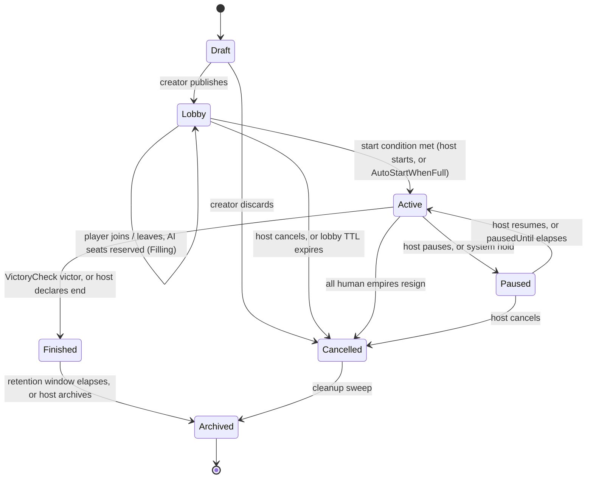

# galaxies-api: Service Specification

**Service Name:** galaxies-api
**Port:** 8080 (local dev)
**Repository Path:** `galaxies-api/`
**Build Phase:** M1 plus M2 (the playable core, then the depth)
**Status:** Planned; docs only, no code yet
**Owner:** Farehard / Galaxies
**Classification:** Galaxies; Internal

---

## 1. Purpose & Scope

galaxies-api is the single public Cloud Run service and the heart of the platform. It is the only component a client (the adapted WinForms desktop app today, a browser client later, an AI worker in either seat) ever talks to directly. It verifies who the caller is, decides which empire in which game the caller owns, brokers Google sign-in into a first-party session, serves the lobby and game-creation surface, accepts orders and returns fog-of-war-correct intel, runs the turn clock that decides when a year generates, and dispatches the heavy generation to the private `galaxies-turngen` service. It is the server-side authority that replaces Stars! Nova's shared-folder file exchange (`<race>.orders` / `<race>.intel`) and its slot-number trust model with account-backed identity and boundary authorization.

Everything the old desktop app trusted locally (the file names carried identity, `OrderReader` compared `ROOT/Turn` and `ROOT/Id`, `NovaConsole` polled a 2.5s timer and generated on a local disk) moves behind this API and becomes server-authoritative. The file boundary survives only as an internal serialization detail: orders and intel are still the existing XML, but they travel inside a JSON envelope over HTTPS, and no client-supplied field (race name, empire id, turn year) is ever trusted for authorization. See GALAXIES-CLOUD-DESIGN.md §C (identity), §D (scheduling), §E (protocol).

**Out of scope for v1:**

- Native-JSON DTOs for the 24k-line domain model. v1 carries the existing XML in a `body` field (see §7); native JSON is deferred behind content negotiation.
- Streaming transport (WebSockets, gRPC, SSE). Async play-by-email cadence is request/response with polling and optional long-poll (see §6.5).
- The turn engine itself. `TurnGenerator.Generate()`, `ScanStep`, `IntelWriter`, `VictoryCheck` run in `galaxies-turngen`; galaxies-api only decides *when* to generate and dispatches the job (see §8).
- AI move computation. Built-in, plug-in, and LLM AIs run in `galaxies-ai`; the API only authenticates them as participants (see §4) and enqueues takeover turns (see §8.5).
- Email, push, and in-app notification *delivery*. galaxies-api emits events to Pub/Sub; `galaxies-notifier` delivers them (see §8, §10).
- Payments and billing. Free, ad-supported; the abuse floor is `email_verified` Google accounts plus rate limits (see §10), not paywalls.
- Map generation's `System.Drawing` decoupling. That blocker lives with `galaxies-turngen` and the platform track; the API only calls `POST /games/{id}/start`, which the worker fulfils.

---

## 2. High-Level Architecture

### 2.1 Components

- **API host** (`galaxies-api/src/`). ASP.NET Core minimal-API on .NET 10, stateless, scale to zero. Handles all public REST, the auth broker, the boundary-authorization layer (R1 to R7), the lobby, orders/intel I/O against GCS, the turn-clock decision logic, and the internal OIDC-gated endpoints that Cloud Tasks and Cloud Scheduler call.
- **Firestore (native mode)** in project `roybot`. One store for everything: accounts (`users/{google_sub}`), game control docs (`games/{gameId}` = GameMeta), seats (`games/{gameId}/members/{empireId}`), AI credentials, refresh tokens, audit events. Cloud SQL is not used (resolved decision; do not reintroduce Postgres). See §5.
- **GCS blob storage**, three private buckets (uniform access, public-access-prevention enforced): `roybot-galaxies-state` (the heavy `ServerData` XML and per-year backups, written only by turngen, never read by the API), `roybot-galaxies-orders` (one `.orders` object per game/empire/turn), `roybot-galaxies-intel` (one `.intel` object per game/empire/turn). Intel and orders are never public; they leave only through this API under per-empire authorization (R5, R4).
- **galaxies-turngen** (private, ingress=internal, port 8081, code scaffolded under `ServerHost/`). The generation worker. galaxies-api enqueues a Cloud Tasks task that invokes it with a Cloud Run OIDC identity token; it loads `ServerData`, runs `TurnGenerator.Generate()`, writes intel and state, and advances GameMeta. See §8.
- **galaxies-ai** (private, ingress=internal, port 8082). Runs AI seats and missed-turn takeovers. Invoked by galaxies-api / the generation pre-phase with OIDC tokens.
- **galaxies-notifier** (private, ingress=internal, port 8083). Subscribes to Pub/Sub and delivers email/push/in-app. galaxies-api never sends mail; it publishes events.
- **galaxies-web** (static, no port). The future browser client; a third `ITurnTransport` over the same `/v1` surface.
- **Firebase Authentication (Identity Platform)** in project `roybot`, Google provider only. Brokers Google sign-in; galaxies-api verifies the resulting ID token and mints its own first-party session (see §4.1).
- **Pub/Sub topics** `turn-generated`, `game-created`, `deadline-approaching`. galaxies-api and turngen publish; galaxies-notifier subscribes.
- **Cloud Tasks** queue for per-game deadline tasks (`gen-{gameId}-{turnYear}`) plus a one-minute **Cloud Scheduler** sweep backstop that drives the nested `jobs/deadline-sweeper` Cloud Run Job (see §2.4, §8.4).

### 2.2 Request / turn flow (the main path)

The full "player submits, everyone is in, turn generates" path:

1. Client holds a first-party session JWT (minted at sign-in, §4.1). It composes an entire turn offline against the last-fetched `Intel`, then `PUT /v1/games/{gameId}/orders` with the gzip+base64 orders XML in a JSON envelope.
2. galaxies-api runs R1 (valid session) then R2 (active membership) then R3 (derive the caller's `empireId` from the seat, never from the body). It parses the XML through the `CommandRegistry` into real `ICommand` objects, runs each `ICommand.IsValid`, and cross-checks the envelope `turnYear` against `games/{gameId}.turnYear` (R4). Valid orders are gzipped to `roybot-galaxies-orders/orders/{gameId}/{turnYear}/{empireId}.orders.xml.gz`.
3. Client calls `POST /v1/games/{gameId}/orders/submit` to mark the turn final. galaxies-api sets the seat's submitted mirror, adds `empireId` to `games/{gameId}.submittedEmpireIds`, zeroes `consecutiveMisses[empireId]`, and calls `evaluateGeneration(deadlineReached=false)` inside a Firestore transaction (see §8.3).
4. If every active empire is in and `now >= minReleaseAt` (early generation), or the deadline task fires and quorum holds, `evaluateGeneration` acquires the `generationLock` in the same transaction and, outside the transaction, enqueues a Cloud Tasks task carrying `(gameId, turnYear, lockToken)` targeting `galaxies-turngen POST /generate` with an OIDC token.
5. galaxies-turngen re-validates the lock, runs the D.2 missed-turn pre-phase (idle empires resolve to HoldOrders, or an AI-takeover task to galaxies-ai), ingests all `.orders`, runs `TurnGenerator.Generate()` seeded from `hash(MasterSeed, turnYear)`, runs `VictoryCheck.Victor()`, persists `ServerData` and per-empire `.intel`, then advances GameMeta (`turnYear += 1`, `turnStartedAt = now`, recompute `deadlineAt`/`minReleaseAt`, clear `submittedEmpireIds`, arm a fresh `gen-{gameId}-{turnYear}` task, release the lock).
6. turngen publishes `turn-generated` to Pub/Sub; galaxies-notifier emails / pushes "your turn is ready".
7. The client's next `GET /v1/games/{gameId}/status` (60s poll, on focus, on manual refresh, or a `?wait=` long-poll held open) sees `turnYear` advanced; it calls `GET /v1/games/{gameId}/intel`, and galaxies-api returns only that caller's empire view (R5) from `roybot-galaxies-intel`.

Deadline path (nobody submits): the armed `gen-{gameId}-{turnYear}` Cloud Tasks task fires at `deadlineAt + GracePeriod`, calls `POST /internal/deadline-fire` (OIDC), which runs `evaluateGeneration(deadlineReached=true)`; unsubmitted empires are handled by the escalation ladder (§8.5), not waited on. The one-minute sweep (§8.4) re-arms any game whose task was lost.

### 2.3 GCP Topology

| Concern | Setting |
|---|---|
| Project / region | `roybot` / `us-central1` |
| Runtime | Cloud Run, container from `us-central1-docker.pkg.dev/roybot/roybot-galaxies/galaxies-api`, .NET 10 |
| Ingress | `all` (public; reachable by desktop and browser clients over TLS/443). Cloud Armor rate-limit + bot policies in front (see §10). |
| Authentication | Public routes verify a first-party session JWT or an `AgentCredential`; the API itself verifies Google ID tokens at `/auth/*`. Internal routes (`/internal/*`) verify a Cloud Run OIDC identity token with audience = this service and `email == INTERNAL_INVOKER_SA`. Galaxies uses GCP-native OIDC for internal auth; there is no shared HMAC secret. |
| Scale | `--min-instances=0 --max-instances=<n>`, scale to zero; `--cpu-boost` for cold-start on the sign-in path. |
| Concurrency | Default 80 per instance (stateless). Long-poll (`?wait=`) requests hold an instance; keep them under the Cloud Run request timeout. |
| Request timeout | Raised to accommodate `?wait=` long-poll (Cloud Run allows up to 60 minutes); default `wait` cap is 30s (see §6.5). |
| Egress | `--network=<vpc> --subnet=<subnet> --vpc-egress=private-ranges-only` to reach the internal `galaxies-turngen` / `galaxies-ai` / `galaxies-notifier` services and Firestore/GCS/Tasks. |
| Outbound service-to-service | galaxies-api mints an OIDC identity token from the metadata server (audience = target Cloud Run URL) for every call to a private service and for the OIDC token attached to Cloud Tasks. It holds `roles/run.invoker` on turngen and ai. |
| Secrets | Secret Manager: `galaxies-session-jwt-key` (signs the first-party JWT, rotated), `galaxies-master-seed-pepper` (optional pepper for seat-seed hashing). Firebase Admin uses the runtime SA. |
| Observability | Cloud Logging + Cloud Monitoring + Error Reporting; structured logs carry `gameId`, `empireId`, `turnYear`, `requestId`. |

### 2.4 Repository Layout

One folder per microservice; each service and each nested job ships its own `cloudbuild.yaml` and `Dockerfile`. Cloud Build triggers are wired per-subdirectory in the Console wizard (no monolithic Dockerfile, no shared build context), matching the platform-wide convention.

```
galaxies-api/                        # the public API gateway (ASP.NET Core, .NET 10)
├── src/
│   ├── Program.cs                   # host, middleware pipeline, feature-flag gate
│   ├── Auth/
│   │   ├── GoogleIdTokenVerifier.cs # verify iss/aud/exp/email_verified
│   │   ├── FirebaseBroker.cs        # Firebase Admin: verify + revoke
│   │   ├── SessionJwt.cs            # mint/verify first-party JWT (accountId, roles)
│   │   ├── RefreshTokenStore.cs     # rotating opaque refresh, reuse detection
│   │   └── OidcInboundHandler.cs    # verify Cloud Tasks / Scheduler / worker OIDC
│   ├── Identity/
│   │   ├── AccountStore.cs          # users/{google_sub}
│   │   ├── MembershipStore.cs       # games/{gameId}/members/{empireId}
│   │   └── AgentCredentialStore.cs  # agentCredentials/{credentialId}
│   ├── Authz/
│   │   └── BoundaryRules.cs         # R1..R7, evaluated before any command/intel moves
│   ├── Endpoints/
│   │   ├── AuthEndpoints.cs         # /auth/*, /me
│   │   ├── GameEndpoints.cs         # games CRUD, settings
│   │   ├── LobbyEndpoints.cs        # join/leave/players/start
│   │   ├── OrderEndpoints.cs        # PUT/GET/DELETE orders, submit
│   │   ├── IntelEndpoints.cs        # intel GET (current + past)
│   │   ├── StatusEndpoints.cs       # status + long-poll
│   │   ├── HistoryEndpoints.cs      # turns index + per-turn metadata
│   │   ├── HostEndpoints.cs         # force-generate, pause/resume, extend, kick
│   │   ├── AdminEndpoints.cs        # moderation, roles, review queue
│   │   └── InternalEndpoints.cs     # /internal/deadline-fire, /internal/sweep, /internal/turn-complete
│   ├── Clock/
│   │   ├── GameMeta.cs              # the fast scheduling mirror doc
│   │   ├── EvaluateGeneration.cs    # the one decision funnel (§8.3)
│   │   ├── DeadlineTasks.cs         # arm/cancel gen-{gameId}-{turnYear}
│   │   ├── GenerationLock.cs        # Firestore turnYear+lock transaction
│   │   └── MissedTurnLadder.cs      # escalation ladder (§8.5)
│   ├── Protocol/
│   │   ├── Envelope.cs              # JSON envelope, gzip+base64 body (§7)
│   │   └── CommandRegistry.cs       # ICommandFactory registry, replaces OrderReader switch
│   ├── Storage/
│   │   ├── GcsOrders.cs             # roybot-galaxies-orders
│   │   └── GcsIntel.cs              # roybot-galaxies-intel
│   └── Clients/
│       ├── TurngenClient.cs         # OIDC -> galaxies-turngen /generate
│       ├── AiClient.cs              # OIDC -> galaxies-ai
│       └── NotifierPublisher.cs     # Pub/Sub publish (turn-generated, game-created, deadline-approaching)
├── Dockerfile
├── cloudbuild.yaml
├── spec.md
├── api.md
├── RUNBOOK.md                       # populated when the first deploy lands
└── questions.md                     # forward-looking dev-team forks

galaxies-api/jobs/                   # Cloud Run Jobs, Cloud Scheduler-driven, each independently deployable
├── deadline-sweeper/                # 1-min backstop: re-arm any game whose deadline task was lost (§8.4)
│   ├── Dockerfile
│   └── cloudbuild.yaml
├── lobby-reaper/                    # LobbyTimeToLive expiry: Lobby -> Cancelled (§8.6)
│   ├── Dockerfile
│   └── cloudbuild.yaml
└── retention-sweeper/              # Finished/Cancelled -> Archived after the retention window (§8.6)
    ├── Dockerfile
    └── cloudbuild.yaml
```

Each `jobs/<name>/` folder is a separate Cloud Build trigger against that subdirectory. The deadline-sweeper is the primary backstop the task calls out; lobby-reaper and retention-sweeper drive the two system-triggered lifecycle transitions (§8.6).

---

## 3. Configuration & Feature Flags

Every feature ships dark behind a substitution. With the master flag off the service still boots and serves `/healthz` and `/version`, but gated reads return `{"disabled":true}` and gated mutations return `403 FEATURE_DISABLED` until the flag is flipped. Sub-features are independently dark so the staged rollout (§12) can arm them one at a time.

### 3.1 Switches (all ship OFF)

| Where (trigger) | Switch | Off state | On state |
|---|---|---|---|
| galaxies-api | `_GALAXIES_API_ENABLED` | all `/v1/*` reads `{"disabled":true}`, mutations `403`; `/healthz`, `/version` still live | service live; `/auth/*` and `/me` become reachable |
| galaxies-api | `_GALAXIES_AUTH_ENABLED` | `/auth/*` and `/me` return `403` | Google sign-in, session mint, refresh, logout live |
| galaxies-api | `_GALAXIES_LOBBY_ENABLED` | games CRUD / join / leave / roster reads `{"disabled":true}`, mutations `403` | lobby and game creation live |
| galaxies-api | `_GALAXIES_ORDERS_ENABLED` | `PUT/GET/DELETE /orders`, `/orders/submit` return `403` | order write, read, submit live |
| galaxies-api | `_GALAXIES_INTEL_ENABLED` | `GET /intel` and `/intel/{turnYear}` return `{"disabled":true}` | intel read live |
| galaxies-api | `_GALAXIES_CLOCK_ENABLED` | no deadline task armed; `evaluateGeneration` no-ops; `force-generate` / `extend` / `pause` / `resume` return `403`; `/internal/deadline-fire` and `/internal/sweep` accept-and-drop | deadline arming, auto-generate, force-generate, and the sweep are live |
| galaxies-api | `_GALAXIES_ADMIN_ENABLED` | admin and moderation routes return `403` | moderation, role assignment, review queue live |
| galaxies-api | `_GALAXIES_LONGPOLL_ENABLED` | `?wait=` ignored; status returns immediately | long-poll held open up to the `wait` cap |

`_GALAXIES_CLOCK_ENABLED` is the load-bearing one: with it off, games can be created and orders submitted, but no year ever generates automatically (a host with `force-generate` also blocked). Flip it only after the orders/intel round-trip smokes clean (§12).

### 3.2 Environment variables

| Env var | Example / default | Purpose |
|---|---|---|
| `GCP_PROJECT` | `roybot` | Project id for Firestore, GCS, Tasks, Pub/Sub. |
| `GCP_REGION` | `us-central1` | Region for Cloud Tasks queue and service URLs. |
| `FIREBASE_PROJECT_ID` | `roybot` | Firebase Admin token verification. |
| `FIRESTORE_DATABASE` | `(default)` | Native-mode database id. |
| `STATE_BUCKET` | `roybot-galaxies-state` | Read by turngen only; the API never reads it. |
| `ORDERS_BUCKET` | `roybot-galaxies-orders` | Orders objects (R4 write path). |
| `INTEL_BUCKET` | `roybot-galaxies-intel` | Intel objects (R5 read path). |
| `TASKS_QUEUE` | `projects/roybot/locations/us-central1/queues/galaxies-turnclock` | Deadline and generation tasks. |
| `TURNGEN_URL` | `https://galaxies-turngen-<PROJECT_NUMBER>.us-central1.run.app` | OIDC audience for generation dispatch. |
| `AI_URL` | `https://galaxies-ai-<PROJECT_NUMBER>.us-central1.run.app` | OIDC audience for AI-takeover tasks. |
| `TOPIC_TURN_GENERATED` | `projects/roybot/topics/turn-generated` | Pub/Sub publish target. |
| `TOPIC_GAME_CREATED` | `projects/roybot/topics/game-created` | Pub/Sub publish target. |
| `TOPIC_DEADLINE_APPROACHING` | `projects/roybot/topics/deadline-approaching` | Pub/Sub publish target (reminder fanout). |
| `SESSION_JWT_KEY` | `projects/roybot/secrets/galaxies-session-jwt-key` | Signs/verifies the first-party JWT (mounted secret). |
| `MASTER_SEED_PEPPER` | `projects/roybot/secrets/galaxies-master-seed-pepper` | Optional pepper folded into per-seat seed hashing. |
| `INTERNAL_INVOKER_SA` | `galaxies-scheduler-sa@roybot.iam.gserviceaccount.com` | The only SA whose OIDC tokens `/internal/*` accepts. |
| `SESSION_TTL_MINUTES` | `60` | First-party JWT lifetime. |
| `REFRESH_TTL_DAYS` | `30` | Sliding refresh-token lifetime. |
| `STATUS_WAIT_MAX_SECONDS` | `30` | Cap on `?wait=` long-poll. |

The upstream service URLs are pinned to real `*-<PROJECT_NUMBER>.us-central1.run.app` hostnames in `cloudbuild.yaml`, never an `*.internal` placeholder (it will not resolve). Verify the flags landed on the deployed revision after deploy (§12), because a substitution without a matching `--set-env-vars` entry is a silent no-op.

---

## 4. Identity, Authentication & Authorization

This section replaces slot-only identity (`PlayerSettings.PlayerNumber`, `EmpireData.Id`) and the file-boundary trust model (order and intel files keyed by `Race.Name`) with account-backed identity, and retires the inert MD5 race password entirely. The guiding rule: identity comes from a verified bearer token, and empire ownership comes from a server-side membership lookup. No client-supplied field is trusted for authorization; those become defense-in-depth cross-checks only. Full per-field storage layout is in §5; this section covers the flows and the rules. See GALAXIES-CLOUD-DESIGN.md §C.

### 4.1 Sign-in: Firebase broker, first-party JWT, rotating refresh

Google/Gmail sign-in is brokered through **Firebase Authentication (Identity Platform)** with the Google provider enabled. galaxies-api verifies the incoming Google/Firebase ID token and mints its own first-party session, so the desktop client, the future web client, and AI workers all converge on one uniform bearer token. Firebase is used only to issue and verify tokens; game authorization never lives in client-side Firebase rules.

| Concern | Decision |
|---|---|
| Desktop sign-in | OAuth 2.0 authorization-code with PKCE and a loopback redirect (RFC 8252). The WinForms client opens the system browser, catches the code on `http://127.0.0.1:<ephemeral-port>`, exchanges it for a Google ID token, then `POST /v1/auth/google`. No embedded webview, no client secret. |
| Web sign-in (future) | Firebase JS SDK `signInWithPopup(GoogleAuthProvider)`; the web app posts the Firebase ID token to `POST /v1/auth/google`; the session is delivered as an HttpOnly, Secure, SameSite=Lax cookie so browser JS never handles the token. |
| ID token verification | galaxies-api verifies signature, `iss`, `aud`, `exp`, and `email_verified` on every `/auth/google` call. An unverified token is never trusted. |
| First-party session | A Galaxies session JWT, ~60 minute TTL (`SESSION_TTL_MINUTES`), signed with `SESSION_JWT_KEY` from Secret Manager (rotated). Claims: `accountId` (the `google_sub`), `roles`, `iat`, `exp`. Stateless verification on every request. |
| Refresh | An opaque refresh token, ~30 day sliding TTL, stored server-side hashed and rotated on every use; reuse of a retired token revokes the whole chain (replay defense). Desktop sends it in a header; web keeps it in the cookie. `POST /v1/auth/refresh`. |
| Revocation / logout | `POST /v1/auth/logout` deletes the server-side refresh record; the short session TTL bounds the window. Firebase token revocation is available for a hard kill. |
| AI and system workers | Do not use Google. Each AI seat presents a server-minted `AgentCredential` (see §5) as a bearer token against the same API. This is how the open AI-participant contract authenticates. |
| Retired MD5 password | There are no passwords anywhere; Google is the only human credential and `AgentCredential` the only AI credential. `Common/PasswordUtility.cs`, `ControlLibrary/CheckPassword.cs`, `Race.Password`, and the `-p` CLI argument are dead; the race loader stays tolerant of a stray `Password` element but never reads it for any auth decision. |

Internal service-to-service auth is entirely separate: Cloud Tasks, Cloud Scheduler, and the generation worker call `/internal/*` with a Cloud Run OIDC identity token whose audience is this service and whose SA email matches `INTERNAL_INVOKER_SA`. There is no HMAC header pattern here.

### 4.2 The identity entities

Three entities carry identity; full field detail in §5.

- **Account** (`users/{google_sub}`). The human. One document per Google identity; `google_sub` is the stable key, never the email. Created on first sign-in.
- **GameMembership** (`games/{gameId}/members/{empireId}`). The seat. Binds one account (or one AI agent) to exactly one empire slot (`EmpireData.Id`, 1 to 127, 0 reserved) in one game. This replaces `PlayerSettings` (race plus Human/AI) and the slot number as identity.
- **AgentCredential** (`agentCredentials/{credentialId}`). The bearer credential for an AI seat, so built-in C#, plug-in, and LLM AIs authenticate as participants without a Google account.

One account, many games (many `members` docs across games, found by a collection-group query on `accountId`). Each seat is exactly one account or one AI agent, enforced by the `members/{empireId}` document key (one seat per empire) plus a transactional reverse-index check (one seat per human per game). `race_name` remains for display and for the internal per-empire object naming, but it is no longer an identity or authorization key.

### 4.3 Boundary authorization rules R1 to R7

Every game action goes through galaxies-api. The old checks in `OrderReader.ReadPlayerTurn` (comparing `ROOT/Turn` to `turnYear`, `ROOT/Id` to `empire.Id`) and the per-file split in `IntelWriter.WriteIntel` are replaced by these rules, evaluated in `Authz/BoundaryRules.cs` before any command reaches turngen or any intel leaves the server.

| Rule | Statement | Failure |
|---|---|---|
| **R1 Authenticated** | The request carries a valid, unexpired session JWT (human) or `AgentCredential` (AI). | `401` |
| **R2 Member of this game** | A `members/{empireId}` doc exists binding `(gameId, caller)` with `seat_status = active`. | `403` |
| **R3 Owns this empire** | The server derives `empireId` from the membership; the caller never names it. A client-supplied empire id or race name is compared and, on mismatch, rejected (not corrected). | `403` |
| **R4 Orders write, own empire only** | `PUT /orders` applies commands only to the caller's `empireId`. The server stamps the turn year; a submitted `turnYear != games/{gameId}.turnYear` is rejected. Malformed or out-of-vocabulary commands are rejected at parse via the `CommandRegistry` (replacing the hardcoded `OrderReader` switch, §7). | `409` wrong year, `400` bad command |
| **R5 Intel read, own empire only** | `GET /intel` returns only the caller's empire view from `roybot-galaxies-intel`, produced by turngen's `ScanStep` / per-empire `EmpireData` split. No empire's `.intel` is ever addressed by public race name or handed to a non-owner. | `403` / `404` |
| **R6 Turn state, own empire only** | `TurnSubmitted` / `LastTurnSubmitted` mirrors are read and set only for the caller's empire. | `403` |
| **R7 Admin override** | An account with role `admin` or `moderator` may read game-level metadata and perform the moderation actions in §10, logged to `auditEvents`. Admins do not read a live player's private intel except through an explicitly logged support action. | `403` if role absent |

Because authorization lives at the boundary and reads membership from Firestore, the file boundary (`<empire>.orders`, `<empire>.intel`) is an internal serialization detail behind the API, not a security boundary. The client never trusts, writes, or names those objects directly.

### 4.4 Account lifecycle

| Stage | Behavior |
|---|---|
| Sign-up | First `/auth/google` for a new `google_sub` creates the `Account`, seeding `email`, `email_verified`, and `display_name` from the Google profile. No separate registration. |
| Display name | Editable by the owner, shown to other players in place of email. Not globally unique; disambiguate with a short handle. Light profanity/impersonation filter. |
| Joining a game | Creating a `members/{empireId}` doc for `(gameId, accountId)`; picks or is assigned an `empireId` and a race. This is where `GameInitialiser.Initialize` inputs are sourced from accounts instead of a local `List<PlayerSettings>`. |
| Data export (DSAR) | `GET /v1/account/export` returns a JSON bundle: profile, memberships, and per game the account's own submitted orders history and current empire intel. It never exports another player's private view. |
| Account deletion (DSAR) | `DELETE /v1/account` soft-deletes: set `status = deleted`, null `email`/`display_name`/`avatar_url`, break the `google_sub` link (store an irreversible tombstone so the same identity cannot silently reclaim the record), purge `refreshTokens`, revoke Firebase tokens, retain anonymized `auditEvents`. |
| Empires on deletion | Each active seat is marked `handed_off` and detached; the empire persists as an ownerless seat labeled "Deleted player." What happens next (AI takeover, elimination) is scheduling's decision (§8.5). The guarantee here: the account and its PII are gone, and the game's `EmpireData` (a `ushort` slot) survives without dangling references, consistent with `ServerData.LinkServerStateReferences()` re-wiring by key. |

---

## 5. Data Model (Firestore, native mode)

One Firestore database in `roybot` holds everything: identity, seats, the game control doc, credentials, refresh tokens, and audit. Documents are small and low-write-contention; the heavy `ServerData` XML never lives here (it is a GCS blob, written only by turngen). Timestamps are UTC. See GALAXIES-CLOUD-DESIGN.md §C, §D.

### 5.1 `users/{google_sub}` (Account)

| Field | Type | Notes |
|---|---|---|
| `accountId` | string | Equals `google_sub`; the stable key, never the email. |
| `email` | string | Verified Gmail; contact/recovery PII, not shown to other players by default. |
| `emailVerified` | bool | Must be true to act (abuse floor, §10). |
| `displayName` | string | Editable; shown to others. |
| `avatarUrl` | string | From the Google profile. |
| `roles` | array<string> | `player` (default), `moderator`, `admin`. |
| `status` | enum | `active` / `suspended` / `deleted`. |
| `createdAt` | timestamp | |
| `tombstone` | string? | Irreversible hash set on deletion; blocks silent reclaim. |

Notification preferences (`emailEnabled`, `pushEnabled`, `perEvent`, `quietHours`, `digestMode`, `unsubscribeToken`) live under `users/{google_sub}/prefs` and are owned by galaxies-notifier; galaxies-api writes only the profile fields above.

### 5.2 `games/{gameId}` (GameMeta, the fast scheduling mirror)

The per-tick scheduling decision must never deserialize the ~73k-line universe. GameMeta is the cheap mirror the API reads and writes; `EmpireData.TurnSubmitted/TurnYear` inside `ServerData` remain authoritative and are reconciled at generation.

| Field | Type | Purpose |
|---|---|---|
| `gameId` | string | Server-issued opaque key. |
| `state` | enum | Lifecycle (§8.6): Draft / Lobby / Active / Paused / Finished / Cancelled / Archived. |
| `turnYear` | int | Mirror of `ServerData.TurnYear` (starts at `Global.StartingYear` = 2100). |
| `masterSeed` | long | `ServerData.MasterSeed`, recorded at creation; per-turn seed = `hash(MasterSeed, turnYear)`, per-seat seed = `hash(MasterSeed, turnYear, empireId)`. Replaces `TurnGenerator`'s unseeded `new Random()`. |
| `hostAccountId` | string | Exactly one host; transferable. |
| `settings` | map | Snapshot of `GameSettings` plus cadence/lobby/missed-turn options (§9). |
| `turnStartedAt` | timestamp | When the current turn opened. |
| `deadlineAt` | timestamp | `turnStartedAt + MaxTimeBetweenTurns`, adjusted for SkipWeekends, extensions, pause credit. |
| `minReleaseAt` | timestamp | `turnStartedAt + MinimumHoldWindow`. |
| `activeEmpireIds` | array<int> | In-quorum empires (human, not resigned, not idle-excluded, not on vacation). |
| `submittedEmpireIds` | array<int> | Empires with `.orders` on file for `turnYear`. |
| `aiEmpireIds` | array<int> | Empires currently played by AI (intended or takeover). |
| `consecutiveMisses` | map<int,int> | Drives the escalation ladder (§8.5). |
| `vacationBudget` | map<int,int> | Remaining vacation days per empire. |
| `pausedUntil` | timestamp? | Set while Paused if timed. |
| `deadlineTaskName` | string | The armed `gen-{gameId}-{turnYear}`; canceled/replaced on extend, pause, generate. |
| `generationLock` | map | `{ token, leaseUntil }`; exactly-once guard (§8.4). |
| `lobbyExpiresAt` | timestamp? | `LobbyTimeToLive`; drives lobby-reaper. |
| `archiveAfter` | timestamp? | Retention window for Finished/Cancelled; drives retention-sweeper. |

### 5.3 `games/{gameId}/members/{empireId}` (GameMembership, the seat)

Keyed by `empireId` so the document key enforces one seat per empire (unique on `(gameId, empireId)`).

| Field | Type | Notes |
|---|---|---|
| `empireId` | int | `EmpireData.Id`, 1 to 127 (0 reserved). |
| `accountId` | string? | Null for AI seats. |
| `principalType` | enum | `human` / `ai_builtin` / `ai_plugin` / `ai_llm`. |
| `agentCredentialId` | string? | Null for humans. |
| `raceName` | string | Display + internal object naming; not an auth key. |
| `isHost` | bool | Mirrors `hostAccountId`. |
| `seatStatus` | enum | `active` / `resigned` / `handed_off` / `eliminated`. |
| `joinState` | enum | `Invited` / `Joined` / `Active` / `Vacation` / `Idle` / `AiTakeover` / `Resigned` (drives quorum and the ladder). |
| `submittedTurnYear` | int | Fast mirror of the submitted year (R6). |
| `ordersEtag` | string? | ETag of the current `.orders` object (concurrency, §6.3). |
| `joinedAt` | timestamp | |

One seat per human per game is enforced transactionally against a reverse index `games/{gameId}/memberIndex/{accountId}`, written in the same transaction as the seat. "List my games" is a collection-group query on `members` where `accountId == caller`.

### 5.4 Other collections

| Collection | Key | Purpose |
|---|---|---|
| `agentCredentials/{credentialId}` | credentialId | `ownerAccountId` (nullable, for community plug-in authors), `kind`, `secretHash`, `status`. Bearer credential for an AI seat. |
| `refreshTokens/{tokenId}` | tokenId | `accountId`, `tokenHash`, `chainId`, `expiresAt`, `revokedAt`. Server-side refresh with rotation and reuse detection. |
| `auditEvents/{eventId}` | eventId | `accountId`, `gameId`, `type` (login, order_submit, join, resign, admin_action, dsar_export, support_read), `ip`, `ua`, `at`. Anti-cheat and moderation trail; append-only; anonymized-retained on account deletion. |

### 5.5 GCS object layout

| Bucket | Object key | Written by | Read by |
|---|---|---|---|
| `roybot-galaxies-state` | `state/{gameId}/current.xml`; `state/{gameId}/{turnYear}/serverdata.xml` | turngen | turngen only (never the API) |
| `roybot-galaxies-orders` | `orders/{gameId}/{turnYear}/{empireId}.orders.xml.gz` | galaxies-api (R4) | turngen (`OrderReader.ReadOrders`) |
| `roybot-galaxies-intel` | `intel/{gameId}/{turnYear}/{empireId}.intel.xml.gz` | turngen (`IntelWriter`) | galaxies-api (R5) |

All three buckets are private with uniform access and public-access-prevention enforced. Intel and orders never go public; the API is the only path, gated by R4/R5.

---

## 6. Endpoint Catalog

Base path `https://<galaxies-api-url>/v1`. All calls except `/auth/*`, `/version`, and `/healthz` require a Bearer session JWT or `AgentCredential`. `{gameId}` is a server-issued opaque id; the server derives the caller's `empireId` from session plus membership (R3), so the client never asserts its own identity in the body. The "Maps to" column names the pre-cloud file-boundary construct each endpoint replaces.

### 6.1 Auth & identity

| Method + path | Purpose | Maps to |
|---|---|---|
| `POST /auth/google` | Exchange a Google/Firebase ID token for a session JWT plus rotating refresh token | new (no auth existed) |
| `POST /auth/refresh` | Rotate the refresh token and mint a fresh session JWT | new |
| `POST /auth/logout` | Revoke the current refresh chain | new |
| `GET /me` | Current profile (google_sub, display name, roles, joined/owned games) | new |
| `PATCH /me` | Edit display name / avatar | new |
| `GET /account/export` | DSAR bundle (profile, memberships, own orders history, own intel) | new |
| `DELETE /account` | Soft-delete the account (§4.4) | new |

### 6.2 Games CRUD & lobby

| Method + path | Purpose | Maps to |
|---|---|---|
| `GET /games` | List games; `?scope=mine|open|public|finished` | new (no lobby existed) |
| `POST /games` | Create a game; body is the full options set (§9) | `NewGameWizard` + `GameInitialiser`; `GameSettings` |
| `GET /games/{gameId}` | Summary: state, turn year, deadline, roster, settings snapshot | new |
| `GET /games/{gameId}/settings` | Full `GameSettings` (victory, map, cadence) | `.settings` XML |
| `PATCH /games/{gameId}/settings` | Host edits settings before start | `GameSettings` fields |
| `DELETE /games/{gameId}` | Host abandons/deletes the game | new |
| `POST /games/{gameId}/join` | Join an open slot with a chosen race (upload/select a `.race`) | `PlayerSettings` (RaceName, PlayerNumber), `.race` file |
| `POST /games/{gameId}/leave` | Leave before start | new |
| `GET /games/{gameId}/players` | Roster: per empire the race, Human/AI, and current-turn `submitted` flag | `PlayerSettings` list + `EmpireData.TurnSubmitted` |
| `POST /games/{gameId}/players/ai` | Host adds an AI participant (built-in, plug-in, or LLM) via the open AI contract | `PlayerSettings.AiProgram` |
| `DELETE /games/{gameId}/players/{empireId}` | Host removes a player/AI before start | new |
| `POST /games/{gameId}/start` | Host starts: lock lobby, run map/empire init, emit turn-2100 intel | `GameInitialiser.Initialize`, `StarMapInitialiser` |

### 6.3 Orders

| Method + path | Purpose | Maps to |
|---|---|---|
| `PUT /games/{gameId}/orders` | Create/replace the caller's draft orders for the current turn; idempotent by turn year; validates turn-year, empire, and each `ICommand.IsValid` | `OrderWriter.WriteOrders`; validated by `OrderReader.ReadPlayerTurn` |
| `GET /games/{gameId}/orders` | Read back the caller's current draft/submitted orders | new (was implicit in the file) |
| `POST /games/{gameId}/orders/submit` | Mark the turn final; sets `TurnSubmitted`, may trigger early generation when the last empire submits | `EmpireData.TurnSubmitted`; NovaConsole autoGenerate check |
| `DELETE /games/{gameId}/orders` | Unsubmit / clear before the deadline | new |

`PUT` is the forgiving, retry-safe draft write (idempotent by `(gameId, empireId, turnYear)`); `submit` is the one intentional state transition that can trip generation. An `ETag` on the orders resource plus `If-Match` guards two devices from clobbering each other's draft.

### 6.4 Intel

| Method + path | Purpose | Maps to |
|---|---|---|
| `GET /games/{gameId}/intel` | The caller's current-turn intel, fog-of-war correct, one empire's view | `IntelWriter.WriteIntel` output; read by `IntelReader.ReadIntel` |
| `GET /games/{gameId}/intel/{turnYear}` | The caller's intel for a past turn (replay/history) | per-turn backups in `GameFolder/<year>/` |

Intel for a resolved turn is immutable, so `GET /intel` is cacheable per turn (`ETag` / `If-None-Match`) to cut bandwidth on repeated polls.

### 6.5 Status & history

| Method + path | Purpose | Maps to |
|---|---|---|
| `GET /games/{gameId}/status` | Turn year, deadline timestamp, generation state (`open` / `generating` / `complete`), who has submitted; supports `?wait=<sec>` long-poll | NovaConsole poll loop |
| `GET /games/{gameId}/turns` | History index: resolved turn years with timestamps | `GameFolder/<year>/` listing |
| `GET /games/{gameId}/turns/{turnYear}` | Metadata for one resolved turn (pointer to that turn's intel for replay) | per-turn backup |

`?wait=<sec>` (capped at `STATUS_WAIT_MAX_SECONDS`, gated by `_GALAXIES_LONGPOLL_ENABLED`) holds the request open and returns early when the turn generates. This replaces NovaConsole's 2.5s WinForms timer, which was tuned for a local disk, not a WAN; the client default poll is 60s, on focus, and on manual refresh.

### 6.6 Host & admin actions

Each host control is an authenticated action on GameMeta, audited (see §8.1 for effects, §10 for admin roles).

| Method + path | Purpose | Maps to |
|---|---|---|
| `POST /games/{gameId}/force-generate` | Host forces generation now, applying the missed-turn policy to unsubmitted empires | NovaConsole manual GenerateTurn |
| `POST /games/{gameId}/extend-deadline` | Host pushes `deadlineAt` out and reschedules the task | new |
| `POST /games/{gameId}/pause` | Host pauses; cancel the pending deadline task; no clock runs | new |
| `POST /games/{gameId}/resume` | Host resumes; recompute `deadlineAt`, re-arm the task | new |
| `POST /games/{gameId}/transfer-host` | Transfer host to another player | new |
| `POST /games/{gameId}/vacation` | Player spends a vacation day (excluded from quorum, never a miss) | new |
| `POST /admin/games/{gameId}/kick` | Moderator/host marks an empire resigned or open, optionally hands to AI | new |
| `POST /admin/accounts/{accountId}/suspend` | Moderator suspends an account | new |
| `POST /admin/accounts/{accountId}/roles` | Admin assigns roles (`player`/`moderator`/`admin`) | new |
| `GET /admin/review-queue` | Collusion/abuse review queue (flagged, human-decided) | new |
| `POST /admin/games/{gameId}/support-read` | Explicit, logged read of a player's view (never silent) | new |

### 6.7 Meta & internal

| Method + path | Auth | Purpose |
|---|---|---|
| `GET /version` | none | API version, protocol version, `minClientVersion` |
| `GET /healthz` | none | Liveness/readiness (Cloud Run) |
| `POST /internal/deadline-fire` | OIDC (`INTERNAL_INVOKER_SA`) | Cloud Tasks deadline callback; runs `evaluateGeneration(deadlineReached=true)` (§8.3) |
| `POST /internal/sweep` | OIDC | Backstop entry the deadline-sweeper job may also call; re-arm lost deadline tasks (§8.4) |
| `POST /internal/turn-complete` | OIDC | turngen callback after a generation; reconcile GameMeta and publish `turn-generated` if the worker did not |

The old `OrderReader` identity checks stay server-side and become HTTP codes: wrong turn year is `409`, empire mismatch is `403`, unknown command `Type` is `400`, turn already generated is `410`. They are load-bearing and must not move to the client. See §7 for the error catalog.

---

## 7. The Wire Protocol: JSON Envelope & CommandRegistry

The file boundary is already a per-player wire protocol; we lift the existing one onto HTTPS and give it an envelope and a registry rather than inventing a new one. Transport is REST/JSON over HTTPS with client polling; no streaming (see GALAXIES-CLOUD-DESIGN.md §E).

### 7.1 The envelope

The existing per-empire `Nova.Common.Intel` and the `ICommand` set (`WaypointCommand`, `ResearchCommand`, `DesignCommand`, `ProductionCommand`, `RenameFleetCommand`) already have symmetric `ToXml(XmlDocument)` / `XmlNode`-constructor pairs that are tested and correct. v1 carries that XML in a `body` field so the client keeps calling `new Intel(xmldoc)` and `command.ToXml(xmldoc)` byte-for-byte, with zero semantic drift in the domain model on day one. It also sidesteps the `using System.Drawing;` coupling inside `Intel.cs` that a naive JSON serializer would trip over.

Intel response:

```
GET /v1/games/{id}/intel  ->  200
{
  "protocolVersion": "1",
  "gameId": "...",
  "turnYear": 2101,
  "empireId": 1,
  "contentType": "application/vnd.nova.intel+xml",
  "encoding": "gzip+base64",
  "body": "<base64 of gzipped <Intel>...</Intel>>"
}
```

Orders request:

```
PUT /v1/games/{id}/orders
{
  "protocolVersion": "1",
  "turnYear": 2101,
  "empireId": 1,
  "contentType": "application/vnd.nova.orders+xml",
  "encoding": "gzip+base64",
  "body": "<base64 of gzipped <Orders><Command Type=\"Waypoint\">...</Orders>>"
}
```

The server still parses the XML into real `ICommand` objects and runs `IsValid` / `ApplyToState`; the XML is a transport encoding, not an opaque blob. `turnYear` and `empireId` are read from the envelope and cross-checked against the parsed body and the session, exactly as `OrderReader` cross-checks today. Native-JSON DTOs are deferred and selected later by `Accept: application/json`; the `contentType` and `protocolVersion` fields make that a per-request negotiation, not a flag day, so the browser client can move to JSON without forcing the desktop client off XML.

### 7.2 The CommandRegistry

The worst extensibility blocker in the boundary is the hardcoded `switch (subnode.Attributes["Type"].Value...)` in `OrderReader.ReadPlayerTurn`, duplicated in weaker form inside `ClientData`'s XML constructor. It is replaced by a registry so new command types (and the open AI contract's community/LLM commands) drop in without editing a switch.

- Add `ICommandFactory` and a static `CommandRegistry` in `Nova.Common.Commands`: a `Dictionary<string, Func<XmlNode, ICommand>>` keyed by the lowercased `Type` string (`"waypoint"`, `"research"`, ...). A parallel `Func<JToken, ICommand>` map is added when native JSON lands.
- Each command self-registers, either via a `[Command("waypoint")]` attribute discovered by a one-time reflection scan of loaded assemblies at startup, or via explicit registration in a static initializer. The attribute path is what makes a community/plug-in AI assembly pluggable (drop the DLL, it registers its own command types).
- `OrderReader.ReadPlayerTurn`, `OrderWriter` (round-trip validation), and the `ClientData` XML constructor all call `CommandRegistry.Create(type, node)` instead of switching. The obsolete `<remarks>` warning on `ICommand.cs` is deleted.
- The registry gives the server a clean rejection path: an unknown `Type` becomes a structured `400` per-command error rather than `OrderReader`'s current silent `Report.Error` and skip.

### 7.3 Errors, versioning, idempotency

Standard HTTP status codes with an `application/problem+json` body carrying a machine code and, for orders, a per-command validation list from `ICommand.IsValid`.

| Status | Meaning | Origin in today's code |
|---|---|---|
| `400` | Malformed envelope, unknown command `Type`, or `IsValid` failures (per-command detail) | `OrderReader` unrecognised-command path + `IsValid` |
| `401` | No/expired session or agent credential | new (R1) |
| `403` | Not a member, empire mismatch, or role missing | `OrderReader` empire-id reject (R2/R3/R7) |
| `404` | Unknown game/turn/empire | new |
| `409` | Orders for the wrong turn year, or a stale `If-Match` draft | `OrderReader` turn-year reject (R4) |
| `410` | Turn already generated; the window is closed | deadline/autoGenerate |
| `429` | Rate limited | new (§10) |
| `5xx` | Server/engine fault; client retries with backoff | new |

Versioning: URL-prefix major (`/v1`) for breaking shape changes; the envelope `protocolVersion` for payload-format evolution; `GET /version` publishes `minClientVersion`. On a version mismatch the client prompts an upgrade rather than sending orders the server can no longer parse. Because async cadence is hours to days, submission is queue-and-retry-with-backoff; a dropped connection means "try again in a minute," not a lost turn, as long as the retry lands before the deadline.

---

## 8. The Turn Clock & Scheduler

This is the clock Galaxies wraps around Nova's engine. Nova has no wall-clock concept: `NovaConsole` runs a 2.5s WinForms timer, re-reads every `.orders`, tests "all turned in" per empire (`empireData.TurnYear == serverState.TurnYear && empireData.TurnSubmitted`), and generates only if the `autoGenerateCheckBox` is checked. We keep that submission truth exactly and add a deadline, a policy for what happens when it passes, and a lifecycle. The per-tick decision must be cheap and must never deserialize the ~73k-line `ServerData`; it runs entirely on GameMeta (§5.2). See GALAXIES-CLOUD-DESIGN.md §D.

### 8.1 Host controls (effects on GameMeta)

Available while Active or Paused; each is authenticated and audited. Endpoints in §6.6.

| Control | Effect |
|---|---|
| Force generate now | Bypasses clock and quorum; applies the missed-turn policy to any unsubmitted active empire, then generates. Mirrors clicking Generate with autoGenerate off in NovaConsole. |
| Pause | Move to Paused, cancel the pending deadline task; no clock runs, no miss counted. |
| Resume | Recompute `deadlineAt` (optionally crediting lost time), re-arm the task, return to Active. |
| Extend deadline | Push `deadlineAt` by a delta, reschedule, notify players. |
| Adjust turn clock | Change `MaxTimeBetweenTurns` for all future turns. |
| Kick / replace player | Mark an empire resigned or open, optionally hand to AI or reopen the seat. |
| Grant vacation / clear misses | Adjust `vacationBudget` or reset `consecutiveMisses`. |
| Transfer host | Move host to another player. A public game with an absent host keeps running on its clock; only the discretionary controls go dormant. |

### 8.2 Cadence settings

Chosen at creation, most adjustable mid-game by the host; stored on GameMeta alongside `GameSettings`. Full defaults in §9 (Category 3 and 4).

| Setting | Type | Default | Meaning |
|---|---|---|---|
| `MaxTimeBetweenTurns` | Duration | 24h | The clock. `deadlineAt = turnStartedAt + this`. Presets 12h, 24h, 48h, 72h, 7d; custom 1h to 30d. |
| `AutoGenerateWhenAllSubmitted` | bool | true | Generate early if all active empires submit, subject to `MinimumHoldWindow`. Cloud analogue of NovaConsole's autoGenerate. |
| `MinimumHoldWindow` | Duration | 0 (off) | Floor on turn length; do not generate before `turnStartedAt + this`, even if everyone is in. Typical 4h to 12h. |
| `GracePeriod` | Duration | 15m | Slack after `deadlineAt` before a forced generation, to absorb clock skew, a last-second submit, and AI-takeover latency. |
| `QuorumPercent` | int (0 to 100) | 100 | Fraction of active empires whose orders must be present for a deadline generation to proceed. |
| `SkipWeekends` | bool | false | Deadlines landing on Sat/Sun (in `GameTimezone`) roll to the next weekday. |
| `GameTimezone` | IANA tz | host's tz | Display, SkipWeekends, quiet hours. Stored timestamps are UTC. |
| `VacationDaysPerPlayer` | int (days) | 3 | Per-empire budget; while on vacation an empire is out of quorum and never a miss. |
| `ReminderLeadTimes` | list<Duration> | [24h, 6h, 1h] | When galaxies-notifier sends "deadline approaching" (only if not yet submitted). |
| `HostCanForceGenerate` | bool | true | Exposes force-generate-now to the host. |
| `AllowPlayerDeadlineExtensionRequest` | bool | true | Lets a player ask the host for a one-time extension in-client. |

### 8.3 The `evaluateGeneration` decision

Generation is evaluated on two events: an order submission and the deadline task firing. Both funnel into one function. All GameMeta reads/writes run inside a Firestore transaction; the actual generation is enqueued outside the transaction.

```
onOrderSubmitted(gameId, empireId, turnYear):
    if game.state != Active: reject
    if turnYear != game.turnYear: reject as stale        // same guard OrderReader.ReadPlayerTurn enforces
    persist the .orders blob for (gameId, turnYear, empireId)   // roybot-galaxies-orders
    game.submittedEmpireIds.add(empireId)
    game.consecutiveMisses[empireId] = 0
    if empireId was idle / AI-takeover:
        move it back to activeEmpireIds (flip AiProgram to "Human" if it was permanent)
    evaluateGeneration(gameId, deadlineReached = false)

onDeadlineFire(gameId, expectedTurnYear):                 // POST /internal/deadline-fire
    if game.turnYear != expectedTurnYear: return          // stale task from a turn that already advanced
    if game.state == Paused: return                       // re-armed on resume
    evaluateGeneration(gameId, deadlineReached = true)

evaluateGeneration(gameId, deadlineReached):
    now        = utcNow()
    activeIn   = activeEmpireIds is subset of submittedEmpireIds
    earlyOk    = AutoGenerateWhenAllSubmitted and activeIn and now >= minReleaseAt
    deadlineOk = deadlineReached or now >= (deadlineAt + GracePeriod)
    quorumOk   = |submittedEmpireIds intersect activeEmpireIds| >= ceil(QuorumPercent/100 * |activeEmpireIds|)
    if not (earlyOk or (deadlineOk and quorumOk)):
        return                                            // keep waiting
    if not tryAcquire(generationLock, lease):             // exactly-once
        return
    enqueueTurnGeneration(gameId, turnYear, lockToken)    // Cloud Tasks -> galaxies-turngen /generate (OIDC)
```

`QuorumPercent = 100` combined with the missed-turn policy (§8.5) means the turn always runs at the deadline: unsubmitted empires are handled, not waited on. Values below 100 exist for large public games.

### 8.4 Cloud Tasks deadline, exactly-once lock, and the sweep

- **Deadline timer.** When a turn opens, galaxies-api arms a Cloud Tasks task named deterministically `gen-{gameId}-{turnYear}`, scheduled for `deadlineAt + GracePeriod`, targeting `POST /internal/deadline-fire` with an OIDC token (`INTERNAL_INVOKER_SA`). The deterministic name makes arm/cancel idempotent: extend, pause, and generate cancel-and-replace it. `deadlineTaskName` on GameMeta records the armed task.
- **Exactly-once.** `evaluateGeneration` acquires `generationLock = {token, leaseUntil}` inside the Firestore transaction before enqueue. galaxies-turngen re-validates the token; it is keyed by `(gameId, turnYear, lockToken)`. After the worker advances `turnYear` (step 6 of §2.2), any duplicate delivery finds the year already advanced and is dropped, matching the stale-task guard.
- **The sweep (backstop).** A one-minute Cloud Scheduler drives the `jobs/deadline-sweeper` Cloud Run Job (its own `cloudbuild.yaml` + `Dockerfile`). It scans GameMeta for Active games whose `deadlineAt + GracePeriod` has passed but whose `deadlineTaskName` is missing or whose task never fired (Cloud Tasks best-effort loss), and re-arms or directly re-evaluates them. It is the only thing that guarantees a lost deadline task cannot freeze a game. With `_GALAXIES_CLOCK_ENABLED` off, the sweeper is a no-op.

### 8.5 Missed-turn escalation ladder

Nova already tolerates "no new orders" gracefully: orders are incremental `ICommand`s, so an empire with nothing new keeps its waypoints, production queue, and research budget. A missed turn is never fatal to the simulation; it is a question of how long a silent player coasts.

| `MissedTurnAction` | Behavior | Cost / risk |
|---|---|---|
| `HoldOrders` (base) | Generate with whatever is on file (often nothing new). Fleets and queues continue. | Player drifts, not eliminated; zero extra compute. |
| `AiForThisTurn` | Enqueue an AI-worker turn (galaxies-ai) for that empire, let it submit, then generate. | One AI run per miss; small latency inside `GracePeriod`. |
| `MarkIdle` | Generate with held orders and drop the empire from the active/quorum set so it never blocks early generation again. | Empire stagnates; good for large public games. |

Escalation ladder, evaluated per empire on each miss (recommended defaults):

| Consecutive misses | Action |
|---|---|
| 1 | `HoldOrders`, and `ExcludeFromQuorumAfter = 1`: remove the empire from the quorum for subsequent turns so its silence never stalls submitters. It rejoins the moment it submits. |
| 2 to `IdleTurnsBeforeAi` (default 2) | Continue `HoldOrders`. |
| > `IdleTurnsBeforeAi` | `AiForThisTurn`: galaxies-ai plays the empire each turn until the human returns. |
| >= `PermanentAiAfter` (default 4) | Permanent handoff: `PlayerSettings.AiProgram` flips to the Default AI. Player is notified and reclaims by submitting orders, which flips it back to Human and resets misses. |

A submission at any point resets `consecutiveMisses` to 0 and reactivates the empire. AI takeover reuses the same containerized worker as a normal AI seat (an AI is just another client): the generation pre-phase enqueues an AI-turn task carrying that empire's `.intel` view, awaits it with a bounded timeout inside `GracePeriod`, and falls back to `HoldOrders` if the worker times out, so a stuck worker can never freeze the game. Because AI empires submit like humans, they land in `submittedEmpireIds` naturally.

### 8.6 Game lifecycle state machine



| From | To | Trigger | Who |
|---|---|---|---|
| Draft | Lobby | Publish (settings frozen except seat management) | Creator |
| Draft | Cancelled | Discard | Creator |
| Lobby | Lobby | Join/leave; AI seat reserved (the "Filling" self-transition; not a persisted state, so the join loop does not thrash) | Any eligible user; host |
| Lobby | Active | Min players met and host presses Start, or `AutoStartWhenFull` and seats full | Host (or system) |
| Lobby | Cancelled | Cancel, or `LobbyTimeToLive` expires with too few players (lobby-reaper) | Host (or system) |
| Active | Paused | Pause (host, or system: abuse hold, infra incident) | Host (or system) |
| Paused | Active | Resume, or `pausedUntil` reached | Host (or system) |
| Active | Finished | `VictoryCheck.Victor()` fires, or host ends | System (victory); host (manual) |
| Active | Cancelled | Every human empire resigned/kicked, no AI continuation chosen | System |
| Finished | Archived | Retention window elapses (retention-sweeper), or host archives | System; host |
| Cancelled | Archived | Cleanup sweep (retention-sweeper) | System |

Entering Active initializes the first turn: `GameInitialiser.Initialize` runs in turngen (map generation, currently coupled to `System.Drawing`, which the platform track must decouple), `turnStartedAt`/`deadlineAt` are set, AI seats get their first AI-turn tasks, and the first "game started" notice publishes to `game-created`. Finished and Archived are read-only for gameplay, but intel stays viewable. Pause suspends only the clock; no turn generates and no miss is counted while Paused.

---

## 9. Game-Creation Options

The `POST /games` body, grouped by category. "Existing" rows are the current `Common/Files/GameSettings.cs` fields with real defaults; "new" rows are cloud additions stored on GameMeta. Victory conditions are the existing `EnabledValue` pairs (an `IsChecked` flag plus a `NumericValue`); Enabled and Threshold below map to those two members. See GALAXIES-CLOUD-DESIGN.md §D.6.

**Category 1: Identity and map (existing, `GameSettings`)**

| Setting | Type | Default |
|---|---|---|
| `GameName` | string | "Feel the Nova" |
| `MapWidth` | int | 400 |
| `MapHeight` | int | 400 |
| `NumberOfStars` | int | 50 |
| `StarSeparation` | int | 10 |
| `StarDensity` | int | 40 |
| `StarUniformity` | int | 60 |
| `AcceleratedStart` | bool | false |

**Category 2: Victory conditions (existing, `EnabledValue`; enforced by `VictoryCheck` in turngen)**

| Setting | Enabled default | Threshold default | Notes |
|---|---|---|---|
| `PlanetsOwned` | true | 60 (%) | Percent of galaxy owned. |
| `TechLevels` | false | 22 | Target tech level. |
| `NumberOfFields` | false | 4 | Fields that must reach `TechLevels`. |
| `TotalScore` | false | 1000 | |
| `SecondPlaceScore` | false | 0 | Multiple of second place's score. |
| `ProductionCapacity` | false | 1000 | In K resources. |
| `CapitalShips` | false | 100 | |
| `HighestScore` | false | 100 | Highest score after this many years. |
| `TargetsToMeet` | int | 1 | How many of the above must hold to win. |
| `MinimumGameTime` | int (years) | 50 | No victory (except last-empire-standing) before this. |

**Category 3: Cadence and scheduling (new, GameMeta)**

| Setting | Type | Default |
|---|---|---|
| `MaxTimeBetweenTurns` | Duration | 24h |
| `AutoGenerateWhenAllSubmitted` | bool | true |
| `MinimumHoldWindow` | Duration | 0 |
| `GracePeriod` | Duration | 15m |
| `QuorumPercent` | int | 100 |
| `SkipWeekends` | bool | false |
| `GameTimezone` | IANA tz | host's tz |
| `VacationDaysPerPlayer` | int (days) | 3 |
| `ReminderLeadTimes` | list<Duration> | [24h, 6h, 1h] |
| `HostCanForceGenerate` | bool | true |
| `AllowPlayerDeadlineExtensionRequest` | bool | true |

**Category 4: Missed-deadline policy (new, GameMeta)**

| Setting | Type | Default |
|---|---|---|
| `MissedTurnAction` | enum {HoldOrders, AiForThisTurn, MarkIdle} | HoldOrders |
| `ExcludeFromQuorumAfter` | int (misses) | 1 |
| `IdleTurnsBeforeAi` | int (misses) | 2 |
| `PermanentAiAfter` | int (misses) | 4 |

**Category 5: Lobby and access (new, GameMeta)**

| Setting | Type | Default | Notes |
|---|---|---|---|
| `Visibility` | enum {Public, Unlisted, Private} | Public | Public is listed/browsable; Unlisted is link-only; Private is invite-only. |
| `JoinPolicy` | enum {Open, Approval, InviteOnly} | Open | Open games are password-free by product decision. |
| `InviteEmails` | list<string> (Gmail) | empty | For Private/Approval games. |
| `MaxPlayers` | int | 8 | Honors the engine's empire-id space (`EmpireData.Id` 1 to 127, 0 reserved). |
| `MinPlayersToStart` | int | 2 | |
| `AutoStartWhenFull` | bool | true | Start without host action once seats fill. |
| `AiFillToMax` | bool | false | Fill remaining seats with AI at start. |
| `AiFillCount` | int | 0 | Explicit count of AI seats to reserve. |
| `AiDifficulty` | enum {Default, ...} | Default | Selects among AI plug-ins (galaxies-ai open contract). |
| `LobbyTimeToLive` | Duration | 7d | If start conditions are not met by then, the lobby Cancels (lobby-reaper). |

**Category 6: Engine and fairness (new)**

| Setting | Type | Default | Notes |
|---|---|---|---|
| `MasterSeed` | long | random, then recorded | Persisted as `ServerData.MasterSeed`. Per-turn seed = `hash(MasterSeed, turnYear)`; per-seat seed = `hash(MasterSeed, turnYear, empireId)`. Replaces `TurnGenerator`'s unseeded `new Random()`; recorded so a game is reproducible and generations are safely retryable. |

**Category 7: Players (existing structure, extended)**

`ServerData.AllPlayers` stays a `List<PlayerSettings>`. Each keeps `RaceName`, `AiProgram` ("Human" or an AI id), and `PlayerNumber` (the empire slot, mapped to `EmpireData.Id`), and gains cloud identity/roster fields:

| Added field | Type | Notes |
|---|---|---|
| `GoogleUserId` | string | Stable `google_sub`; the real account key (the vestigial MD5 race password stays dead). |
| `Email` | string | Verified Gmail, for notifications and invites. |
| `IsHost` | bool | Exactly one at a time; transferable. |
| `JoinState` | enum {Invited, Joined, Active, Vacation, Idle, AiTakeover, Resigned} | Drives quorum and the §8.5 ladder. |

---

## 10. Abuse, Rate Limits & Admin Roles

For a free, public, ad-supported service the goal is proportionate friction, not perfect enforcement.

- **One account per seat, one seat per account per game.** Enforced by the `members/{empireId}` document key plus the transactional `memberIndex/{accountId}` guard (§5.3).
- **Multi-account collusion** (one human, many seats in one game) cannot be blocked outright, so detect and flag for a moderator rather than auto-ban. Signals written to `auditEvents`: shared source IP or subnet across seats in the same game, correlated submission timing, invite-graph clustering (accounts that only ever appear together), and identical device/user-agent fingerprints. Surfaced on the `GET /admin/review-queue`; the action stays human.
- **Rate limits** (Cloud Armor at the edge plus per-account counters), rejecting with `429`:

| Surface | Limit |
|---|---|
| `POST /auth/google` | per-account and per-IP login cap |
| `POST /orders/submit` | one accepted submission per empire per turn (later submissions replace earlier), count-capped |
| `POST /games` (create) | per-account and per-IP create cap |
| `POST /games/{id}/join` | per-account join cap |
| `GET /status?wait=` | concurrent long-poll cap per account (protects instance-hours) |

- **Bot floor.** Require `email_verified` Google accounts; optionally gate game creation behind account age or a lightweight challenge if abuse appears. AI participants are legitimate but must present a registered `AgentCredential`, so scripted play is channeled through the sanctioned AI contract, not by impersonating a human seat.
- **Admin roles** (`Account.roles`): `player` (default), `moderator` (review queue, warn, suspend seats, hand off empires, kick), `admin` (game lifecycle, credential management, role assignment). All privileged actions are logged to `auditEvents` (R7). Admins do not silently read live private intel; any support read of a player's view goes through `POST /admin/games/{gameId}/support-read` and is explicitly logged.

---

## 11. Build Phases

Ordered, testable steps, each small enough to ship. M1 is the playable core (a human can sign in, create/join a game, submit a turn, get intel, and the clock advances the year). M2 is the depth (escalation, host/admin controls, history, DSAR, rate limits, notifications wiring).

**M1 (playable core)**

1. Service skeleton on Cloud Run: `Program.cs`, feature-flag gate, `/healthz`, `/version`. Deploy dark (all flags off). Verify gated reads return `{"disabled":true}`.
2. Firestore schema and stores: `users`, `games`, `games/*/members`, `memberIndex`, `agentCredentials`, `refreshTokens`. Composite indexes (collection-group on `members.accountId`).
3. Auth: Google/Firebase ID-token verification, first-party JWT mint/verify, rotating refresh with reuse detection, `POST /auth/google|refresh|logout`, `GET /me`. Behind `_GALAXIES_AUTH_ENABLED`.
4. Boundary rules R1 to R7 in `Authz/BoundaryRules.cs`, with the R3 server-derivation and the R4 turn-year/empire cross-checks.
5. Lobby: `POST/GET /games`, `GET/PATCH /settings`, join/leave, roster, `players/ai`, and `POST /start` (dispatch map/empire init to turngen). Behind `_GALAXIES_LOBBY_ENABLED`.
6. Wire protocol: the JSON envelope and the `CommandRegistry` replacing the `OrderReader` switch. Orders `PUT/GET/DELETE`, `submit`; intel `GET`. GCS I/O to `roybot-galaxies-orders` / `roybot-galaxies-intel`. Behind `_GALAXIES_ORDERS_ENABLED` / `_GALAXIES_INTEL_ENABLED`.
7. Status endpoint with the 60s poll shape and optional `?wait=` long-poll.
8. The clock, minimum viable: GameMeta scheduler state, `evaluateGeneration`, Cloud Tasks `gen-{gameId}-{turnYear}` arming, the exactly-once `generationLock` transaction, dispatch to turngen, auto-generate-when-all-submitted, `HoldOrders` on miss, `POST /force-generate`. The `jobs/deadline-sweeper` backstop. Behind `_GALAXIES_CLOCK_ENABLED`.
9. Lifecycle Draft to Lobby to Active to Finished, plus `game-created` / `turn-generated` publishes (delivery is notifier's job).

**M2 (depth)**

10. Full missed-turn escalation ladder with AI takeover (enqueue to galaxies-ai, bounded await, HoldOrders fallback), vacation budget, `ExcludeFromQuorumAfter`.
11. Host controls: `pause`/`resume`/`extend-deadline`/`adjust clock`/`transfer-host`, plus `SkipWeekends`, `MinimumHoldWindow`, `QuorumPercent`, `GameTimezone`.
12. History/replay: `GET /turns`, `GET /turns/{turnYear}`, `GET /intel/{turnYear}`.
13. Admin/moderation: roles, suspend, kick, review queue, `support-read`, and the collusion signals written to `auditEvents`.
14. Rate limits and Cloud Armor policies (§10); `429` paths.
15. DSAR: `GET /account/export`, `DELETE /account`, ownerless-seat handoff.
16. Lifecycle completions: `jobs/lobby-reaper` (LobbyTimeToLive) and `jobs/retention-sweeper` (Archived), plus `Active to Paused to Cancelled` edges.
17. Reminder emission wiring (`deadline-approaching` publishes on `ReminderLeadTimes`) for galaxies-notifier.

---

## 12. Rollout (ships dark)

galaxies-api is `--ingress=all` and verifies session JWTs (no laptop-side HMAC), so the client-facing smokes run from your laptop after `gcloud auth login`; the `/internal/*` smokes need an OIDC identity token from a service account with `run.invoker`. Everything ships dark and arms in stages. Pinned values below (`roybot`, `us-central1`, the three buckets, the task-name shape).

### §0 Set these once per shell

```bash
gcloud config set project roybot
export REGION=us-central1
export API=https://galaxies-api-<PROJECT_NUMBER>.us-central1.run.app
export TASKS_QUEUE=projects/roybot/locations/us-central1/queues/galaxies-turnclock
export INTERNAL_SA=galaxies-scheduler-sa@roybot.iam.gserviceaccount.com
```

### §1 First deploy (all flags off)

Deploy galaxies-api via the Console "Continuously deploy from a source repository" wizard against `galaxies-api/cloudbuild.yaml` (build context `galaxies-api/`). Leave every `_GALAXIES_*_ENABLED` at `false`. The deploy step pins `--port=8080`, `--ingress=all`, `--min-instances=0`, `--cpu-boost`, VPC egress, the mounted secrets, and the env from §3.2. Then:

```bash
curl -s "$API/healthz" | jq .     # -> {"status":"ok","service":"galaxies-api",...}
curl -s "$API/version" | jq .     # -> {"api":"v1","protocol":"1","minClientVersion":"..."}
# master off -> gated read is disabled, not 404:
curl -s "$API/v1/games?scope=public" | jq .   # -> {"disabled":true}
# verify the flags actually landed on the revision (a substitution without --set-env-vars is a silent no-op):
gcloud run services describe galaxies-api --region="$REGION" \
  --format='value(spec.template.spec.containers[0].env)' | tr ',' '\n' | grep -E 'GALAXIES_|BUCKET|TASKS_QUEUE'
```

### §2 Firestore indexes

Create the collection-group index on `members.accountId` (for "list my games") and any composite indexes for `auditEvents` before arming lobby, or those queries `400`. Ship them in `galaxies-api/firestore.indexes.json` and apply once.

### §3 Staged flips (each with a smoke)

Flip a trigger substitution and redeploy for a durable change, or `gcloud run services update galaxies-api --region="$REGION" --update-env-vars=<FLAG>=true` for an immediate effect the next deploy wipes. Prefer the substitution for anything you are leaving on.

**Flip 1: master on.** `_GALAXIES_API_ENABLED=true`, `_GALAXIES_AUTH_ENABLED=true`.

```bash
# no token -> 401 (R1), proving auth is wired, not open:
curl -s -o /dev/null -w "%{http_code}\n" "$API/v1/me"                       # expect 401
# a garbage Google token is rejected at verification, not trusted:
curl -s -o /dev/null -w "%{http_code}\n" -X POST "$API/v1/auth/google" \
  -H 'Content-Type: application/json' -d '{"idToken":"not-a-real-token"}'   # expect 401
```

Complete a real sign-in from the desktop client (system-browser PKCE loopback) to obtain a session JWT; export it as `TOK` for the flips below.

**Flip 2: lobby.** `_GALAXIES_LOBBY_ENABLED=true`.

```bash
export TOK=<session-jwt-from-sign-in>
# create a game (minimal body; defaults fill the rest):
GID=$(curl -s -X POST "$API/v1/games" -H "Authorization: Bearer $TOK" \
  -H 'Content-Type: application/json' \
  -d '{"GameName":"ZZ Smoke Game","MaxPlayers":2,"MinPlayersToStart":2}' | jq -r '.gameId')
echo "$GID"
curl -s "$API/v1/games?scope=mine" -H "Authorization: Bearer $TOK" | jq '.[].gameId'
# a second account joins the open slot with a race, then host starts:
curl -s -X POST "$API/v1/games/$GID/join" -H "Authorization: Bearer $TOK2" \
  -H 'Content-Type: application/json' -d '{"raceName":"Humanoid"}' | jq '.empireId'
curl -s -X POST "$API/v1/games/$GID/start" -H "Authorization: Bearer $TOK" | jq '.state'  # -> "Active"
```

**Flip 3: orders + intel.** `_GALAXIES_ORDERS_ENABLED=true`, `_GALAXIES_INTEL_ENABLED=true`.

```bash
# fetch the year-2100 intel for the caller's empire (R5; body is gzip+base64 XML):
curl -s "$API/v1/games/$GID/intel" -H "Authorization: Bearer $TOK" | jq '{turnYear, empireId, contentType}'
# PUT a draft for the wrong year must 409 (R4), proving the server stamps/checks the year:
curl -s -o /dev/null -w "%{http_code}\n" -X PUT "$API/v1/games/$GID/orders" \
  -H "Authorization: Bearer $TOK" -H 'Content-Type: application/json' \
  -d '{"protocolVersion":"1","turnYear":1999,"empireId":1,"contentType":"application/vnd.nova.orders+xml","encoding":"gzip+base64","body":"<...>"}'  # expect 409
# a real draft for turnYear 2100 -> 200, then submit:
curl -s -X PUT "$API/v1/games/$GID/orders" -H "Authorization: Bearer $TOK" \
  -H 'Content-Type: application/json' -d @/tmp/orders_2100.json | jq '.ok'
curl -s -X POST "$API/v1/games/$GID/orders/submit" -H "Authorization: Bearer $TOK" | jq '.submitted'
```

**Flip 4: the clock.** `_GALAXIES_CLOCK_ENABLED=true`.

```bash
# both seats submit -> early generation fires; poll status until it advances:
curl -s "$API/v1/games/$GID/status" -H "Authorization: Bearer $TOK" | jq '{turnYear, generationState, submitted}'
# a deadline task should be armed for the CURRENT turn:
gcloud tasks list --queue="$TASKS_QUEUE" --location="$REGION" --format='value(name)' | grep "gen-$GID-"
# exactly-once check: force-generate twice quickly; the second is a no-op (turnYear already advanced):
curl -s -X POST "$API/v1/games/$GID/force-generate" -H "Authorization: Bearer $TOK" | jq '.generationState'
curl -s -X POST "$API/v1/games/$GID/force-generate" -H "Authorization: Bearer $TOK" | jq '.generationState'
# internal deadline callback rejects a caller without the right OIDC identity:
curl -s -o /dev/null -w "%{http_code}\n" -X POST "$API/internal/deadline-fire" \
  -d '{"gameId":"'"$GID"'","turnYear":2100}'                                 # expect 401 (no OIDC)
ID_TOKEN=$(gcloud auth print-identity-token --impersonate-service-account="$INTERNAL_SA" --audiences="$API")
curl -s -o /dev/null -w "%{http_code}\n" -X POST "$API/internal/deadline-fire" \
  -H "Authorization: Bearer $ID_TOKEN" -d '{"gameId":"'"$GID"'","turnYear":2100}'  # expect 200 (or a drop if stale)
```

**Flip 5: admin.** `_GALAXIES_ADMIN_ENABLED=true`.

```bash
# a plain player cannot reach moderation (R7):
curl -s -o /dev/null -w "%{http_code}\n" "$API/v1/admin/review-queue" -H "Authorization: Bearer $TOK"   # expect 403
# an admin-role account can:
curl -s "$API/v1/admin/review-queue" -H "Authorization: Bearer $ADMIN_TOK" | jq 'length'
```

Delete `ZZ Smoke Game` afterward via `DELETE /v1/games/$GID`.

### §4 Kill switch / rollback

Flip any switch back to `false` on its trigger and redeploy (or `--update-env-vars=<FLAG>=false` for an immediate stop): gated reads return `{"disabled":true}`, mutations `403`, and the clock stops arming deadlines. Firestore and GCS are additive; no down-migration exists. Fastest full pause:

```bash
gcloud run services update galaxies-api --region="$REGION" --update-env-vars=GALAXIES_API_ENABLED=false
```

---

## 13. Testing

Three layers, mirrored between unit, integration, and operator smoke.

**Unit (`galaxies-api/tests/unit/`)**

- Boundary rules R1 to R7: R3 rejects a client-supplied empire id/race that does not match the seat (never corrects it); R4 rejects a mismatched turn year and an unknown command `Type`.
- `CommandRegistry`: every registered command round-trips (`ToXml` then `Create(type, node)`); an unknown `Type` yields a structured `400`, not a silent skip.
- Envelope: gzip+base64 encode/decode of `Intel` and `Orders` XML; `protocolVersion` / `contentType` negotiation.
- Session JWT mint/verify (claims, TTL, signature); refresh rotation and reuse-detection (a retired token revokes the chain).
- `evaluateGeneration` truth table: earlyOk vs deadlineOk vs quorumOk across submit-and-deadline events; the exactly-once lock rejects the second acquirer.
- Escalation ladder transitions: miss counts 1 / IdleTurnsBeforeAi / PermanentAiAfter, and a submit resetting `consecutiveMisses` and reactivating the empire.
- Cadence math: `deadlineAt` with SkipWeekends, MinimumHoldWindow floor, pause credit.

**Integration (`galaxies-api/tests/integration/`)**

- Firestore emulator: seat uniqueness (one per empire, one human per game via `memberIndex`), collection-group "list my games".
- GCS emulator or a test bucket: orders write and intel read object keys; ETag `If-Match` concurrency on the orders resource.
- Cloud Tasks mock: `gen-{gameId}-{turnYear}` arm/cancel/replace idempotency; `/internal/deadline-fire` under a valid vs invalid OIDC identity.
- turngen dispatch contract: the OIDC-signed `POST /generate` payload `(gameId, turnYear, lockToken)`; the stale-duplicate drop after `turnYear` advances.
- Full submit-to-generate round-trip against a stub turngen that advances GameMeta and writes a stub intel object.

**Smoke (`galaxies-api/tests/test_smoke`)**

- `GET /healthz` 200; `GET /version` carries `minClientVersion`.
- `GET /v1/me` without a token returns `401`; a gated read with the master flag off returns `{"disabled":true}`.
- `/internal/deadline-fire` without an OIDC token returns `401`.
- `PUT /orders` for the wrong turn year returns `409`; unknown command `Type` returns `400`.

---

## 14. Open Questions

Forward-looking forks for the dev team; resolve before the first code pass. Tracked in `galaxies-api/questions.md`.

- **Seat-seed pepper.** Is `MASTER_SEED_PEPPER` folded into `hash(MasterSeed, turnYear, empireId)` at all, or is `MasterSeed` alone sufficient for reproducibility? A pepper hides the seed from a self-hoster's blob inspection but complicates deterministic replay support tooling. Decide before turngen consumes the seat seed.
- **Long-poll vs instance cost.** `?wait=` holds a Cloud Run instance; at scale-to-zero this can pin instances. Do we cap concurrent long-polls per account (leaning on §10) or push turn-ready entirely to notifier push and drop long-poll for the browser client?
- **AgentCredential ownership for community AIs.** For plug-in / LLM AIs authored by the community, does `agentCredentials.ownerAccountId` gate who can register a seat, and do those credentials rotate on the same cadence as human refresh tokens?
- **Collusion enforcement threshold.** The signals in §10 are heuristic and feed a human queue. What is the minimum viable signal set for launch, and do we ever auto-suspend, or is every action human until the false-positive rate is measured?
- **Reverse-index vs transaction cost.** Is `games/{gameId}/memberIndex/{accountId}` worth the extra write, or is a transactional read-modify-write on the members collection sufficient at expected lobby sizes (MaxPlayers <= 127)?
- **Where `evaluateGeneration` fires on deadline.** The deadline task can hit `galaxies-api /internal/deadline-fire` (keeps the decision in one place) or target `galaxies-turngen` directly (one fewer hop). We chose the API to keep GameMeta writes single-owner; confirm turngen never writes the scheduler mirror except at step 6 of §2.2.
- **Vacation accounting on generation.** When an empire on vacation is excluded from quorum, does the day debit at turn start or at generation? This changes how `VacationDaysPerPlayer` interacts with `MaxTimeBetweenTurns` for very short clocks.
- **Native-JSON cutover.** When native DTOs land (deferred), the desktop client keeps XML-in-field via `Accept`. Do we version the `CommandRegistry`'s JSON map independently of the XML map, and does `minClientVersion` gate the cutover per command type or globally?

---

*Galaxies; Internal*